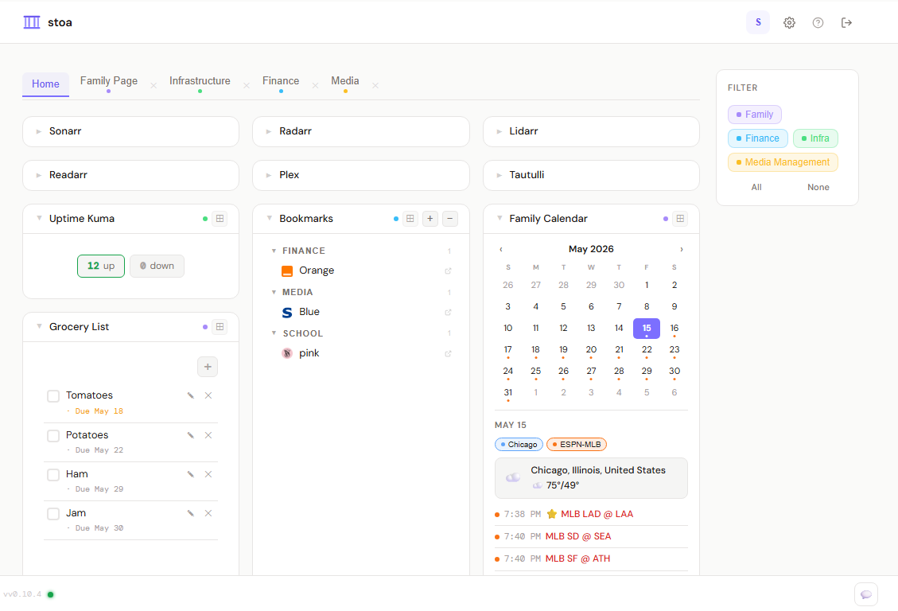
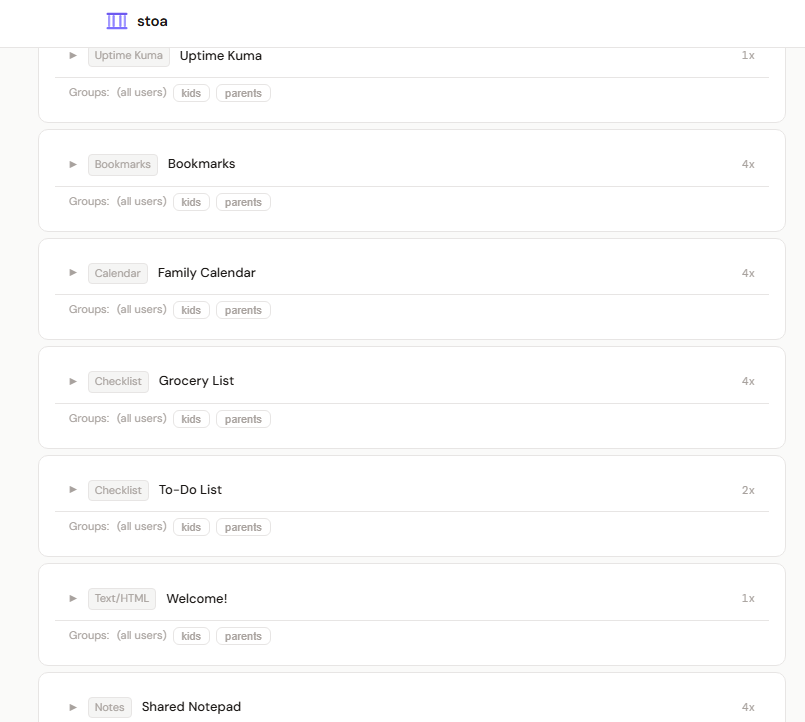
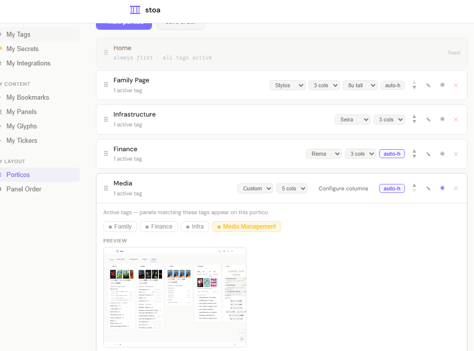
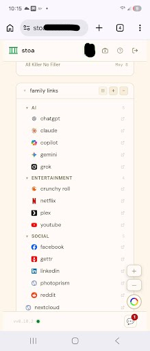

# Stoa

A self-hosted homelab dashboard — multi-user, data-rich, and built to stay out of your way.

Connect Stoa to your services and pull live data into a clean, responsive dashboard. Every user gets their own view — panel ordering, layout modes, tag filters, and named porticos — without affecting anyone else.

---

<p align="center">
  
  
</p>
<p align="center">
  
  
</p>

---

## Features

- **~90 integrations** — media servers (Plex, Jellyfin, Emby, Tautulli), media management (*arr stack, Overseerr, Tdarr, Maintainerr), photo libraries (Immich, PhotoPrism, Kavita, Komga, Navidrome, Audiobookshelf), storage (TrueNAS, Proxmox, Unraid, Synology, QNAP, OMV), networking (OPNsense, pfSense, OpenWrt, UniFi, Omada), downloads (qBittorrent, Transmission, Deluge, ruTorrent, SABnzbd, NZBGet), smart home, security, finance, gaming, and more — over 50 personally tested and validated
- **Live data** — OPNsense, TrueNAS, and other fast-polling integrations push updates every 1–30 seconds via SSE; all others poll on configurable intervals
- **Multi-user** — users, groups, and tag-based access control; each user gets their own layout and panel order
- **Porticos** — named dashboard views with independent tag filters, layouts, and panel ordering; live scaled preview in profile settings
- **Layout modes** — Stylos (column-fill), Seira (CSS grid rows), Rema (collapsible rows), Custom (manual column assignment)
- **Calendar** — multi-source calendar aggregating Sonarr/Radarr/Lidarr/Readarr releases and Google Calendar events
- **Glyphs & Tickers** — persistent status indicators (weather, server stats, ping) and scrolling tickers (sports, stocks, crypto, RSS) in the header and footer
- **Docker control panel** — view and manage containers across local and remote Docker hosts
- **Notes & Checklists** — shared panels with per-user locking (notes) and shared state (checklists)
- **Bookmarks** — nested folder tree with custom icons, import/export via CLI
- **Custom CSS** — per-user CSS upload for fine-grained personalization
- **OAuth/SSO** — Authentik, Keycloak, and any OIDC-compatible provider; local accounts always work as a fallback
- **Security** — AES-256-GCM encrypted secrets, auth rate limiting, CSP headers, audit log
- **CLI** — `stoa-cli` for user management, database maintenance, and full backups

---

## Quick start

```yaml
services:
  stoa-backend:
    image: ghcr.io/the-d-b/stoa-backend:latest
    container_name: stoa-backend
    volumes:
      - stoa-data:/data
    environment:
      STOA_SESSION_SECRET: "change-me-use-openssl-rand-hex-32"
    restart: unless-stopped
    networks:
      - stoa-net

  stoa-frontend:
    image: ghcr.io/the-d-b/stoa-frontend:latest
    container_name: stoa-frontend
    ports:
      - "8080:80"
    depends_on:
      - stoa-backend
    restart: unless-stopped
    networks:
      - stoa-net

networks:
  stoa-net:

volumes:
  stoa-data:
```

```bash
docker compose up -d
```

Open `http://localhost:8080` and follow the setup wizard to create your admin account.

See [docker-compose.yml](docker-compose.yml) for a full reference including optional mounts (Docker socket, custom CA certificates, OAuth).

---

## Environment variables

| Variable | Required | Default | Description |
|---|---|---|---|
| `STOA_SESSION_SECRET` | **Yes** | — | Signs JWTs and derives the AES-256 key for encrypting stored secrets. Generate with `openssl rand -hex 32`. |
| `STOA_DB_PATH` | No | `/data/db/stoa.db` | SQLite database path |
| `STOA_PORT` | No | `8080` | Port the backend listens on |
| `STOA_ICONS_DIR` | No | `/data/icons` | Directory for uploaded bookmark icons |
| `STOA_CSS_DIR` | No | `/data/css` | Directory for user CSS customization files |
| `STOA_ATTACHMENTS_DIR` | No | `/data/attachments` | Directory for file attachments (notes, checklists) |
| `STOA_ALLOWED_ORIGINS` | No | `http://localhost:3000` | Comma-separated allowed CORS origins |
| `STOA_OAUTH_CLIENT_ID` | No | — | OIDC client ID for SSO |
| `STOA_OAUTH_CLIENT_SECRET` | No | — | OIDC client secret |
| `STOA_OAUTH_ISSUER_URL` | No | — | OIDC issuer URL |
| `STOA_OAUTH_REDIRECT_URL` | No | — | OAuth callback URL |

---

## Documentation

| | |
|---|---|
| [Comparison](docs/comparison.md) | How Stoa compares to Homepage, Homarr, Organizr, and others |
| [Getting started](docs/getting-started.md) | Install, volume mounts, order of operations, express setup |
| [Concepts](docs/concepts.md) | Users, groups, tags, panels, and porticos |
| [Integrations](docs/integrations/) | Master chart + per-integration setup guides with panel screenshots |
| [Layouts](docs/layouts.md) | Stylos, Seira, Rema, and Custom layout modes |
| [Glyphs & Tickers](docs/glyphs-and-tickers.md) | Header/footer widgets |
| [Docker control panel](docs/docker-control-panel.md) | Container management setup |
| [OAuth / SSO](docs/oauth.md) | OIDC provider setup |
| [CLI reference](docs/cli.md) | stoa-cli commands |
| [Why Stoa](docs/why-stoa.md) | Background and design philosophy |

---

## Development

```bash
# Backend (Go + SQLite, serves API on :8080)
cd backend
go run ./cmd/stoa

# Frontend (React + Vite, dev server on :5173, proxies /api to :8080)
cd frontend
npm install
npm run dev
```

---

## Contributing

See [CONTRIBUTING.md](CONTRIBUTING.md).

---

## License

MIT
