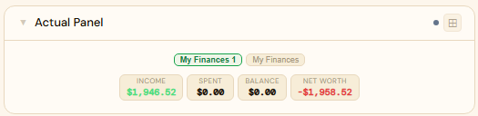
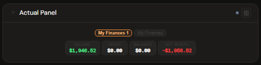
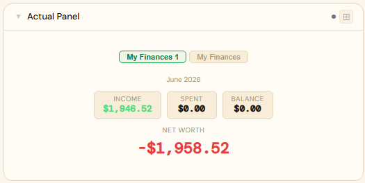
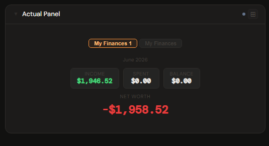
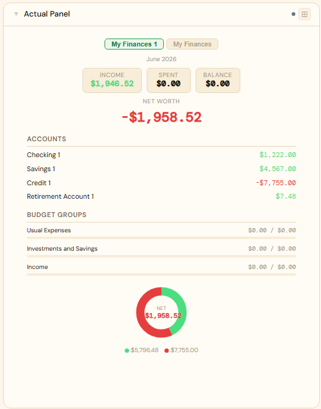
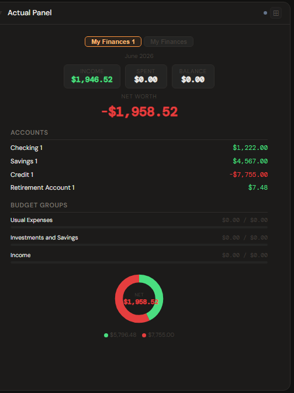

# Actual Budget

**Category:** Finance | **Status:** ✅ Tested | **Polling:** 5 min

---

## Integration

**Secret format:** API key

> Set the `API_KEY` environment variable on the `actual-http-api` sidecar container. Use that same value here.

**URL required:** Required — point to the sidecar, not to Actual Budget itself

**Example URL:** `http://192.168.1.10:5006`

### Sidecar requirement

Actual Budget does not expose an HTTP API on its own. Stoa connects through the unofficial [jhonderson/actual-http-api](https://github.com/jhonderson/actual-http-api) sidecar, which wraps the Actual Node.js API and exposes it over REST.

**Tested with:** `jhonderson/actual-http-api` (Docker image `jhonderson/actual-http-api:latest`)

Setup is straightforward — the sidecar requires only two environment variables:

| Variable | Description |
|---|---|
| `ACTUAL_SERVER_URL` | URL of your Actual Budget sync server |
| `ACTUAL_PASSWORD` | Your Actual Budget server password |
| `API_KEY` | An arbitrary string you choose; used by Stoa to authenticate to the sidecar |

A minimal Docker Compose snippet:

```yaml
actual-http-api:
  image: jhonderson/actual-http-api:latest
  environment:
    ACTUAL_SERVER_URL: http://actual-budget:5006
    ACTUAL_PASSWORD: your-actual-password
    API_KEY: your-chosen-api-key
  ports:
    - "3000:3000"
```

The sidecar is stateful — it opens one budget at a time and syncs from the Actual server on each switch. Stoa fetches all budgets sequentially (never concurrently) to avoid race conditions with the sidecar's open-budget state.

### Setup

1. Deploy `jhonderson/actual-http-api` alongside Actual Budget with the env vars above
2. Admin → Secrets → New: paste the `API_KEY` value you chose
3. Admin → Integrations → New: type `Actual Budget`, URL = `http://actual-http-api:3000`, select your secret
4. Admin → Panels → New: type `Actual Budget`, select the integration

---

## Panel

Envelope-budgeting dashboard showing monthly income, spending, and available balance with per-category-group progress bars, account balances (on-budget and off-budget), net worth, and an assets vs. liabilities donut chart. If your Actual instance has more than one budget, pills at the top of the panel let you switch between them instantly — no page reload.

### Height behavior

| Height | What you see |
|---|---|
| 1x | Budget pills (if multiple budgets) · Income, Spent, Balance, Net Worth chips — compact layout |
| 2–3x | Budget pills · month label · Income / Spent / Balance chips · Net Worth as large standalone figure |
| 4x+ | Budget pills · month label · chips · Net Worth · stacked sections: Accounts → Budget Groups → Assets/Liabilities donut |

### Default budget selection

If you have multiple budgets and always want a specific one pre-selected when the panel loads, set **Default Budget** in the panel config. You can supply either:

- The budget's **friendly name** — e.g. `My Finances`
- The budget's **Sync ID** — the UUID found in Actual Budget → Settings → Show advanced settings → Sync ID

Leave it blank to default to the first budget in the list. All budgets remain accessible via the pill selector regardless of this setting.

### How data flows

On each poll cycle the backend fetches all budgets from the sidecar sequentially, then caches the full dataset keyed by integration ID. The frontend never talks to the sidecar directly — it reads from the backend cache and uses **Server-Sent Events (SSE)** to receive live updates whenever the cache refreshes. This means the panel updates automatically in the background without any user action, and **Refresh Now** (right-click the panel title bar) triggers an immediate out-of-cycle fetch that pushes fresh data to the panel via the same SSE path.

### Screenshots

| | Light | Dark |
|---|---|---|
| **1x** |  |  |
| **2x** |  |  |
| **4x** |  |  |

---

## Calendar

Add Actual Budget as a calendar source (Profile/Admin → Calendar panel → Calendar sources → **Stoa integration**) to see upcoming scheduled transactions on the calendar. Each schedule appears as an all-day "Due soon" event 3 days before its due date. See [Calendar](../calendar/README.md#actual-budget) for details.

---

## Notes

- The sidecar opens and syncs one budget at a time from the Actual sync server. If you notice stale data, use **Refresh Now** to force an immediate re-sync.
- Account balances are fetched concurrently per account within a single budget fetch — panels with many accounts are still fast.
- The `carryover` field in Actual's budget API returns a boolean rather than a number; Stoa handles this gracefully and ignores it.
