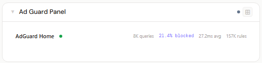
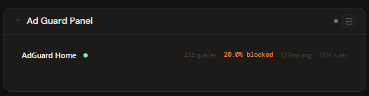
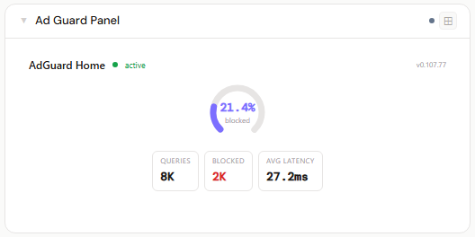
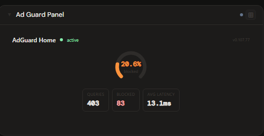
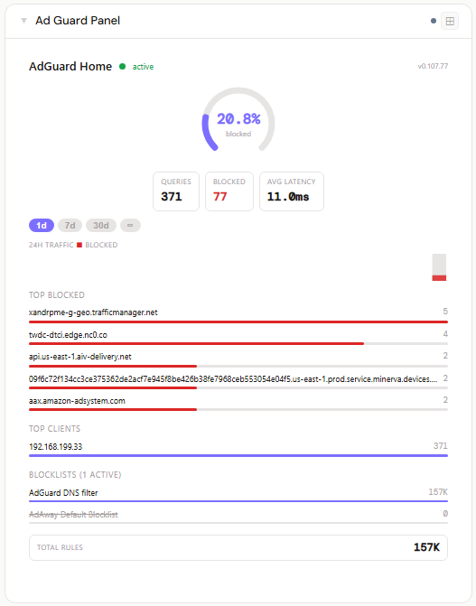
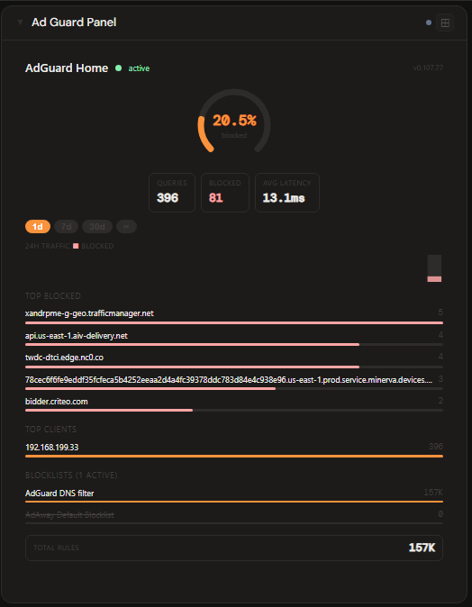

# AdGuard Home

**Category:** DNS & Proxy | **Status:** ✅ Tested | **Polling:** 30 s

---

## Integration

**Secret format:** `username:password`

> Your AdGuard Home web UI login credentials. Format: `admin:yourpassword`

**URL required:** Required — point directly at the AdGuard Home web UI/API port

**Example URL:** `http://192.168.1.10:3000`

### Setup

1. Admin → Secrets → New: paste `username:password` (e.g. `admin:yourpassword`)
2. Admin → Integrations → New: type `AdGuard Home`, URL = `http://adguard-home:3000`, select your secret
3. Admin → Panels → New: type `AdGuard Home`, select the integration

No additional configuration is required in AdGuard Home itself — the same credentials used for the web UI grant API access.

---

## Panel

DNS query statistics dashboard showing blocked percentage arc gauge, query counts, average latency, a traffic sparkline with time range selection, top blocked domains, top clients, active blocklist inventory with rule counts, and total rules summary.

### Height behavior

| Height | What you see |
|---|---|
| 1x | Inline bar: AdGuard Home link · status dot · total queries · blocked % · avg latency · total rules |
| 2–3x | Header · arc gauge (centered) · Queries / Blocked / Avg Latency chips (centered below gauge) |
| 4x+ | Header · arc gauge · stat chips · time range pills · traffic sparkline · stacked sections: Top Blocked (5) → Top Clients (5) → Blocklists (5) → Total Rules |

### Time range selection (4x+)

The `[1d] [7d] [30d] [∞]` pill picker in the 4x+ view controls the time window reported by AdGuard Home. Selecting a pill immediately re-fetches data for that period — the sparkline, query counts, top lists, and blocked percentage all reflect the chosen window. The ∞ option returns data for AdGuard Home's full configured retention period.

The selection is session-local and resets to 1d on page reload. It is not persisted to the panel config.

### Panel config

AdGuard Home has no user-settable panel config fields. The only stored value is `integrationId`, which is set automatically when you pick an integration in the panel editor.

### How data flows

On each 30-second poll cycle the backend makes three requests to AdGuard Home:

| Endpoint | Data retrieved |
|---|---|
| `GET /control/status` | Version string, protection enabled/paused |
| `GET /control/stats[?time_delta=N]` | Query counts, blocked counts, safe browsing/search/parental counts, average processing time, per-interval time series, top blocked domains, top queried domains, top clients, upstream response times |
| `GET /control/filtering/status` | Blocklist names, enabled state, rule counts |

The full dataset is stored in the backend cache keyed by integration ID. The frontend never calls AdGuard Home directly — it reads from the backend cache. When the 4x+ time range pill is changed, the frontend sends `?days=N` as a query parameter, which the backend converts to `time_delta=N×86400` seconds on the `/control/stats` call and bypasses the cache to return fresh data for that window.

The panel subscribes to **Server-Sent Events (SSE)**. When the worker refreshes the cache, the backend broadcasts a `cache-update` event on the integration's SSE channel. The panel receives this signal and re-fetches with the current time range selection — so the display stays current automatically without any user action. **Refresh Now** (right-click the panel title bar) triggers an immediate out-of-cycle fetch that pushes fresh data through the same SSE path.

### Screenshots

| | Light | Dark |
|---|---|---|
| **1x** |  |  |
| **2x** |  |  |
| **4x** |  |  |

---

## Notes

- Safe Browsing, Safe Search, and Parental Control chips appear in the 4x+ stat row only when those features are active and have a non-zero count for the selected time window.
- The AdGuard Home `time_delta` parameter for per-request time windows requires a recent version of AdGuard Home (v0.107+). On older versions the full configured retention period is always returned regardless of the pill selection.
- If AdGuard Home's configured stats retention period is shorter than the selected time window (e.g. retention is 7 days but you select 30d), AdGuard Home silently returns however much data it has.
