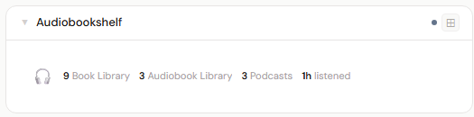
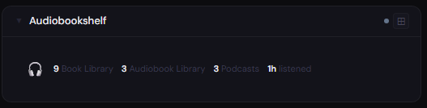
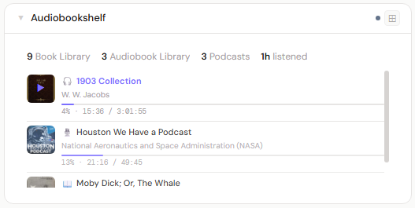
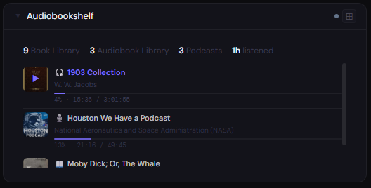
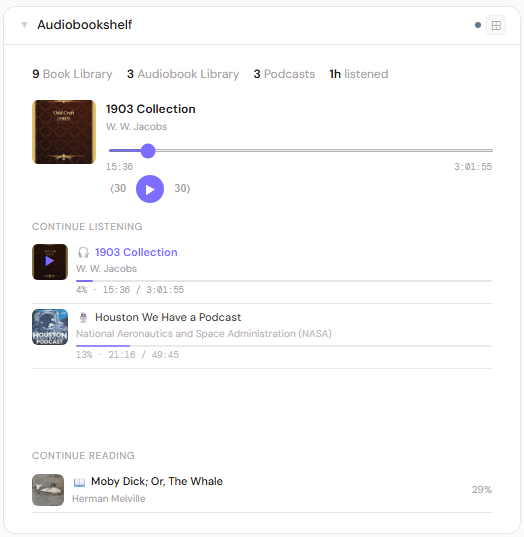
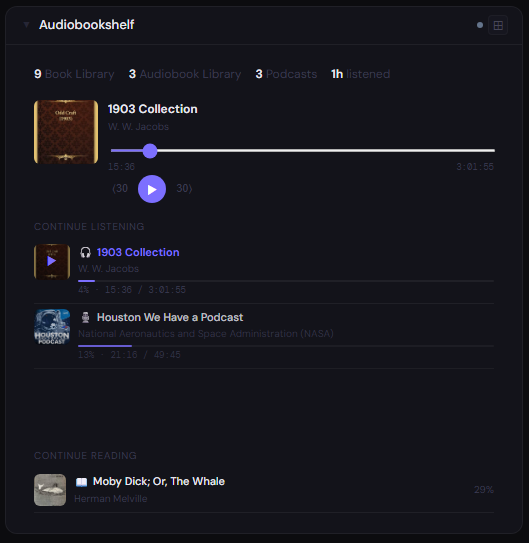

# Audiobookshelf

**Category:** Photos & Libraries | **Status:** Tested | **Polling:** 60 s

---

## Integration

**Secret format:** `username:password` or plain API key

> ABS → Settings → Users → your user → API Token. For root accounts, use `username:password` (e.g. `root:yourpassword`).

**URL required:** Required

**Example URL:** `http://192.168.1.10:13378`

If ABS is served under a sub-path (e.g. via a reverse proxy), include it in the URL: `http://192.168.1.10:13378/audiobookshelf`

### Setup

1. ABS → Settings → Users → your user → copy **API Token** (or use `username:password`)
2. Stoa → Admin → Secrets → New: paste the credential
3. Stoa → Admin → Integrations → New: select **Audiobookshelf**, enter URL and secret
4. Stoa → Admin → Panels → New: select **Audiobookshelf**

---

## Panel

In-progress audiobooks, podcasts, and ebooks with playback stats and a built-in audio player. The panel pulls from your personal ABS listening history and keeps progress in sync across Stoa and ABS.

### What's shown

- **Library overview** — total item counts per library
- **Total listening time** — all-time hours listened
- **Items finished** — total completed items
- **Continue Listening** — audiobooks and podcast episodes with a progress bar and mini audio player
- **Continue Reading** — ebooks in progress (click to open in ABS)

### Audio playback

Clicking any item in **Continue Listening** opens the mini player inline. The player:

- Resumes from where you last stopped in ABS (position is fetched per-item from `/api/me/progress/{itemId}`)
- For multi-track audiobooks, determines the correct track based on your global position and streams only that track
- Supports skip ±30 s and scrubbing within the current track
- Syncs progress back to ABS every 30 s while playing and on pause/stop — so your position in ABS stays current
- Global position (seconds from the start of the book, not per-track) is always what gets synced, ensuring ABS and any other client see the correct position

> **Note:** Stoa streams audio through its own backend proxy (`/api/abs/{id}/stream/{itemId}?track=N`). Your ABS credentials never leave the server.

### Progress sync details

- Stoa calls `PATCH /api/me/progress/{libraryItemId}` (books) or `PATCH /api/me/progress/{libraryItemId}/{episodeId}` (podcasts) with `currentTime`, `duration`, and `progress`
- Ebook progress uses ABS's `ebookProgress` field (separate from the audio progress ratio)
- The panel refreshes via SSE every 60 s; after a sync the displayed position updates automatically

### Height behavior

| Height | What you see |
|---|---|
| 1x | Listening time + items finished at a glance |
| 2–3x | Continue Listening list with progress bars |
| 4x+ | Full layout: stats header + Continue Listening with mini player + Continue Reading |

### Screenshots

| | Light | Dark |
|---|---|---|
| **1x** |  |  |
| **2x** |  |  |
| **4x** |  |  |

*Add screenshots as `screenshots/1x-light.png`, `screenshots/1x-dark.png`, etc.*

---

## Explicit filter

Enable **Hide explicit items** in the panel config to hide items flagged explicit in Audiobookshelf from the in-progress list.

---

## Notes

- **TLS:** If your ABS instance uses a self-signed certificate, enable **Skip TLS Verify** on the integration
- **Sub-path installs:** Include the sub-path in the URL (e.g. `.../audiobookshelf`) — Stoa appends API paths directly
- **Multi-track audiobooks:** Stoa fetches the track layout from ABS at panel load time and routes playback to the right track automatically. When a track ends, the next track loads and plays without interruption. Scrubbing is scoped to the current track; clicking a different position in another track requires reloading the panel
- **Ebooks:** Non-audio items appear in **Continue Reading** with your reading progress percentage. Clicking opens the item directly in ABS
- **Progress safety:** ABS will not let progress regress for some sync paths; Stoa always sends the authoritative global position so ABS and other clients stay in sync
