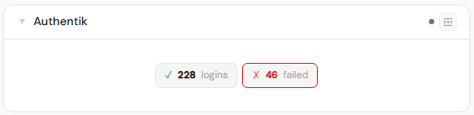
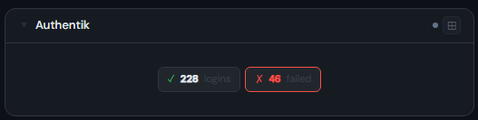
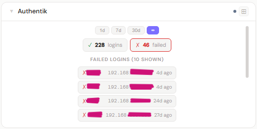
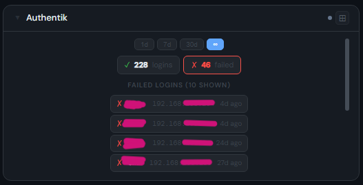
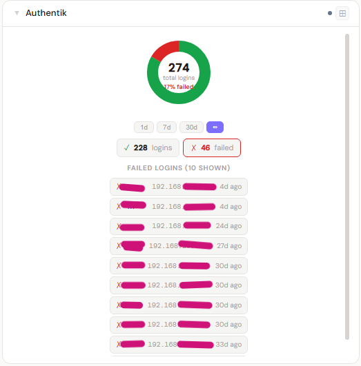
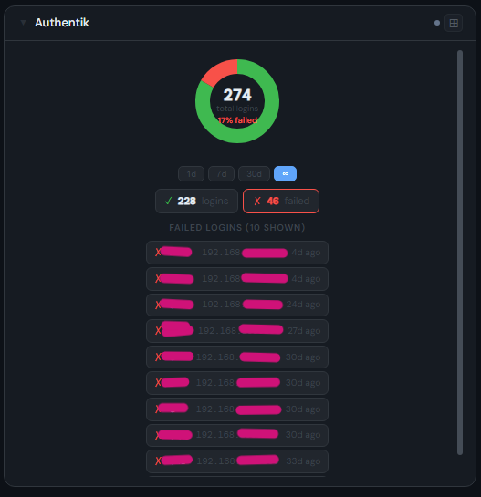

# Authentik

**Category:** VPN & Security | **Status:** Tested | **Polling:** 5 min

---

## Integration

**Secret format:** API token

> Authentik → Admin interface → System → API Tokens → Create

**URL required:** Required

**Example URL:** `https://auth.example.com`

### Setup

1. Authentik → Admin → System → API Tokens → create token
2. Stoa → Admin → Secrets → New: paste the token
3. Stoa → Admin → Integrations → New: select **Authentik**, enter URL and secret
4. Stoa → Admin → Panels → New: select **Authentik**

---

## Panel

Login counts, failed login attempts with IP and timestamp, and active session count. Includes a time range picker (1d / 7d / 30d / ∞) and a donut chart at 4x showing the success/failure split.

### Height behavior

| Height | What you see |
|---|---|
| 1x | Login count + failed attempt count + active sessions |
| 2–3x | Time range pills + login stats + recent failed login list |
| 4x+ | Donut chart (success vs. failures) + time range pills + stats + failures |

### Screenshots

| | Light | Dark |
|---|---|---|
| **1x** |  |  |
| **2x** |  |  |
| **4x** |  |  |

---

## Notes

- **Time range:** The ∞ option fetches all-time totals directly from Authentik's pagination count. Finite ranges (1d / 7d / 30d) filter events in Go against a rolling cutoff
- **Active sessions:** Pulled from `/api/v3/core/authenticated_sessions/` — reflects sessions currently alive in Authentik
- **TLS:** If your Authentik instance uses a self-signed certificate, enable **Skip TLS Verify** on the integration
