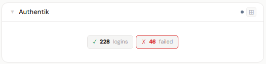
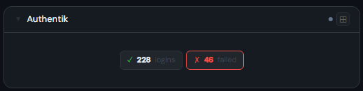
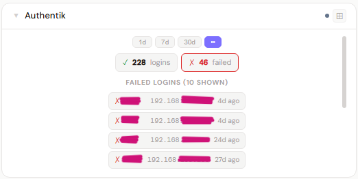
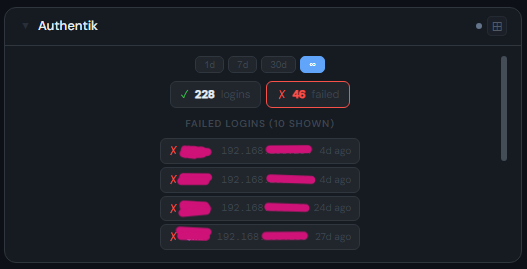
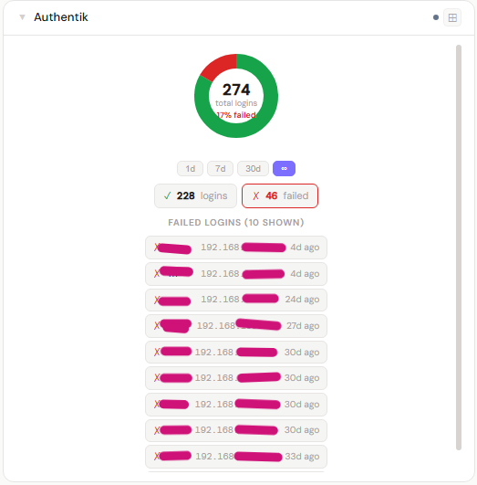
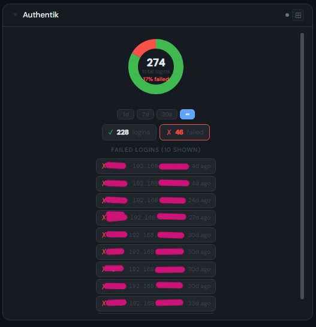

# Authentik

## What is Authentik?

Authentik is a self-hosted identity provider and single-sign-on (SSO) server. It centralizes authentication for your apps via SAML, OAuth2/OpenID Connect, LDAP, and more, with flexible login flows, MFA, and user management — an open-source alternative to Okta and Auth0.

**Official site:** [goauthentik.io](https://goauthentik.io)

---

## Getting the key

Authentik → **Admin interface → System → API Tokens → Create** — copy the token.

- **Secret format:** API token
- **URL:** required — your Authentik base URL, e.g. `https://auth.example.com`

---

## Add it to Stoa

1. **Admin → Secrets → New** — paste the token.
2. **Admin → Integrations → New** — select **Authentik**, enter the URL, choose the secret. Enable **Skip TLS Verify** if it uses a self-signed certificate.
3. **Admin → Panels → New** — select **Authentik**.

---

## Panel

Login counts, failed login attempts with IP and timestamp, and active session count. Includes a time range picker (1d / 7d / 30d / ∞) and a donut chart at 4x showing the success/failure split.

### Height behavior

| Height | What you see |
|---|---|
| 1x | Login count + failed attempt count + active sessions |
| 2–3x | Time range pills + login stats + recent failed login list |
| 4x+ | Donut chart (success vs. failures) + time range pills + stats + failures |

### Screenshots

| | Light | Dark |
|---|---|---|
| **1x** |  |  |
| **2x** |  |  |
| **4x** |  |  |

---

## Notes

- **Time range:** The ∞ option fetches all-time totals directly from Authentik's pagination count. Finite ranges (1d / 7d / 30d) filter events in Go against a rolling cutoff
- **Active sessions:** Pulled from `/api/v3/core/authenticated_sessions/` — reflects sessions currently alive in Authentik
- **TLS:** If your Authentik instance uses a self-signed certificate, enable **Skip TLS Verify** on the integration
