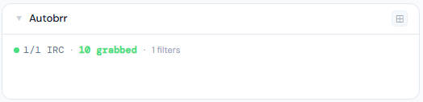
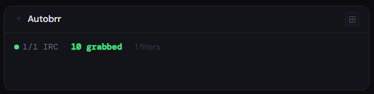
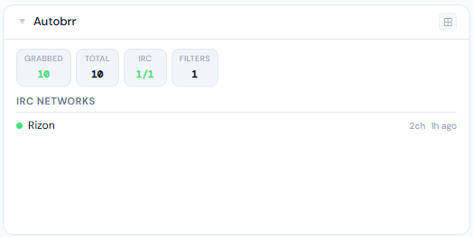
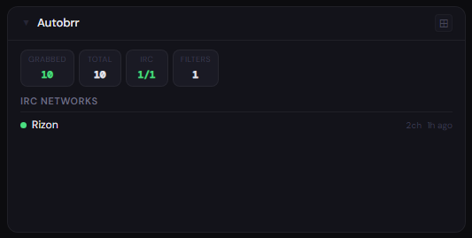
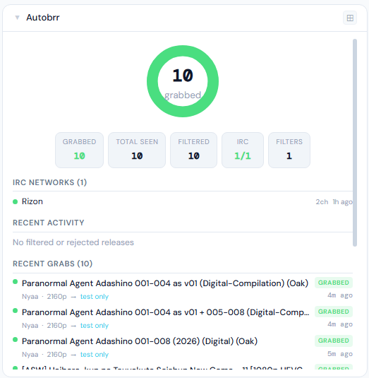
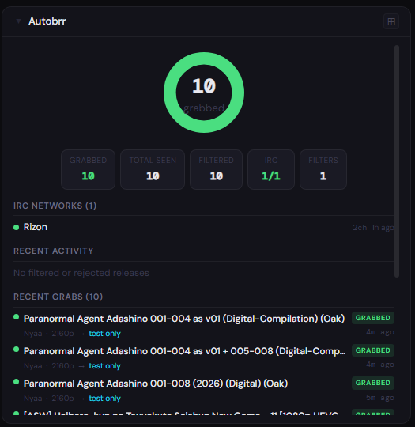

# autobrr

**Category:** Media Management | **Status:** Tested | **Polling:** 30 s

---

## Integration

**Secret format:** Plain API key

> autobrr → Settings → API → copy API Key

**URL required:** Required

**Example URL:** `http://192.168.1.10:7474`

### Setup

1. autobrr → Settings → API → copy API Key
2. Stoa → Admin → Secrets → New: paste the key
3. Stoa → Admin → Integrations → New: select **autobrr**, enter URL and secret
4. Stoa → Admin → Panels → New: select **autobrr**

---

## What is autobrr?

autobrr is a torrent automation tool that monitors IRC announce channels on private trackers and RSS feeds in real time. When a new release is announced that matches one of your filters, autobrr grabs it instantly and pushes it to your configured download client — qBittorrent, Deluge, Radarr, Sonarr, and others.

This is fundamentally faster than letting Sonarr/Radarr poll RSS on their own schedule. IRC announces arrive within seconds of a release being posted; autobrr acts on them immediately.

---

## Panel

IRC network connection health, cumulative grab/reject/filter statistics, and live feeds of recent activity and grabs.

### What's shown

- **Donut chart** — grab count and grab rate at a glance; color shifts green → cyan → gray as grab rate drops
- **Stat chips** — grabbed, total seen, filtered, rejected, push errors, IRC health, active filter count
- **IRC Networks** — one row per configured network with connection status (green/red dot), channel count, and uptime
- **Recent Activity** — releases that were filtered out or rejected (not grabbed); shows indexer, filter name, and rejection reason
- **Recent Grabs** — releases that were successfully pushed to a download client; shows indexer, filter, and destination client

### Height behavior

| Height | What you see |
|---|---|
| 1x | IRC health indicator + grabbed count + rejected count + filter count |
| 2–3x | Compact stat chips (no donut) + IRC network list |
| 4x+ | Donut chart → stat chips → IRC networks → recent activity → recent grabs |

### Screenshots

| | Light | Dark |
|---|---|---|
| **1x** |  |  |
| **2x** |  |  |
| **4x** |  |  |

---

## Notes

- **Polling interval:** 30 s — IRC connection status and release stats update every half minute via SSE push. The panel updates automatically; no manual refresh needed
- **Recent Activity vs Recent Grabs:** Activity shows only releases that were *not* grabbed (filtered out, rejected, or errored), so the two sections are always distinct. If all your releases are being grabbed, Activity will show empty
- **IRC networks:** autobrr connects to one IRC network per configured indexer. The panel shows each network's name, monitored channel count, and how long it has been connected. Disconnected networks are surfaced first with a red DOWN badge
- **Test action:** autobrr's built-in *Test* action type marks releases as grabbed without sending them anywhere — useful for validating filter logic before wiring up a real download client
- **API compatibility:** Tested against autobrr v1.x. The panel uses `/api/release/stats`, `/api/release`, `/api/irc`, and `/api/filters`
