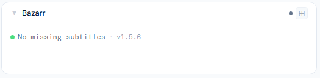
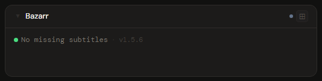
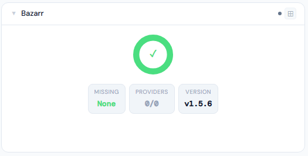
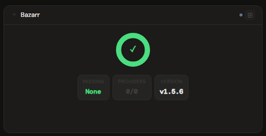
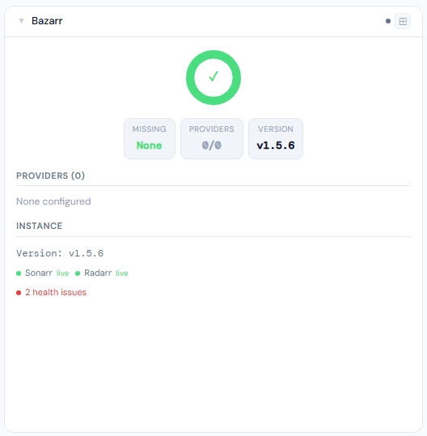
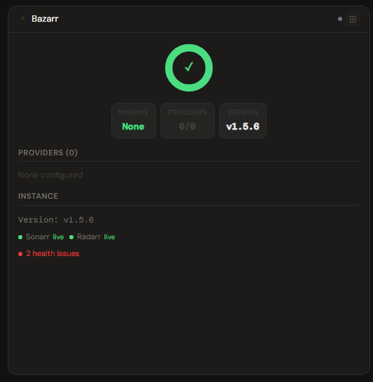

# Bazarr

**Category:** Media Management | **Status:** ✅ Tested | **Polling:** 60 s

---

## Integration

**Secret format:** Plain API key

> Bazarr → Settings → General → Security → API Key

**URL required:** Required — point at your Bazarr port

**Example URL:** `http://192.168.1.10:6767`

### Setup

1. Bazarr → Settings → General → copy the API Key
2. Admin → Secrets → New: paste the key
3. Admin → Integrations → New: type `Bazarr`, URL = `http://bazarr:6767`, select your secret
4. Admin → Panels → New: type `Bazarr`, select the integration

---

## Panel

Subtitle management overview showing missing subtitle counts for TV and movies, a health donut gauge, per-provider status, monthly download volumes, and Sonarr/Radarr connection status.

### Height behavior

| Height | What you see |
|---|---|
| 1x | Donut gauge (missing / wanted) + stat chips: missing TV · missing movies · providers with issues |
| 2x | Donut gauge centered + stat chips centered below |
| 4x+ | Donut + stat chips + provider health list (enabled / failed / disabled counts per provider) + instance info (Sonarr/Radarr connection status, monthly TV/movie subtitle downloads) |

### How data flows

On each 60-second poll cycle the backend calls:

| Endpoint | Data retrieved |
|---|---|
| `GET /api/episodes` | Missing episode subtitle count |
| `GET /api/movies` | Missing movie subtitle count |
| `GET /api/providers` | Provider list with enabled/failed/disabled status |
| `GET /api/system/status` | Sonarr and Radarr connection state, version |
| `GET /api/history/stats` | Monthly subtitle download counts by type |

All data is cached by integration ID. The browser never calls Bazarr directly.

The panel uses **backend polling** — there is no SSE push for Bazarr. The display updates on the next 60-second poll cycle or when you use **Refresh Now** (right-click the panel title bar).

### Screenshots

| | Light | Dark |
|---|---|---|
| **1x** |  |  |
| **2x** |  |  |
| **4x** |  |  |

---

## Notes

- Provider health reflects Bazarr's own provider test results. A provider listed as `failed` means Bazarr was unable to reach it on its most recent check — check Bazarr's own logs for the specific error.
- The donut gauge shows missing subtitles as a proportion of total monitored items. A full green ring means zero missing.
- Bazarr requires Sonarr and/or Radarr to be configured within it for the instance info section to show connection status.
