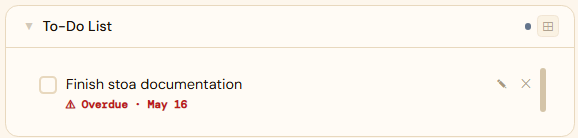
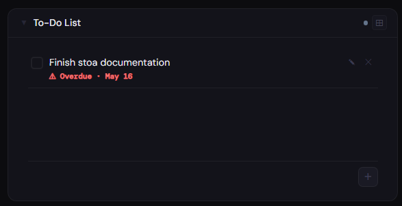
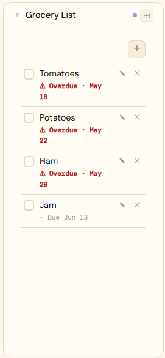

# Checklist

**Category:** Productivity | **Status:** Tested | **Requires integration:** No - data stored locally in Stoa

---

## Panel

Shared checklist panel. Items can be checked off, added, or removed. State is shared - when one user checks an item, it is checked for everyone who can see the panel.

### Height behavior

| Height | What you see |
|---|---|
| 1x | Checked/total count + completion bar |
| 2-3x | Item list with checkboxes |
| 4x+ | Full item list with add/remove controls |

### Screenshots

| 1x | 2x | 4x |
|---|---|---|
|  |  |  |

*Screenshots pending - add as screenshots/1x.png, screenshots/2x.png, screenshots/4x.png.*