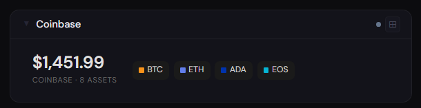
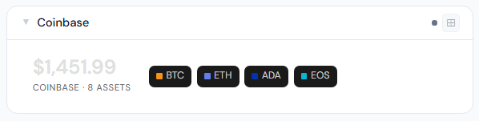
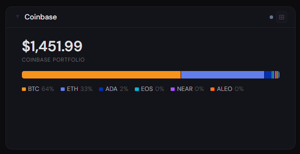
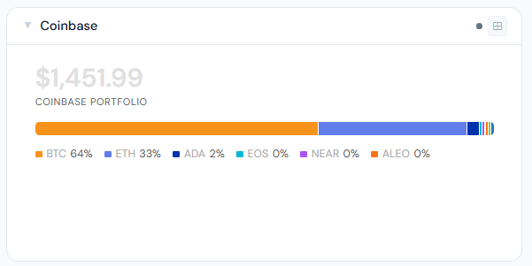
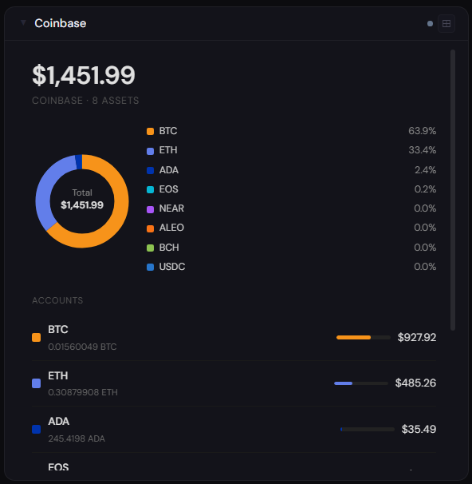
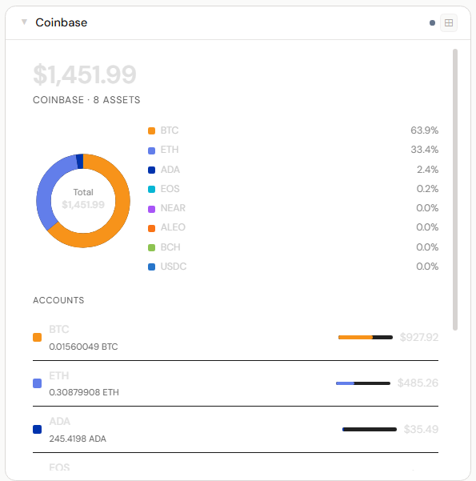

# Coinbase

**Category:** Finance | **Status:** Tested | **Polling:** 5 min

---

## Integration

**Secret format:** `keyName:privateKey` (colon-separated, values copied directly from the JSON file Coinbase gives you)

> Coinbase issues **CDP (Coinbase Developer Platform) API keys** — these are JWT-signed keys, not the old HMAC `apiKey:apiSecret` style. You must create a new CDP key even if you have a legacy key; legacy keys cannot be reactivated.

**URL required:** None (Coinbase cloud API, URL is fixed)

### Creating a CDP API key

1. Go to **coinbase.com → Settings → API** (use the **API** section — not **Advanced API**, which is for day-trading only)
2. Click **New API Key**
3. When prompted for an algorithm, select **Ed25519** (the default — it is labeled "Highly recommended")
4. Set the scopes you need — read-only is sufficient for this panel
5. Coinbase downloads a JSON file to your computer immediately on creation — **this is the only time you can access the private key, save it**

### JSON file format

The downloaded file looks like this:

```json
{
  "name": "organizations/abc123.../apiKeys/xyz789...",
  "privateKey": "AAAAexamplebase64...=="
}
```

*(Values above are placeholders — yours will be long random strings.)*

### Stoa secret format

Concatenate the two fields with a colon — paste them exactly as they appear in the JSON:

```
organizations/abc123.../apiKeys/xyz789...:AAAAexamplebase64...==
```

No quotes, no spaces, no modification to the key material. The private key is raw base64 and should be pasted verbatim.

### Setup

1. Create a CDP API key as described above and save the JSON file
2. Stoa → **Admin → Secrets → New**: paste `{name}:{privateKey}` (colon-separated, values from the JSON) → **Save**
3. Stoa → **Admin → Integrations → New** → select **Coinbase**, select the secret → **Save** (no URL field — the endpoint is fixed)
4. Stoa → **Admin → Panels → New** → select **Coinbase** → **Create**

---

## Panel

Portfolio dashboard showing total holdings value in USD, per-asset allocation, and a breakdown of every non-zero-balance account with live spot prices.

### Height behavior

| Height | What you see |
|---|---|
| 1x | Total USD value · asset count · top-4 currency color swatches |
| 2–3x | Total value + stacked allocation bar with currency legend |
| 4x+ | Total value + allocation donut with legend + full account list with proportional bars |

### Screenshots

| | Dark | Light |
|---|---|---|
| **1x** |  |  |
| **2x** |  |  |
| **4x** |  |  |

---

## Notes

- **CDP keys only:** Legacy HMAC keys (the old `apiKey + apiSecret` pair from coinbase.com/settings) are no longer supported and cannot be reactivated. Only CDP keys created at coinbase.com/settings/api work.
- **Ed25519 vs ECDSA:** Both algorithms are supported, but Ed25519 is what Coinbase recommends and what most users will have. The key type is detected automatically from the key material.
- **No URL needed:** The Coinbase API endpoint is fixed (`api.coinbase.com`), so the integration form does not show a URL field.
- **USD values:** Stoa fetches live spot prices from `/v2/prices/{code}-USD/spot` for each held asset and multiplies by the on-chain balance. Stablecoins (USDC, USDT, DAI) and USD cash use $1.00.
- **Zero-balance accounts:** Wallets with a zero balance are filtered out of the panel display.
- **Permissions:** The integration only reads account balances and spot prices. No trading or withdrawal permissions are needed or requested.
