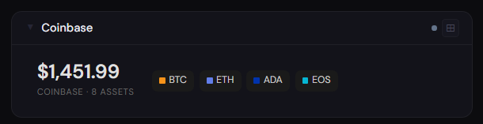
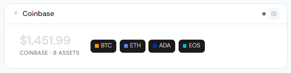
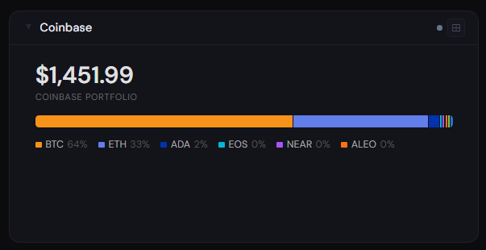
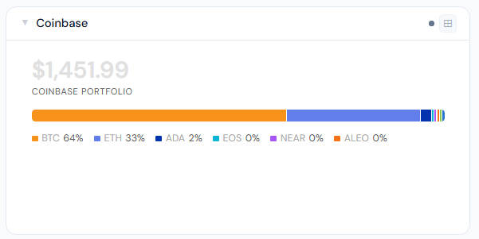
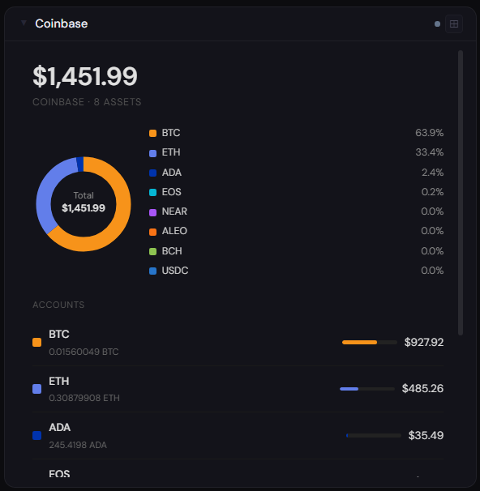
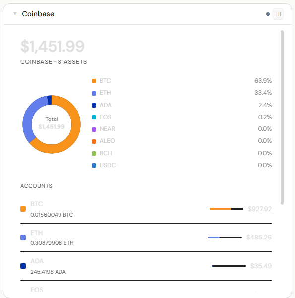

# Coinbase

## What is Coinbase?

Coinbase is a major cryptocurrency exchange and wallet. Its Developer Platform (CDP) API lets read-only apps like Stoa see your account balances and live spot prices to build a portfolio view.

**Official site:** [coinbase.com](https://www.coinbase.com)

---

## Getting the key

Coinbase issues **CDP (Coinbase Developer Platform) API keys** — JWT-signed keys, not the old HMAC style. You must create a new CDP key even if you have a legacy key.

1. Go to **coinbase.com → Settings → API** (the **API** section — not **Advanced API**, which is for day-trading)
2. Click **New API Key**
3. Choose the **Ed25519** algorithm (the default, "Highly recommended")
4. Set read-only scopes (sufficient for this panel)
5. Coinbase downloads a JSON file immediately — **this is the only time you can access the private key, save it**

The JSON looks like:

```json
{
  "name": "organizations/abc123.../apiKeys/xyz789...",
  "privateKey": "AAAAexamplebase64...=="
}
```

Concatenate the two fields with a colon, exactly as they appear (no quotes, no spaces):

```
organizations/abc123.../apiKeys/xyz789...:AAAAexamplebase64...==
```

- **Secret format:** `keyName:privateKey` (colon-separated, values from the JSON)
- **URL:** none — the Coinbase API endpoint is fixed (`api.coinbase.com`)

---

## Add it to Stoa

1. **Admin → Secrets → New** — paste `{name}:{privateKey}` → **Save**.
2. **Admin → Integrations → New** — select **Coinbase**, no URL, choose the secret.
3. **Admin → Panels → New** — select **Coinbase**.

---

## Panel

Portfolio dashboard showing total holdings value in USD, per-asset allocation, and a breakdown of every non-zero-balance account with live spot prices.

### Height behavior

| Height | What you see |
|---|---|
| 1x | Total USD value · asset count · top-4 currency color swatches |
| 2–3x | Total value + stacked allocation bar with currency legend |
| 4x+ | Total value + allocation donut with legend + full account list with proportional bars |

### Screenshots

| | Dark | Light |
|---|---|---|
| **1x** |  |  |
| **2x** |  |  |
| **4x** |  |  |

---

## Notes

- **CDP keys only:** Legacy HMAC keys are no longer supported and cannot be reactivated. Only CDP keys created at coinbase.com/settings/api work.
- **Ed25519 vs ECDSA:** Both algorithms are supported, but Ed25519 is what Coinbase recommends. The key type is detected automatically from the key material.
- **No URL needed:** The Coinbase API endpoint is fixed (`api.coinbase.com`), so the integration form does not show a URL field.
- **USD values:** Stoa fetches live spot prices from `/v2/prices/{code}-USD/spot` for each held asset and multiplies by the on-chain balance. Stablecoins (USDC, USDT, DAI) and USD cash use $1.00.
- **Zero-balance accounts:** Wallets with a zero balance are filtered out of the panel display.
- **Permissions:** The integration only reads account balances and spot prices. No trading or withdrawal permissions are needed or requested.
