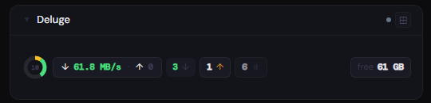
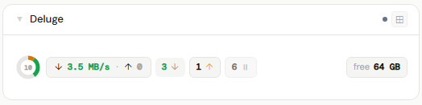
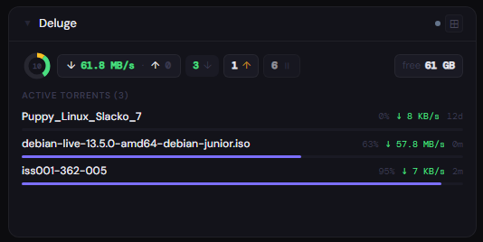
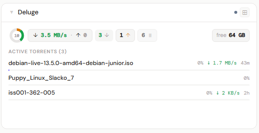
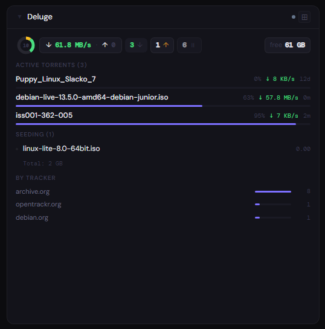
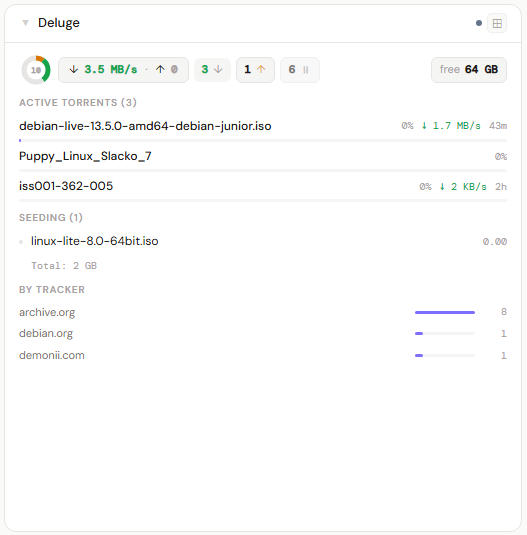

# Deluge

**Category:** Downloads | **Status:** ✅ Tested | **Polling:** 30 s

---

## Integration

**Secret format:** Bare password (no username)

> Just the password — no username prefix. Deluge Web UI authenticates with a password only. The default password is `deluge` (change it in the Web UI under Preferences → Interface).

**URL required:** Required

**Example URL:** `http://192.168.1.10:8112`

### Setup

1. Admin → Secrets → New: paste your Deluge Web UI password (no `username:` prefix)
2. Admin → Integrations → New: type Deluge, URL = `http://deluge:8112`, select secret
3. Admin → Panels → New: type Deluge, assign to the integration

### How it works

Stoa uses Deluge's **Web UI JSON-RPC API** at `/json`. All data is fetched in a single call:

- `auth.login` — authenticates and returns a `_session_id` cookie; Stoa caches this and re-authenticates automatically when it expires
- `web.update_ui` — single call that returns all torrent data plus global transfer stats and free space in one response; fields requested: `name`, `state`, `progress`, `total_size`, `download_payload_rate`, `upload_payload_rate`, `eta`, `tracker_host`, `ratio`

Stoa also calls `web.connected` during connection tests to verify the Web UI daemon connection is active (a disconnected Web UI returns no torrent data).

**Important:** Stoa connects to the Deluge **Web UI** (default port 8112), not to the Deluge daemon directly (default port 58846). The Web UI must be running and connected to a daemon.

Deluge returns all numeric fields (speeds, sizes, eta) as JSON floats. Stoa handles this correctly.

Updates arrive via SSE push every 30 seconds.

---

## Panel

Torrent state donut, aggregate speeds, per-state counts, active torrent list, seeding list, and tracker breakdown.

### Height behavior

| Height | What you see |
|---|---|
| 1x | State donut + speed pill (↓/↑) + per-state count pills (downloading, seeding, paused, checking, errored) + free space |
| 2–3x | 1x summary + **Active Torrents (N)** list — name, progress bar, speed, ETA or ratio — up to 6 items |
| 4x+ | 2x content + **Seeding (N)** list (amber dot if uploading, name, upload speed, color-coded ratio) + **By Tracker** bar chart |

**Ratio coloring:** green ≥ 1.0 · amber ≥ 0.5 · dim < 0.5

Deluge states: `Downloading`, `Allocating` → downloading · `Seeding` → seeding · `Paused`, `Queued`, `Moving` → paused · `Checking` → checking · `Error` → errored (shown in red).

`tracker_host` is provided by Deluge directly as a hostname string (no URL parsing needed).

### Screenshots

| | Dark | Light |
|---|---|---|
| **1x** |  |  |
| **2x** |  |  |
| **4x** |  |  |
