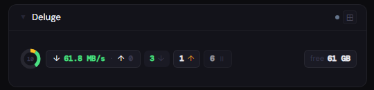
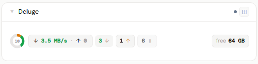
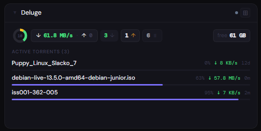
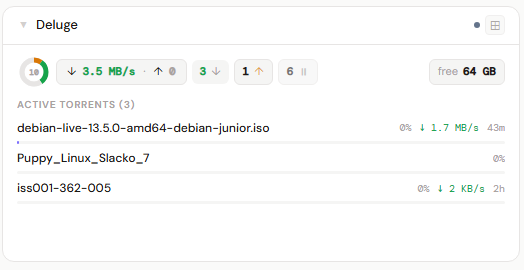
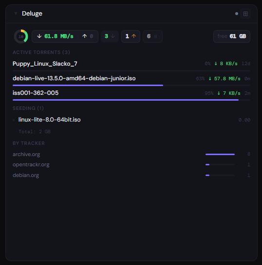
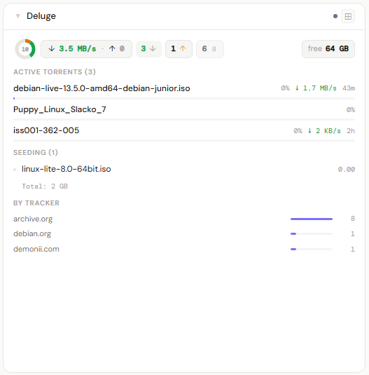

# Deluge

## What is Deluge?

Deluge is a free, open-source, cross-platform BitTorrent client with a client-server architecture and a plugin system. Its Web UI lets you manage a headless daemon remotely, making it a common pick for always-on server downloading.

**Official site:** [deluge-torrent.org](https://deluge-torrent.org)

---

## Getting the key

Use your Deluge Web UI password — no username prefix (Deluge authenticates with a password only). The default is `deluge`; change it under Preferences → Interface.

- **Secret format:** bare password (no username)
- **URL:** required — point at the Deluge **Web UI** (default port 8112), e.g. `http://192.168.1.10:8112`

---

## Add it to Stoa

1. **Admin → Secrets → New** — paste your Deluge Web UI password (no `username:` prefix).
2. **Admin → Integrations → New** — select **Deluge**, enter the URL, choose the secret.
3. **Admin → Panels → New** — select **Deluge**.

---

## How it works

Stoa uses Deluge's **Web UI JSON-RPC API** at `/json`. All data is fetched in a single call:

- `auth.login` — authenticates and returns a `_session_id` cookie; Stoa caches this and re-authenticates automatically when it expires
- `web.update_ui` — one call returning all torrent data plus global transfer stats and free space; fields: `name`, `state`, `progress`, `total_size`, `download_payload_rate`, `upload_payload_rate`, `eta`, `tracker_host`, `ratio`

Stoa also calls `web.connected` during connection tests to verify the Web UI daemon connection is active.

**Important:** Stoa connects to the Deluge **Web UI** (default port 8112), not the Deluge daemon directly (default port 58846). The Web UI must be running and connected to a daemon. Updates arrive via SSE push every 30 seconds.

---

## Panel

Torrent state donut, aggregate speeds, per-state counts, active torrent list, seeding list, and tracker breakdown.

### Height behavior

| Height | What you see |
|---|---|
| 1x | State donut + speed pill (↓/↑) + per-state count pills (downloading, seeding, paused, checking, errored) + free space |
| 2–3x | 1x summary + **Active Torrents (N)** list — name, progress bar, speed, ETA or ratio — up to 6 items |
| 4x+ | 2x content + **Seeding (N)** list (amber dot if uploading, name, upload speed, color-coded ratio) + **By Tracker** bar chart |

**Ratio coloring:** green ≥ 1.0 · amber ≥ 0.5 · dim < 0.5

Deluge states: `Downloading`, `Allocating` → downloading · `Seeding` → seeding · `Paused`, `Queued`, `Moving` → paused · `Checking` → checking · `Error` → errored (shown in red).

`tracker_host` is provided by Deluge directly as a hostname string (no URL parsing needed).

### Screenshots

| | Dark | Light |
|---|---|---|
| **1x** |  |  |
| **2x** |  |  |
| **4x** |  |  |
