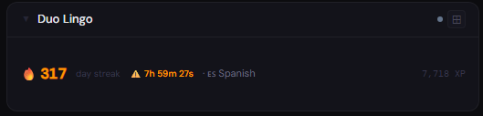
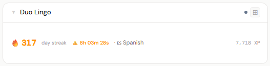
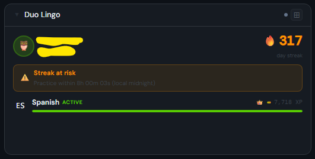
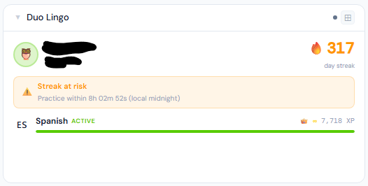
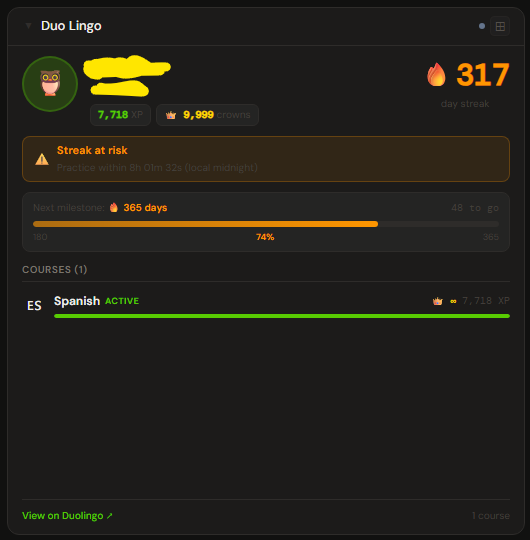
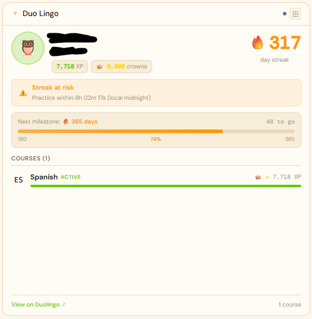

# Duolingo

## What is Duolingo?

Duolingo is the popular gamified language-learning app. It teaches languages through bite-sized lessons and tracks your daily streak, XP, crowns, and league. Stoa reads your **public profile** to display your streak and progress — no password or token needed.

**Official site:** [duolingo.com](https://www.duolingo.com)

---

## Getting the key

Your Duolingo **username** is the only thing needed. It's in your profile URL (`https://www.duolingo.com/profile/USERNAME`) and under **Profile → Edit Profile** in the app. This integration uses Duolingo's public profile API — your profile must be publicly accessible (the default).

- **Secret format:** your Duolingo username
- **URL:** none — always uses `duolingo.com`

---

## Add it to Stoa

1. **Admin → Secrets → New** — Name it e.g. `duolingo-username`, Value = your Duolingo username.
2. **Admin → Integrations → New** — select **Duolingo**, leave URL blank, choose the secret.
3. **Admin → Panels → New** — select **Duolingo**.

---

## Panel

Live Duolingo profile showing current streak with countdown timer, XP, crowns, league, avatar, and active courses with progress bars.

### Features

- **Streak badge** — current day streak with fire emoji
- **Streak countdown** — live timer showing time until local midnight when streak will expire; turns green when today's lesson is complete
- **Milestone progress** (4x only) — progress bar toward next streak milestone (7, 14, 30, 60, 90, 180, 365, 500, 730, 1000…)
- **Courses** — all enrolled courses with flag emoji, crowns (9999 shown as ∞), and XP bar; active course listed first
- **Stats chips** — Total XP, total crowns, longest streak, league badge
- **Avatar** — shows owl 🦉 for default Duolingo avatars

### Height behavior

| Height | What you see |
|---|---|
| 1x | Streak · countdown warning · active course · total XP |
| 2–3x | Avatar · name · streak badge · streak status · all courses |
| 4x+ | Full profile · XP/crowns/league chips · streak badge · streak status · milestone progress bar · courses · profile link |

### Screenshots

| | Dark | Light |
|---|---|---|
| **1x** |  |  |
| **2x** |  |  |
| **4x** |  |  |

---

## Notes

- Duolingo's public API does not require authentication. If your profile is private or your username is incorrect, the panel will show an error.
- Crowns at 9999 indicate course mastery (Duolingo's maximum). The API returns 9999 for completed skill trees.
- The streak countdown uses your **local midnight**, not UTC.
- League data is not always present in the API response; the league badge is hidden when unavailable.
- Google-linked Duolingo accounts have a username set separately from the Google email — check your profile page to confirm it.
