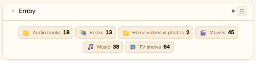
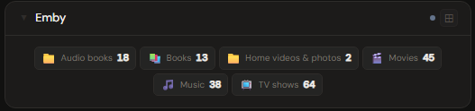
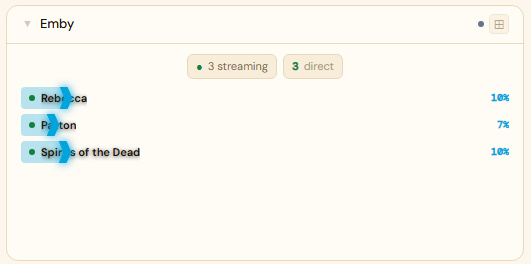
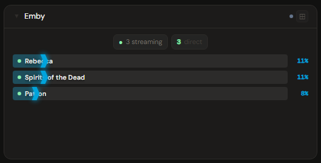
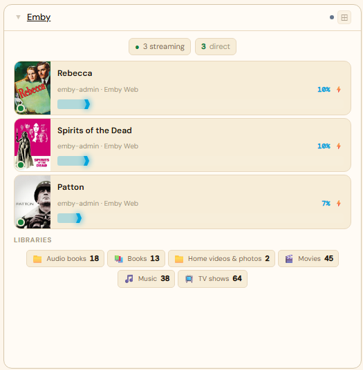
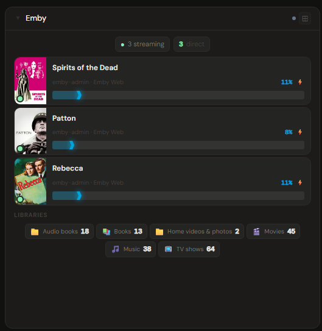

# Emby

**Category:** Media Servers | **Status:** ✅ Tested | **Polling:** 30 s

---

## Integration

**Secret format:** Plain API key

> Emby → Settings → Advanced → API Keys → New API Key. Give it any name (e.g. `stoa`) and copy the generated key.

**URL required:** Required — point at your Emby server port

**Example URL:** `http://192.168.1.10:8096`

### Setup

1. Emby → Settings → Advanced → API Keys → create a new key, copy it
2. Admin → Secrets → New: paste the key
3. Admin → Integrations → New: type `Emby`, URL = `http://emby:8096`, select your secret
4. Admin → Panels → New: type `Emby`, select the integration

---

## Panel

Active stream monitor showing what each user is watching, with transcode vs. direct-play status, playback progress, and library size breakdown. Server version is shown at the top.

### Height behavior

| Height | What you see |
|---|---|
| 1x | Active stream count + currently playing title |
| 2–3x | Stream list with user, title, progress bars, and transcode indicator + library counts |
| 4x+ | Full stream detail (client, quality, transcode vs. direct play) + library breakdown by type + server version |

### How data flows

On each 30-second poll cycle the backend calls Emby's `/Sessions` and `/Library/MediaFolders` endpoints. The session list and library stats are stored in the backend cache keyed by integration ID — the browser never calls Emby directly.

The panel subscribes to **Server-Sent Events (SSE)**. When the worker refreshes the cache, it broadcasts a `cache-update` event on the integration's SSE channel. The panel receives this signal and updates immediately without a page reload. **Refresh Now** (right-click the panel title bar) triggers an out-of-cycle fetch that pushes fresh data through the same SSE path.

### Screenshots

| | Light | Dark |
|---|---|---|
| **1x** |  |  |
| **2x** |  |  |
| **4x** |  |  |

---

## Ratings filter

Set **Allowed ratings** in the panel config (e.g. `G, PG, PG-13, TV-PG`) to hide now-playing sessions for content outside the list — useful on family-shared dashboards. Unrated content is hidden when a filter is active. Matches the item's official rating string as reported by the server.

---

## Notes

- The Emby API key grants read-only access to sessions and library metadata.
- Emby Premier is not required for API access.
