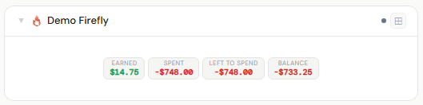
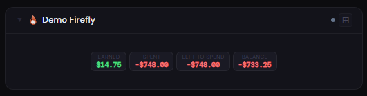
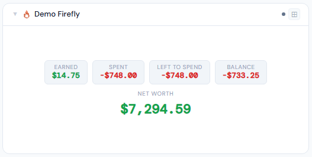
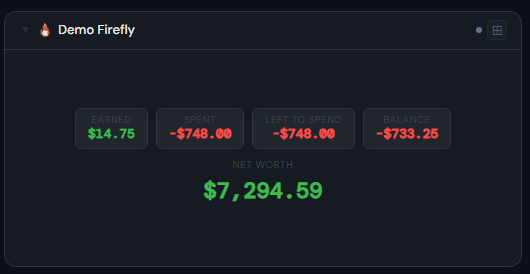
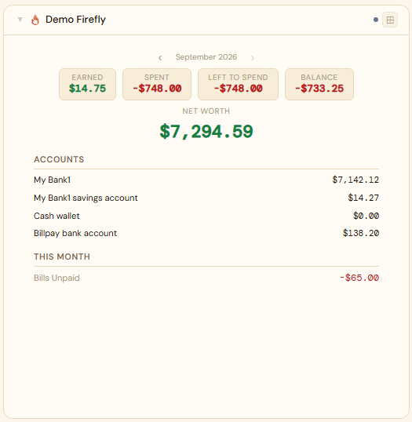
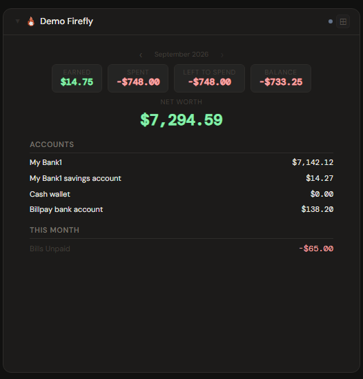

# Firefly III

## What is Firefly III?

Firefly III is a self-hosted personal finance manager. You record income and expenses across accounts, organize them with budgets, categories, and bills, and track net worth over time — a private, double-entry alternative to commercial budgeting apps.

**Official site:** [firefly-iii.org](https://www.firefly-iii.org)

---

## Getting the key

Firefly III's Profile page offers **two different token types** on the same **OAuth** tab — Stoa needs the **Personal Access Token**, not an OAuth Client.

Firefly III → **Profile** (top-right) → **OAuth** tab → scroll to the **Personal Access Tokens** section → **Create New Token** — give it a name, copy the generated token immediately (shown once).

> **If you're asked for a Redirect URL, you're in the wrong section.** That's the "OAuth Clients" panel further up the same page — a separate authorization-code flow for apps that redirect a user's browser back after login. Stoa authenticates with a plain static token instead and has no redirect endpoint to receive that callback, so an OAuth Client won't work here. Personal Access Tokens ask for nothing but a name.

- **Secret format:** Personal Access Token (PAT)
- **URL:** required — point at your Firefly III port, e.g. `http://192.168.1.10:8080`

---

## Add it to Stoa

1. **Admin → Secrets → New** — paste the token.
2. **Admin → Integrations → New** — select **Firefly III**, enter the URL, choose the secret.
3. **Admin → Panels → New** — select **Firefly III**.

---

## Panel

Monthly summary figures (earned, spent, left to spend, balance, bills paid/unpaid) and net worth, styled after the Actual Budget panel. At 4x+, individual asset account balances and a month navigator (‹ › arrows) for browsing past months — the right arrow disables once you're back at the current month, since browsing into the future isn't meaningful for actuals.

### Height behavior

| Height | What you see |
|---|---|
| 1x | Compact tiles — earned, spent, left to spend, balance |
| 2-3x | Same tiles + a prominent net worth figure below |
| 4x+ | Tiles + net worth + month navigator, then account balances and bills paid/unpaid |

### Screenshots

| | Light | Dark |
|---|---|---|
| **1x** |  |  |
| **2x** |  |  |
| **4x** |  |  |

---

## Calendar

Add Firefly III as a calendar source (Profile/Admin → Calendar panel → Calendar sources → **Stoa integration**) to see upcoming bill payment dates and recurring transactions on the calendar. Each expected payment appears as an all-day "Due soon" event 3 days before its due date; recurring bills show every occurrence in the window. See [Calendar](../calendar/README.md#firefly-iii) for details.

---

## Notes

Summary figures default to the current calendar month (so far — not the full month) and update live when you navigate to a past month with the 4x+ panel's ‹ › arrows; the selected month is local to that view and resets to the current month on reload, not saved to the panel's config. Polls hourly — financial data changes infrequently.
