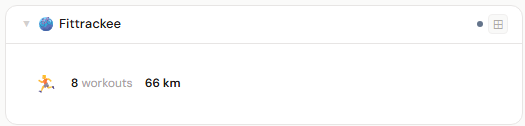
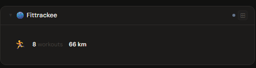
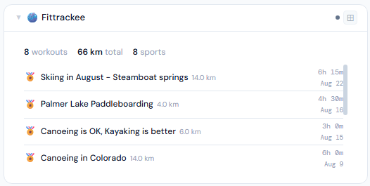
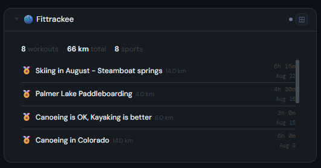
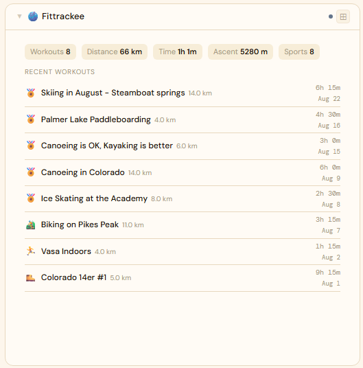
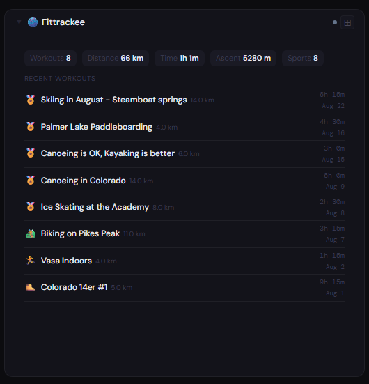

# Fittrackee

## What is Fittrackee?

FitTrackee is a self-hosted outdoor-activity tracker. Upload GPX files from your runs, rides, and hikes and it maps them and computes distance, duration, speed, and elevation stats — a private alternative to Strava for the workouts you own.

**Official site:** [github.com/SamR1/FitTrackee](https://github.com/SamR1/FitTrackee)

---

## Getting the key

Use your Fittrackee login in `email:password` form (e.g. `user@example.com:yourpassword`).

- **Secret format:** `email:password`
- **URL:** required — point at your Fittrackee port, e.g. `http://192.168.1.10:5000`

---

## Add it to Stoa

1. **Admin → Secrets → New** — paste the credential.
2. **Admin → Integrations → New** — select **Fittrackee**, enter the URL, choose the secret.
3. **Admin → Panels → New** — select **Fittrackee**.

---

## Panel

Activity tracker panel — total workouts, sports, distance, duration, and ascent. Recent workout list with sport type, title, distance, speed, and ascent per activity. At 4x+, a time-range pill selector (7d / 30d / 90d / All) recomputes the stats and workout list live for that period — a click, not a saved setting, so it resets to All on reload.

### Height behavior

| Height | What you see |
|---|---|
| 1x | Total workouts + distance + duration |
| 2-3x | Stat chips + recent workout list |
| 4x+ | Time-range pills + stat chips + full workout list with all metrics |

### Screenshots

| | Light | Dark |
|---|---|---|
| **1x** |  |  |
| **2x** |  |  |
| **4x** |  |  |

---

## Notes

**Time-range pills (4x+) use FitTrackee's own period statistics.** Selecting 7d/30d/90d calls FitTrackee's `/api/workouts` with `from`/`to` and `with_statistics=true`, which computes distance/duration/ascent/sport-count totals for that window server-side — Stoa doesn't sum workouts itself. "All" (the default) uses FitTrackee's lifetime profile totals instead, unchanged from before this feature existed.

**Sport icons cover FitTrackee's actual default sport list** (Skiing (Alpine/Cross Country), Canoeing/Kayaking (Whitewater), Standup Paddleboarding, Ice Skating, Inline Skating, Mountain Biking (Electric), Snowshoes, and the original core set) — sports outside this list fall back to a generic 🏅 icon rather than nothing.
