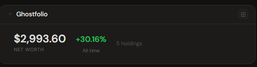
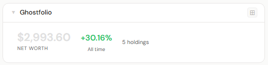
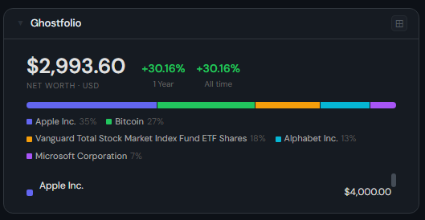
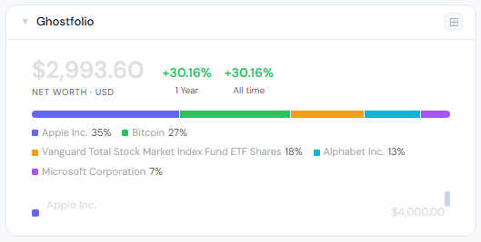
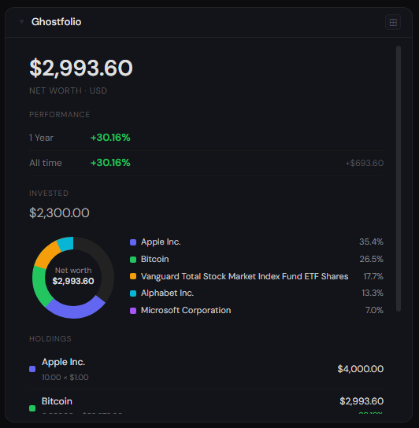
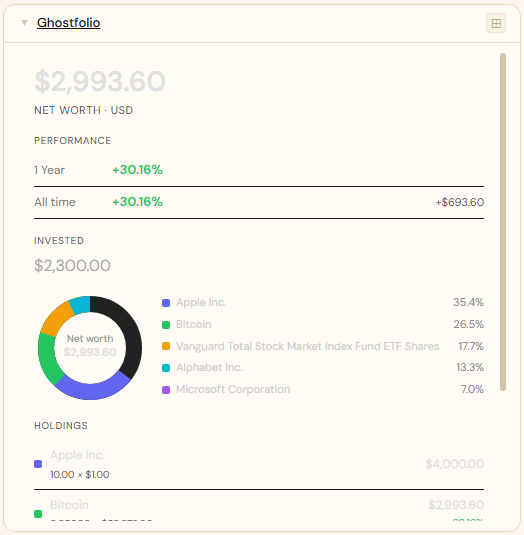

# Ghostfolio

**Category:** Finance | **Status:** Tested | **Polling:** 5 min

---

## Integration

**Secret format:** Security token (recovery key)

> Your Ghostfolio security token is the recovery key you received on first login — it also appears under **My Ghostfolio → User Account → Security Token**. It is used to exchange for a short-lived JWT on each refresh. For production use, OIDC is strongly recommended so the recovery key remains an emergency-only credential.

**URL required:** Required

**Example URL:** `http://192.168.1.10:3333`

### Setup

1. Ghostfolio → **My Ghostfolio → User Account** → copy your **Security Token** (this is the same key Ghostfolio gave you as a "recovery key" on first setup)
2. Stoa → **Admin → Secrets → New**: paste the token, leave username blank → **Save**
3. Stoa → **Admin → Integrations → New** → select **Ghostfolio**, URL = your Ghostfolio address, select the secret → **Save**
4. Stoa → **Admin → Panels → New** → select **Ghostfolio** → **Create**

---

## Panel

Portfolio dashboard showing current net worth, time-range performance metrics, a color-coded holdings allocation donut, and a full holdings list sorted by value.

### Height behavior

| Height | What you see |
|---|---|
| 1x | Net worth · today % change · all-time return · holding count |
| 2–3x | Net worth + Today / 1 Year / All-time badges · colored allocation bar · scrollable holdings list |
| 4x+ | Large net worth · performance rows (Today, 1 Year, All time) · amount invested · holdings donut · full holdings list |

### Screenshots

| | Dark | Light |
|---|---|---|
| **1x** |  |  |
| **2x** |  |  |
| **4x** |  |  |

---

## Notes

- **Security token = recovery key:** Ghostfolio's anonymous auth model uses this single key as both login credential and API token. The `/api/v1/auth/anonymous` endpoint exchanges it for a short-lived JWT; Stoa does this on every panel refresh.
- **Cash accounts:** Manual account balances (savings, 401k, checking) count toward the net worth total but are excluded from the holdings donut and list. The donut shows investment allocation only, so percentages reflect how your invested assets are distributed rather than being dominated by cash.
- **Market data sync:** Stock prices (Yahoo Finance) sync on Ghostfolio's nightly schedule — holdings may show purchase price as current value on day one. Crypto (CoinGecko) populates immediately. Check **Admin → Market Data** in Ghostfolio to trigger a manual refresh.
- **Today's change:** Shows 0 outside market hours or before the first intraday price arrives.
- **API version:** Stoa uses `/api/v2/portfolio/performance` for summary metrics and `/api/v1/portfolio/holdings` for the holdings list, matching current Ghostfolio API versions.
