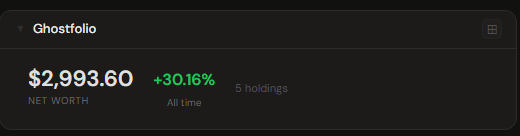
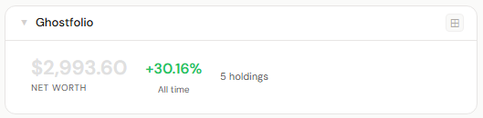
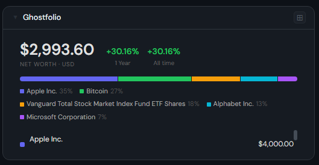
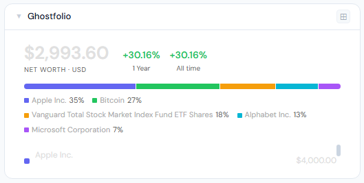
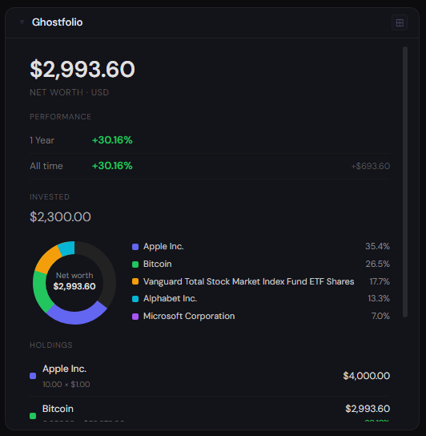
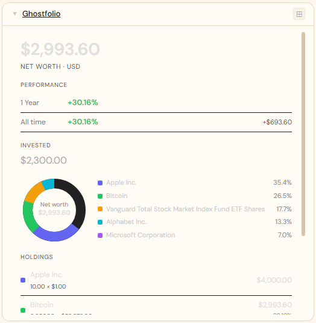

# Ghostfolio

## What is Ghostfolio?

Ghostfolio is a self-hosted, open-source wealth and investment tracker. It consolidates your stocks, ETFs, crypto, and cash across accounts into one dashboard, showing allocation, performance over time, and net worth — a privacy-friendly alternative to portfolio trackers that monetize your data.

**Official site:** [ghostfol.io](https://ghostfol.io)

---

## Getting the key

Ghostfolio → **My Ghostfolio → User Account → Security Token** — this is the same recovery key Ghostfolio gave you on first login. Stoa exchanges it for a short-lived JWT on each refresh. For production, OIDC is recommended so the recovery key stays an emergency-only credential.

- **Secret format:** security token (recovery key) — leave the username blank
- **URL:** required — point at your Ghostfolio address, e.g. `http://192.168.1.10:3333`

---

## Add it to Stoa

1. **Admin → Secrets → New** — paste the token, leave username blank → **Save**.
2. **Admin → Integrations → New** — select **Ghostfolio**, enter the URL, choose the secret.
3. **Admin → Panels → New** — select **Ghostfolio**.

---

## Panel

Portfolio dashboard showing current net worth, time-range performance metrics, a color-coded holdings allocation donut, and a full holdings list sorted by value.

### Height behavior

| Height | What you see |
|---|---|
| 1x | Net worth · today % change · all-time return · holding count |
| 2–3x | Net worth + Today / 1 Year / All-time badges · colored allocation bar · scrollable holdings list |
| 4x+ | Large net worth · performance rows (Today, 1 Year, All time) · amount invested · holdings donut · full holdings list |

### Screenshots

| | Dark | Light |
|---|---|---|
| **1x** |  |  |
| **2x** |  |  |
| **4x** |  |  |

---

## Notes

- **Security token = recovery key:** Ghostfolio's anonymous auth model uses this single key as both login credential and API token. The `/api/v1/auth/anonymous` endpoint exchanges it for a short-lived JWT; Stoa does this on every panel refresh.
- **Cash accounts:** Manual account balances (savings, 401k, checking) count toward the net worth total but are excluded from the holdings donut and list. The donut shows investment allocation only.
- **Market data sync:** Stock prices (Yahoo Finance) sync on Ghostfolio's nightly schedule — holdings may show purchase price as current value on day one. Crypto (CoinGecko) populates immediately. Check **Admin → Market Data** in Ghostfolio to trigger a manual refresh.
- **Today's change:** Shows 0 outside market hours or before the first intraday price arrives.
- **API version:** Stoa uses `/api/v2/portfolio/performance` for summary metrics and `/api/v1/portfolio/holdings` for the holdings list, matching current Ghostfolio API versions.
