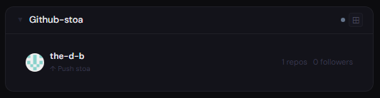
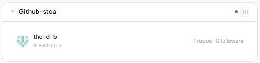
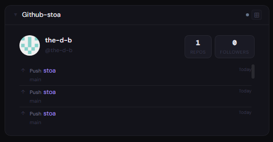
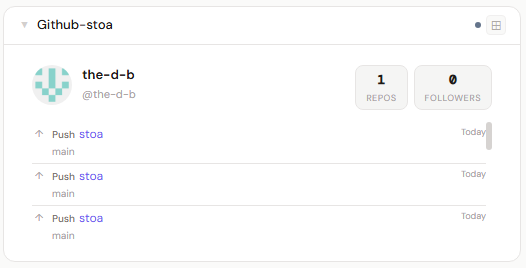
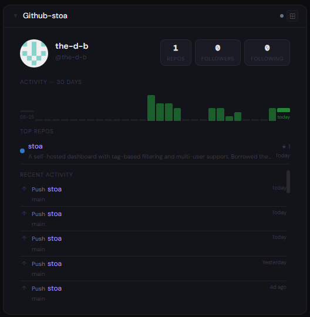
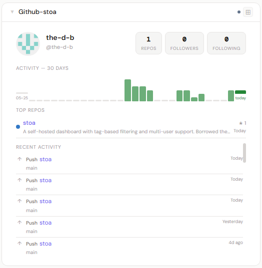

# GitHub

**Category:** Development | **Status:** Tested | **Polling:** 2 min

---

## Integration

**Secret format:** Personal Access Token (classic or fine-grained)

**URL required:** None — always uses `api.github.com`

### Getting a token

**Option A — Classic PAT (simpler)**

1. GitHub → Settings → Developer settings → Personal access tokens → Tokens (classic)
2. Generate new token (classic)
3. Set an expiration and a note (e.g. "Stoa dashboard")
4. Select scopes:
   - `read:user` — profile, bio, follower counts
   - `public_repo` — public repository list and metadata
5. Generate token and copy it immediately (shown once)

**Option B — Fine-grained PAT (more secure)**

1. GitHub → Settings → Developer settings → Personal access tokens → Fine-grained tokens
2. New fine-grained personal access token
3. Under **Repository access**: select "Public Repositories (read-only)"
4. Under **Account permissions**: set **Profile** → Read-only
5. Generate token and copy it immediately

### Setup

1. Admin → Secrets → New: paste the token
2. Admin → Integrations → New: type GitHub, leave URL blank, select the secret
3. Admin → Panels → New: type GitHub

---

## Panel

GitHub profile with avatar, display name, bio, location, and follower/repo/following counts. 30-day event activity bar chart. Top repositories by star count with language color and last-pushed date. Scrollable recent event feed showing pushes, PRs, issues, releases, and more.

### Height behavior

| Height | What you see |
|---|---|
| 1x | Avatar · name · repo and follower counts · most recent event |
| 2–3x | Avatar · handle · location · stat chips · scrolling event feed |
| 4x+ | Full profile header · 30-day activity chart · top repos · full event feed |

### Screenshots

| | Dark | Light |
|---|---|---|
| **1x** |  |  |
| **2x** |  |  |
| **4x** |  |  |

---

## Notes

- Only **public** repos and events are shown with `public_repo` scope. Private activity requires the full `repo` scope on a classic PAT.
- Event history covers the last 30 events returned by GitHub's API (typically up to ~90 days depending on activity volume).
- GitHub's authenticated rate limit is 5 000 requests/hour; polling every 2 minutes uses ~30/hour — well within limits.
- The activity chart counts all event types, not just commits. Low-activity days show a baseline bar so the chart is always visible.
