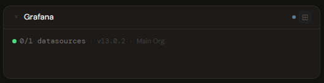
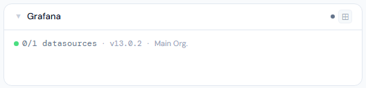
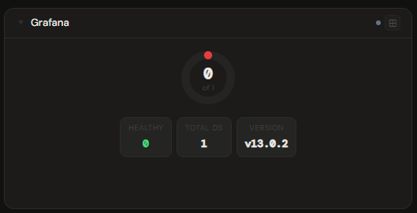
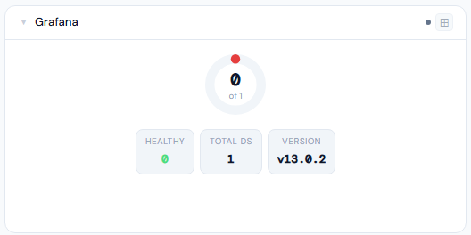
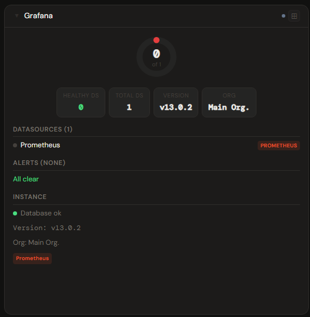
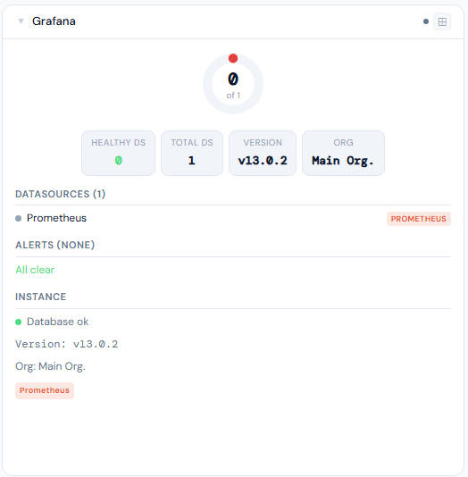

# Grafana

**Category:** Monitoring | **Status:** Tested | **Polling:** 60 s

---

## Integration

**Secret format:** Service Account token (`glsa_...`)

> Grafana → Administration → Service Accounts → Add service account → Add token. Assign Viewer role for datasource/alert data, or Admin role for dashboard and user counts.

**URL required:** Required

**Example URL:** `http://192.168.1.10:3000`

### Setup

1. Grafana → Administration → Service Accounts → Add → create token
2. Admin → Secrets → New: paste the token
3. Admin → Integrations → New: type Grafana, URL = `http://grafana:3000`, select secret
4. Admin → Panels → New: type Grafana

---

## Panel

Datasource health for every configured Grafana datasource, active alerts from unified alerting, and instance metadata (version, database type, org, dashboard count, user count).

### Height behavior

| Height | What you see |
|---|---|
| 1x | Status dot + N/M datasources healthy + firing alert count + version |
| 2–3x | Health donut + stat chips (healthy, unhealthy, total, firing, pending, version) |
| 4x+ | Donut → stat chips → datasource roster → alert list → instance detail |

### Screenshots

| | Dark | Light |
|---|---|---|
| **1x** |  |  |
| **2x** |  |  |
| **4x** |  |  |

---

## Notes

- Dashboard count and user count require the Service Account to have **Admin** role; they show as `—` with a Viewer role.
- Datasource health is polled via Grafana's datasource health-check endpoint — a datasource is "healthy" only if Grafana can successfully query it.
- Unified alerting must be enabled in Grafana for the alert section to populate (legacy alerting is not supported).
