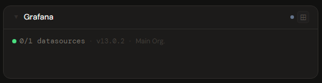
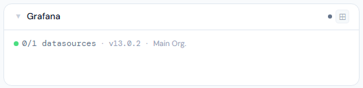
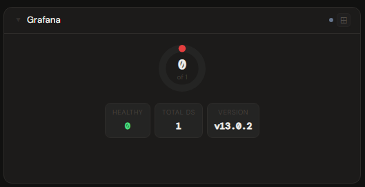
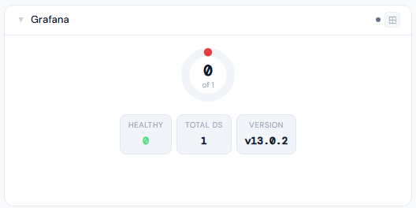
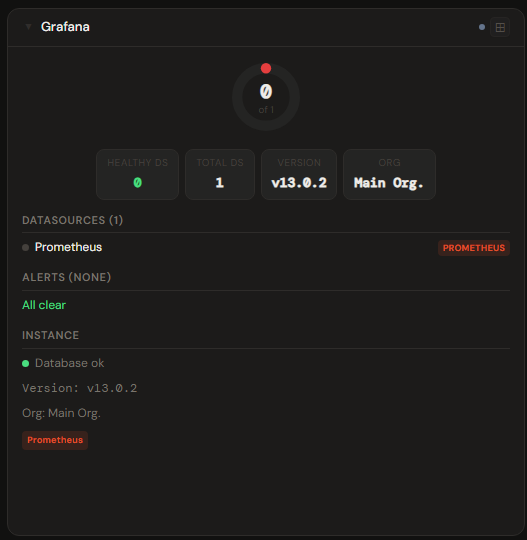
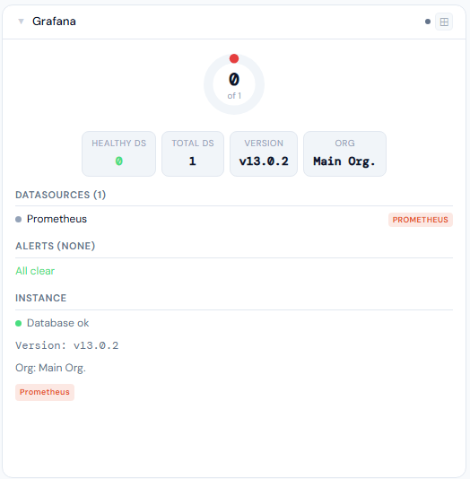

# Grafana

## What is Grafana?

Grafana is an open-source observability and dashboarding platform. It connects to data sources like Prometheus, Loki, and InfluxDB and turns their metrics and logs into visual dashboards, with alerting and a large plugin ecosystem — the visualization layer that commonly pairs with Prometheus.

**Official site:** [grafana.com](https://grafana.com)

---

## Getting the key

Grafana → **Administration → Service Accounts → Add service account → Add token** (starts with `glsa_`). Assign the **Viewer** role for datasource/alert data, or **Admin** for dashboard and user counts.

- **Secret format:** Service Account token (`glsa_...`)
- **URL:** required — point at your Grafana port, e.g. `http://192.168.1.10:3000`

---

## Add it to Stoa

1. **Admin → Secrets → New** — paste the token.
2. **Admin → Integrations → New** — select **Grafana**, enter the URL, choose the secret.
3. **Admin → Panels → New** — select **Grafana**.

---

## Panel

Datasource health for every configured Grafana datasource, active alerts from unified alerting, and instance metadata (version, database type, org, dashboard count, user count).

### Height behavior

| Height | What you see |
|---|---|
| 1x | Status dot + N/M datasources healthy + firing alert count + version |
| 2–3x | Health donut + stat chips (healthy, unhealthy, total, firing, pending, version) |
| 4x+ | Donut → stat chips → datasource roster → alert list → instance detail |

### Screenshots

| | Dark | Light |
|---|---|---|
| **1x** |  |  |
| **2x** |  |  |
| **4x** |  |  |

---

## Notes

- Dashboard count and user count require the Service Account to have **Admin** role; they show as `—` with a Viewer role.
- Datasource health is polled via Grafana's datasource health-check endpoint — a datasource is "healthy" only if Grafana can successfully query it.
- Unified alerting must be enabled in Grafana for the alert section to populate (legacy alerting is not supported).
