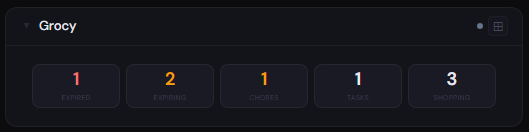
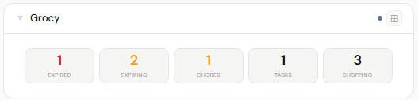
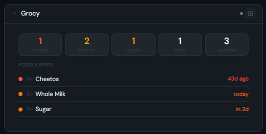
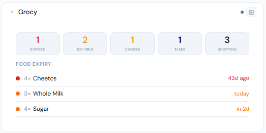
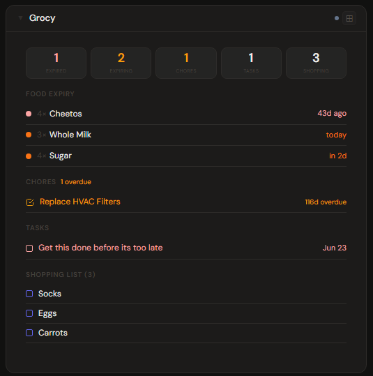
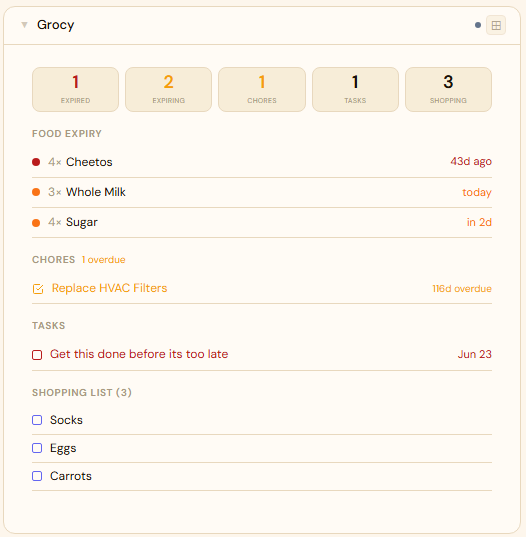

# Grocy

**Category:** Food & Home | **Status:** Tested | **Polling:** 5 min

---

## Integration

**Secret format:** API key

> Grocy → **Manage API Keys** (top-right menu) → **+ Add** → copy the key

**URL required:** Yes — base URL of your Grocy instance

**Example URL:** `http://192.168.1.10:9283`

### Setup

1. In Grocy, open the top-right menu → **Manage API Keys** → **+ Add** → copy the generated key
2. Stoa → **Admin → Secrets → New**: paste the API key (no prefix needed)
3. Stoa → **Admin → Integrations → New**: type **Grocy**, enter your Grocy URL, select the secret
4. Stoa → **Admin → Panels → New**: type **Grocy**, select the integration

> The API key is required — Grocy has no unauthenticated endpoints. If you see "authentication failed", regenerate the key in Grocy and update the secret in Stoa.

---

## Panel

Household management panel — food expiry tracker with urgency color coding, overdue chore list, pending tasks with due dates, and shopping list. All section headers are clickable links to the relevant Grocy page.

### Height behavior

| Height | What you see |
|---|---|
| 1x | Stat chips: Expired · Expiring · Chores · Tasks · Shopping |
| 2–3x | Stat chips + food expiry list |
| 4x+ | Stat chips + food expiry + chores + tasks + shopping list (single scrollable column) |

### Stat chip colors

- **Expired** — red when count > 0
- **Expiring** — amber when count > 0
- **Chores** — amber when overdue
- **Tasks** — white/dim based on pending count

### Screenshots

| | Dark | Light |
|---|---|---|
| **1x** |  |  |
| **2x** |  |  |
| **4x** |  |  |

---

## Notes

- Expiry urgency colors: red = expired, orange = ≤2 days, amber = ≤5 days, yellow = ≤7 days
- Expired vs expiring distinction is based on the best-before date, not Grocy's internal bucket classification
- Chores show their next scheduled date; overdue chores show how many days past due
- Grocy is well-suited to pantry/inventory tracking (bulk goods, prepper stock, restaurant-style daily restocking) — data quality in the panel reflects how thoroughly items are tracked in Grocy
