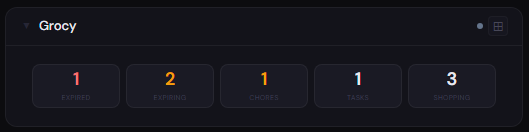
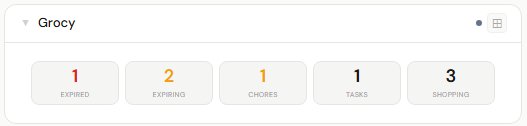
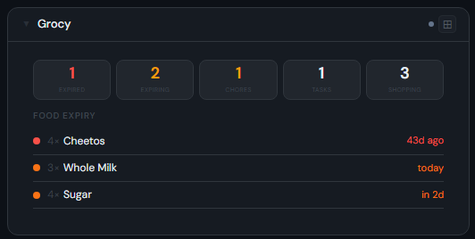
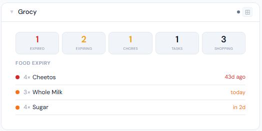
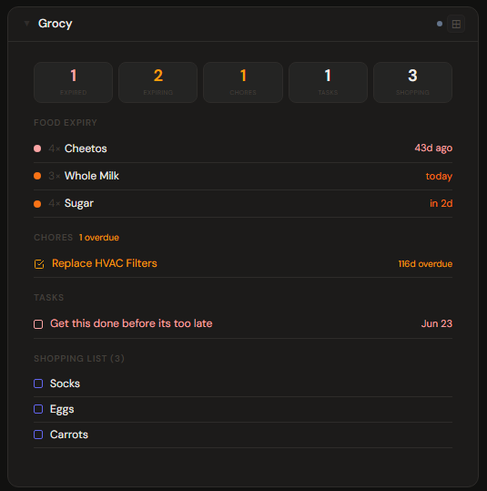
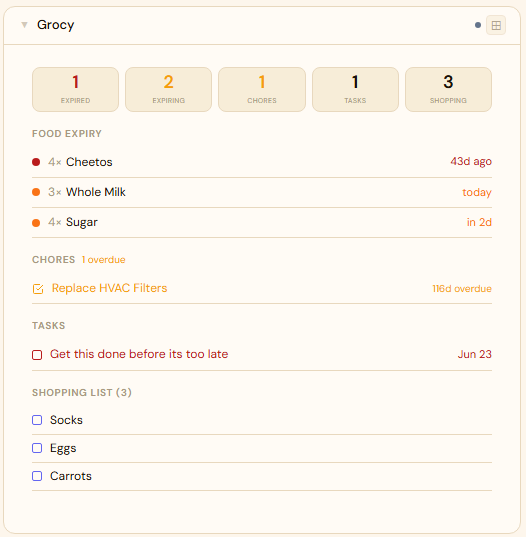

# Grocy

## What is Grocy?

Grocy is a self-hosted "ERP for your groceries" — a household-management app that tracks pantry stock and expiry dates, chores, tasks, and shopping lists, helping cut food waste and stay on top of the home.

**Official site:** [grocy.info](https://grocy.info)

---

## Getting the key

Grocy → top-right menu → **Manage API Keys → + Add** → copy the key. (Grocy has no unauthenticated endpoints, so a key is required.)

- **Secret format:** API key
- **URL:** required — base URL of your Grocy instance, e.g. `http://192.168.1.10:9283`

---

## Add it to Stoa

1. **Admin → Secrets → New** — paste the API key.
2. **Admin → Integrations → New** — select **Grocy**, enter the URL, choose the secret.
3. **Admin → Panels → New** — select **Grocy**.

---

## Panel

Household management panel — food expiry tracker with urgency color coding, overdue chore list, pending tasks with due dates, and shopping list. All section headers are clickable links to the relevant Grocy page.

### Height behavior

| Height | What you see |
|---|---|
| 1x | Stat chips: Expired · Expiring · Chores · Tasks · Shopping |
| 2–3x | Stat chips + food expiry list |
| 4x+ | Stat chips + food expiry + chores + tasks + shopping list (single scrollable column) |

### Stat chip colors

- **Expired** — red when count > 0
- **Expiring** — amber when count > 0
- **Chores** — amber when overdue
- **Tasks** — white/dim based on pending count

### Screenshots

| | Dark | Light |
|---|---|---|
| **1x** |  |  |
| **2x** |  |  |
| **4x** |  |  |

---

## Notes

- Expiry urgency colors: red = expired, orange = ≤2 days, amber = ≤5 days, yellow = ≤7 days
- Expired vs expiring distinction is based on the best-before date, not Grocy's internal bucket classification
- Chores show their next scheduled date; overdue chores show how many days past due
- Grocy is well-suited to pantry/inventory tracking (bulk goods, prepper stock, restaurant-style daily restocking) — data quality in the panel reflects how thoroughly items are tracked in Grocy
