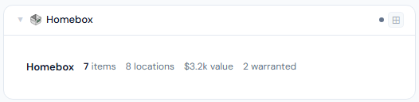
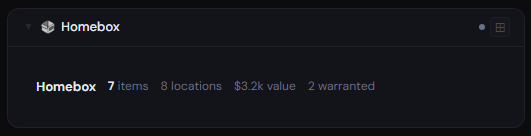
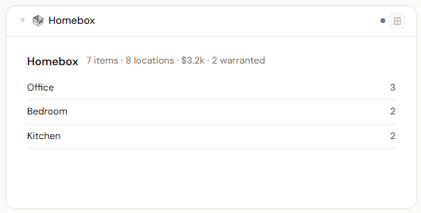
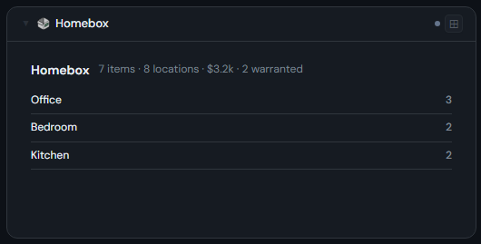
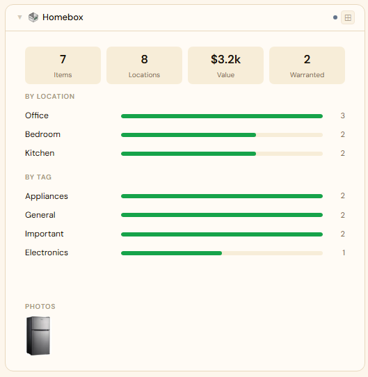
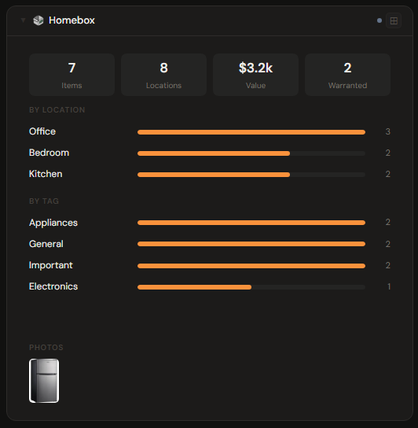

# Homebox

## What is Homebox?

Homebox is a self-hosted home inventory manager. It catalogs your belongings by location and label, tracks purchase details, warranties, and values, and makes it easy to find what you own and where it is — handy for insurance and organization.

**Official site:** [homebox.software](https://homebox.software)

---

## Getting the key

**Recommended:** create an API token — Homebox → Profile → API Tokens — and paste it as-is.

Alternatively, use your Homebox login in `email:password` form (e.g. `user@example.com:yourpassword`); Stoa exchanges it for a session token on each connection.

- **Secret format:** API token (recommended), or `email:password`
- **URL:** required — point at your Homebox port, e.g. `http://192.168.1.10:7745`

---

## Add it to Stoa

1. **Admin → Secrets → New** — paste the credential.
2. **Admin → Integrations → New** — select **Homebox**, enter the URL, choose the secret.
3. **Admin → Panels → New** — select **Homebox**.

---

## Panel

Home inventory panel — total items, locations, labels, warranty count, and inventory value, with a breakdown by location, a breakdown by tag, and a photo strip of items that have a picture attached. Locations, tags, and photos all deep-link back to that item/location/tag's page in Homebox's own web UI. Locations and tags with zero items are hidden — nothing to show for them.

### Height behavior

| Height | What you see |
|---|---|
| 1x | Total items + locations + value + warranties |
| 2-3x | Stat chips + location list |
| 4x+ | Stat chips + by-location bars + by-tag bars + photo strip |

### Screenshots

| | Light | Dark |
|---|---|---|
| **1x** |  |  |
| **2x** |  |  |
| **4x** |  |  |

---

## Notes

**Photos require Stoa's own image proxy.** Homebox's attachment endpoints require the same auth as the rest of its API, so photo thumbnails are fetched server-side by Stoa (with your credential) and streamed to the browser — never loaded directly from Homebox. Nothing to configure; this is automatic.

**Deep links go straight to Homebox, not through Stoa.** Clicking a location, tag, or photo opens that item's page directly on your Homebox server in a new tab — Homebox's own login session (or login prompt, if you're not already signed in there) handles access, the same as visiting any other bookmark.
