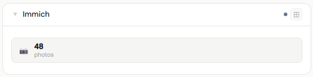
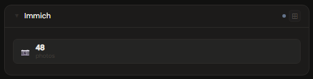
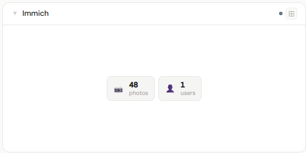
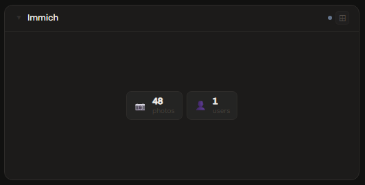
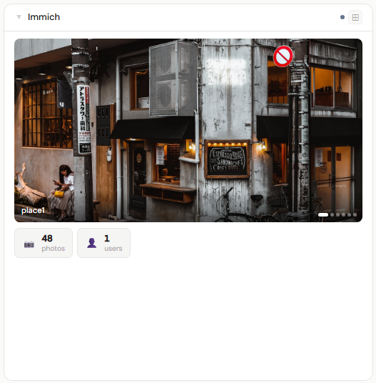
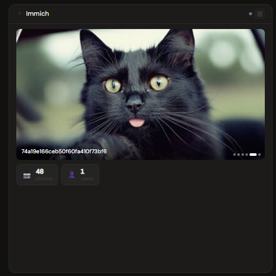

# Immich

**Category:** Photos & Libraries | **Status:** Need Testing | **Polling:** 30 min

---

## Integration

**Secret format:** Plain API key

> Immich → top-right avatar → Account Settings → API Keys → New API Key

**URL required:** Required

**Example URL:** `http://192.168.1.10:2283`

### Setup

1. Immich → top-right avatar → Account Settings → API Keys → create a key
2. Stoa → Admin → Secrets → New: paste the key
3. Stoa → Admin → Integrations → New: select **Immich**, enter URL and secret
4. Stoa → Admin → Panels → New: select **Immich**

---

## Panel

Library stats and a photo preview carousel that pre-loads all thumbnails at mount time so the slideshow cycles with zero network calls.

### What's shown

- **Stat tiles** — photos · videos · albums · people (recognized faces) · storage used · user count; only non-zero values appear
- **Photo carousel** (4x+) — up to 6 random photos fetched from your library and cached for 24 hours; advances every 4 seconds, pauses on hover, navigable via dot indicators

### Height behavior

| Height | What you see |
|---|---|
| 1x | Up to 4 of the best non-zero stat tiles inline |
| 2–3x | Full stat grid — all non-zero tiles, wrapping |
| 4x+ | Photo carousel (top) + stat grid (bottom) |

### Screenshots

| | Light | Dark |
|---|---|---|
| **1x** |  |  |
| **2x** |  |  |
| **4x** |  |  |

---

## Notes

- **API key scope:** A standard user key shows that user's own library stats. An admin key returns server-wide totals (all users combined) and a per-user breakdown for the user count
- **Albums:** The count reflects all albums visible to the authenticated key — shared albums are included if the key has access to them
- **People:** Requires face recognition to be enabled in Immich. The count reflects recognized face groups (named or unnamed). If face recognition is off or no faces have been grouped, this tile is hidden
- **Carousel pre-loading:** All 6 thumbnails are fetched in parallel when the panel first expands, stored as in-memory object URLs, and revoked on unmount. The carousel itself makes no network calls while cycling
- **Photo cache:** The random photo selection is cached for 24 hours per integration. Use the panel's right-click → Refresh to pick a new random set immediately
- **Polling and SSE:** Stoa polls Immich every 30 minutes. Results are cached and pushed to all connected browsers via SSE — no manual refresh needed
- **API calls per poll:** `/api/server/statistics` (counts + storage), `/api/albums` (album count), `/api/people` (face group count), `/api/server/about` (version), `/api/search/random` (preview photos, 24h cached)
