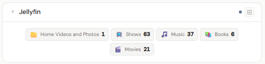
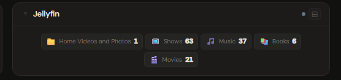
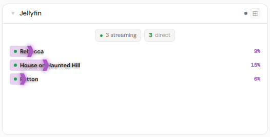
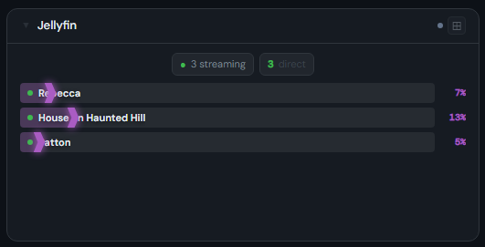
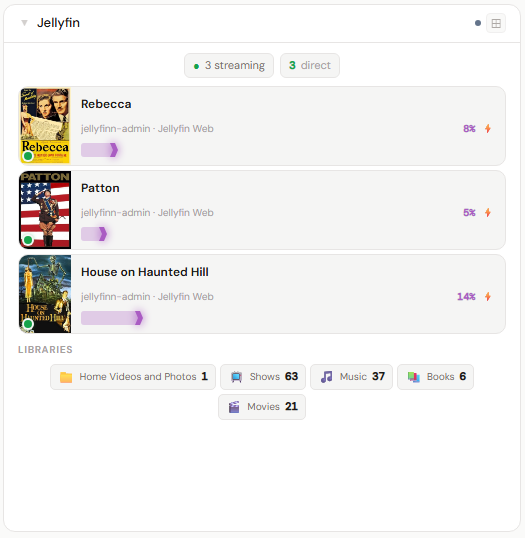
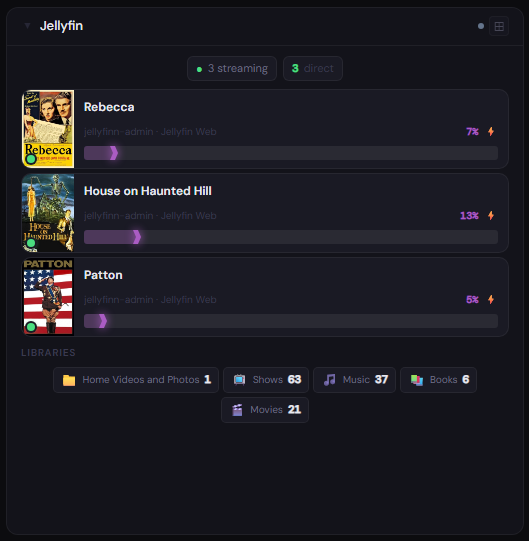

# Jellyfin

**Category:** Media Servers | **Status:** ✅ Tested | **Polling:** 60 s

---

## Integration

**Secret format:** Plain API key

> Jellyfin → Administration → Dashboard → API Keys → click the `+` button to create a new key. Copy the generated key.

**URL required:** Required — point at your Jellyfin server port

**Example URL:** `http://192.168.1.10:8096`

### Setup

1. Jellyfin → Administration → Dashboard → API Keys → create a key, copy it
2. Admin → Secrets → New: paste the key
3. Admin → Integrations → New: type `Jellyfin`, URL = `http://jellyfin:8096`, select your secret
4. Admin → Panels → New: type `Jellyfin`, select the integration

---

## Panel

Active stream monitor showing what each user is watching, with transcode vs. direct-play status, playback progress, and library size breakdown. Server name and version are shown at the top.

### Height behavior

| Height | What you see |
|---|---|
| 1x | Active stream count + currently playing title |
| 2–3x | Stream list with user, title, progress bars, and transcode indicator + library counts |
| 4x+ | Full stream detail (client, quality, transcode codec vs. direct play) + library breakdown by type + server name and version |

### How data flows

On each 60-second poll cycle the backend calls Jellyfin's `/Sessions` and `/Library/MediaFolders` endpoints. The session list and library stats are stored in the backend cache keyed by integration ID — the browser never calls Jellyfin directly.

The panel subscribes to **Server-Sent Events (SSE)**. When the worker refreshes the cache, it broadcasts a `cache-update` event on the integration's SSE channel. The panel receives this signal and updates immediately without a page reload. **Refresh Now** (right-click the panel title bar) triggers an out-of-cycle fetch that pushes fresh data through the same SSE path.

### Screenshots

| | Light | Dark |
|---|---|---|
| **1x** |  |  |
| **2x** |  |  |
| **4x** |  |  |

---

## Notes

- The API key grants read access to the Jellyfin API. No write permissions are used.
- Library counts reflect all media folders visible to the API key's associated user.
