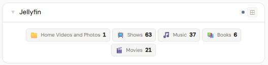
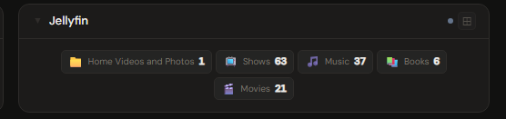
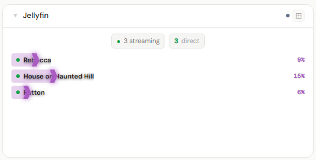
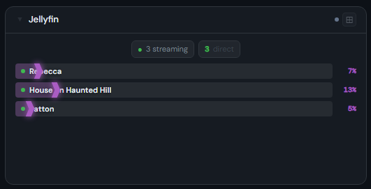
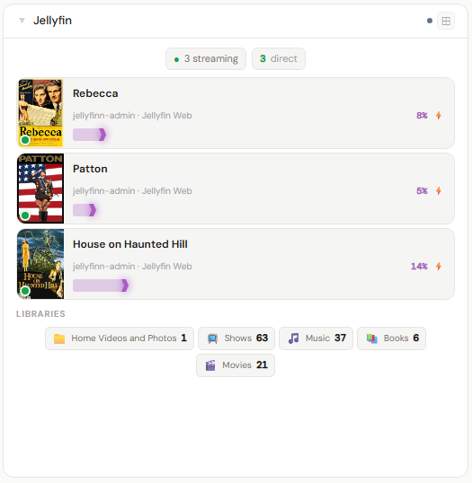
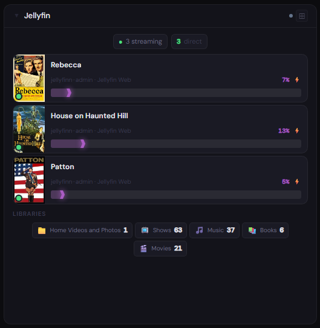

# Jellyfin

## What is Jellyfin?

Jellyfin is a free, fully open-source media server — a community-driven alternative to Plex and Emby with no paid tiers and no account requirement. It catalogs your movies, TV shows, music, and photos with artwork and metadata and streams them to web, mobile, and TV clients, transcoding when a device needs it. Because it's self-contained and open source, nothing phones home and every feature is available without a subscription.

**Official site:** [jellyfin.org](https://jellyfin.org)

---

## Getting the key

Jellyfin → **Administration → Dashboard → API Keys** → click the `+` button to create a new key, then copy it.

- **Secret format:** plain API key
- **URL:** required — point at your Jellyfin server port, e.g. `http://192.168.1.10:8096`

---

## Add it to Stoa

1. **Admin → Secrets → New** — paste the API key.
2. **Admin → Integrations → New** — select **Jellyfin**, enter the URL, choose the secret.
3. **Admin → Panels → New** — select **Jellyfin**.

---

## Panel

Active stream monitor showing what each user is watching, with transcode vs. direct-play status, playback progress, and library size breakdown. Server name and version are shown at the top.

### Height behavior

| Height | What you see |
|---|---|
| 1x | Active stream count + currently playing title |
| 2–3x | Stream list with user, title, progress bars, and transcode indicator + library counts |
| 4x+ | Full stream detail (client, quality, transcode codec vs. direct play) + library breakdown by type + server name and version |

### How data flows

On each 60-second poll cycle the backend calls Jellyfin's `/Sessions` and `/Library/MediaFolders` endpoints. The session list and library stats are stored in the backend cache keyed by integration ID — the browser never calls Jellyfin directly.

The panel subscribes to **Server-Sent Events (SSE)**. When the worker refreshes the cache, it broadcasts a `cache-update` event on the integration's SSE channel. The panel receives this signal and updates immediately without a page reload. **Refresh Now** (right-click the panel title bar) triggers an out-of-cycle fetch that pushes fresh data through the same SSE path.

### Screenshots

| | Light | Dark |
|---|---|---|
| **1x** |  |  |
| **2x** |  |  |
| **4x** |  |  |

---

## Ratings filter

Set **Allowed ratings** in the panel config (e.g. `G, PG, PG-13, TV-PG`) to hide now-playing sessions for content outside the list — useful on family-shared dashboards. Unrated content is hidden when a filter is active. Matches the item's official rating string as reported by the server.

---

## Notes

- The API key grants read access to the Jellyfin API. No write permissions are used.
- Library counts reflect all media folders visible to the API key's associated user.
