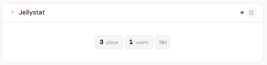
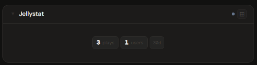
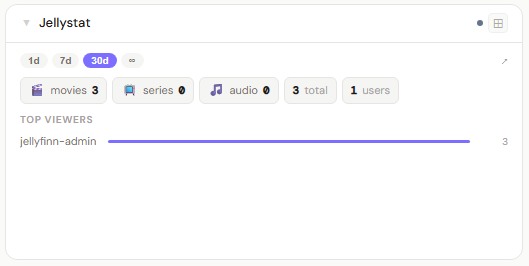
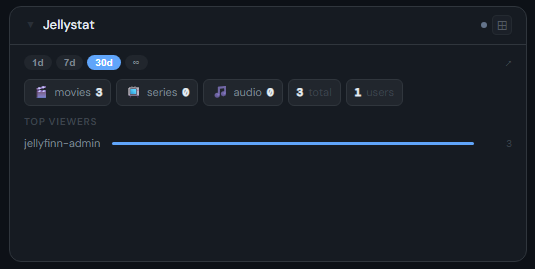
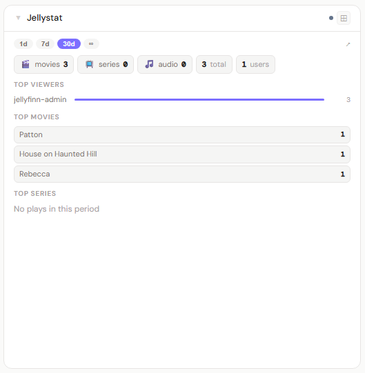
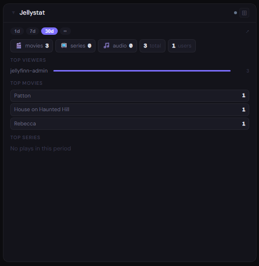

# Jellystat

**Category:** Media Servers | **Status:** ✅ Tested | **Polling:** 60 s

---

## Integration

**Secret format:** Plain API key

> Jellystat → Settings → generate or copy the API Key from the API section.

**URL required:** Required — point at your Jellystat port

**Example URL:** `http://192.168.1.10:3004`

### Setup

1. Jellystat → Settings → copy or generate the API Key
2. Admin → Secrets → New: paste the key
3. Admin → Integrations → New: type `Jellystat`, URL = `http://jellystat:3004`, select your secret
4. Admin → Panels → New: type `Jellystat`, select the integration

---

## Panel

**Analytics panel** — shows historical play statistics broken down by media type (movies, series, audio, other), top viewers with a bar chart, top movies, and top series for the selected time range. This is not a now-playing panel; for live stream monitoring use the Jellyfin panel directly.

### Height behavior

| Height | What you see |
|---|---|
| 1x | Stat tiles: total plays · active users · time range label |
| 2–3x | Time range picker · per-type view chips (movies / series / audio / other / total) · top viewers with bar chart |
| 4x+ | + Top movies list · top series list |

### Time range selection

The `[1d] [7d] [30d] [∞]` pill picker controls the reporting window. Selecting a pill re-fetches data for that period. The `∞` option returns all-time data from Jellystat's full history. The selected range is persisted to the panel config and restored on reload.

### How data flows

On each 60-second poll cycle the backend queries Jellystat's statistics API for the configured time range, retrieving view counts by media type, top users, top movies, and top series. Results are cached by integration ID.

The panel subscribes to **Server-Sent Events (SSE)**. When the worker refreshes the cache, it broadcasts a `cache-update` event on the integration's SSE channel. When a time range pill is changed, the frontend re-fetches with the new `timeRange` parameter and the backend queries Jellystat fresh for that window — bypassing the cache.

### Screenshots

| | Light | Dark |
|---|---|---|
| **1x** |  |  |
| **2x** |  |  |
| **4x** |  |  |

---

## Notes

- Jellystat must be pointed at a Jellyfin server and have an active sync to record play history.
- The user count shown in the 1x tile reflects the number of users who appear in the top users list, not total Jellyfin accounts.
