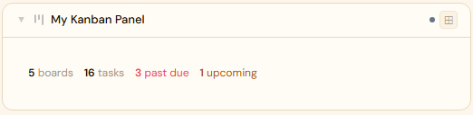
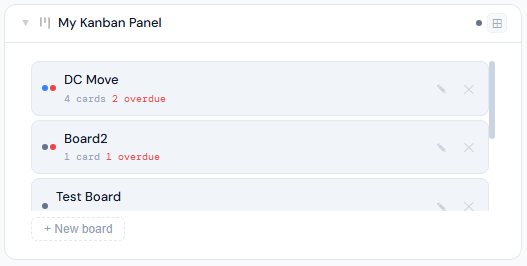
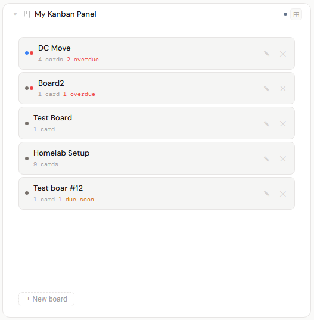
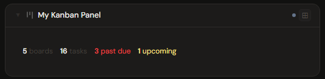
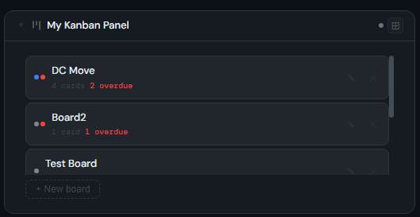
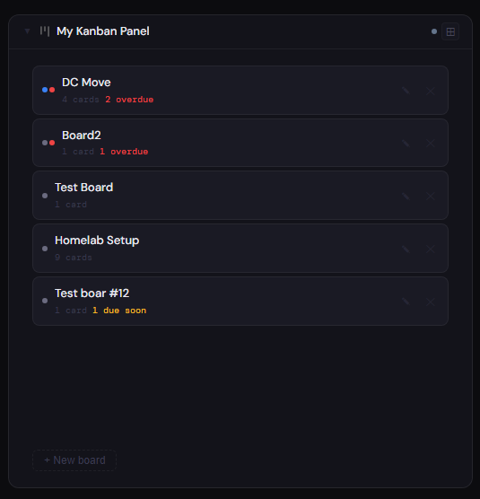
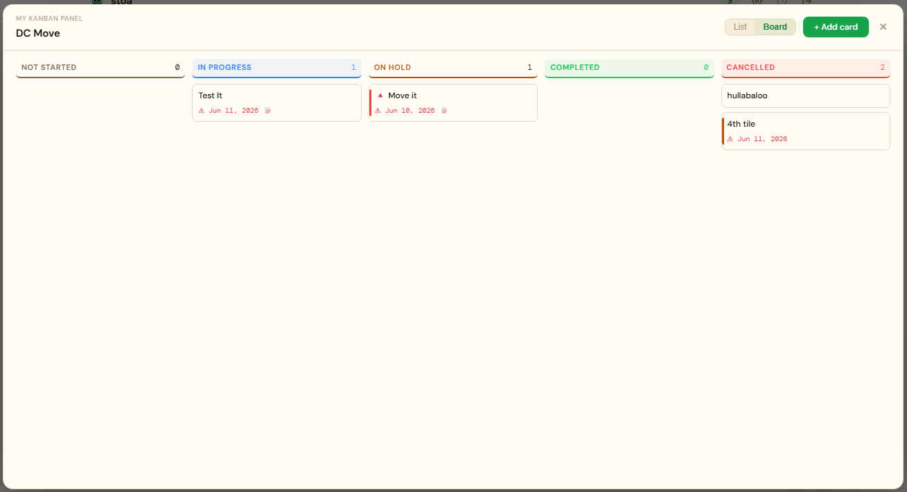
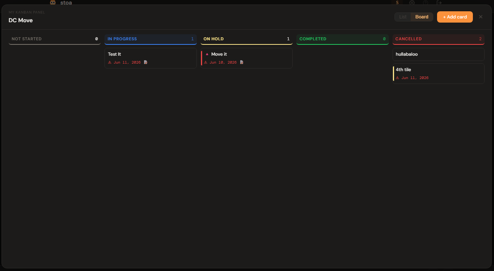

# Kanban

## What is Kanban?

Kanban is a built-in Stoa panel for tracking tasks on boards — no external service or integration needed; data is stored locally in Stoa. Cards move across swim lanes (Not Started → In Progress → On Hold → Completed → Cancelled), with drag-and-drop on desktop and a lane picker on mobile.

---

## Panel

Task tracking panel - multiple named boards per panel. List view (flat table with status filter pills) and Board view (5 swim lanes: Not Started / In Progress / On Hold / Completed / Cancelled). Drag and drop on desktop; lane picker + Move button on mobile. Cards can be marked Normal/High/Urgent priority — High and Urgent cards get a colored accent stripe (and, for Urgent, a 🔺 marker) so they stand out on a busy board instead of blurring together. Boards can be renamed in place via the ✎ icon next to each board in the list.

### Height behavior

| Height | What you see |
|---|---|
| 1x | Compact summary — board count, total tasks, past-due count, upcoming count |
| 2x+ | Full scrollable board list (card counts, due-soon/overdue indicators, rename/delete) + add-board form |

Opening a board (any panel height) launches a full-screen overlay with the swim-lane board view or a sortable/filterable list view.

### Screenshots

| 1x | 2x | 4x |
|---|---|---|
|  |  |  |
|  |  |  |

A single board maximized in the full-screen overlay:

| Light | Dark |
|---|---|
|  |  |

---

## Notes

Cards have: title (required), status, priority (Normal/High/Urgent, optional), due date (optional), notes (optional — plain text; no markdown/rich formatting by design). Add as a calendar source to show cards with due dates on the Calendar (calendar events don't currently reflect priority color). Global search (title bar) matches card title, card notes, and board name.
