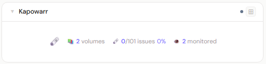
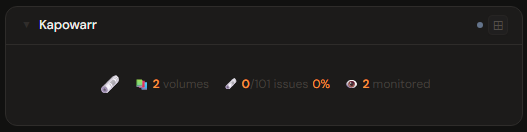
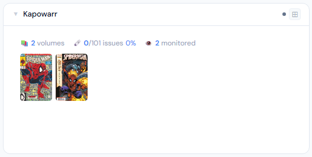
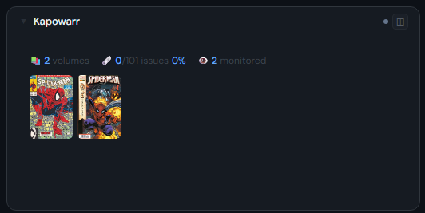
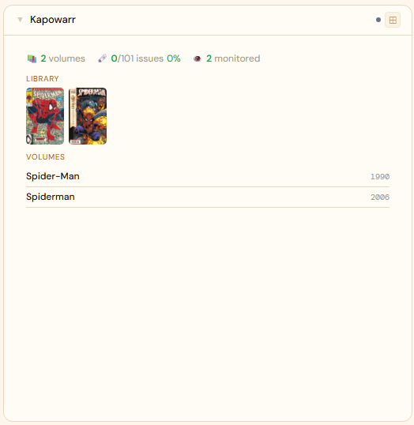
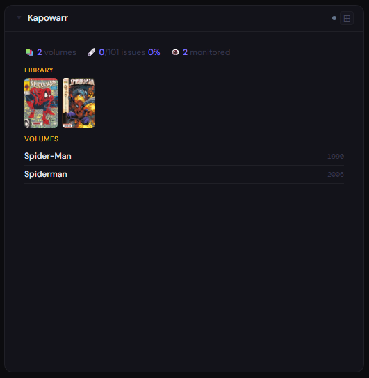

# Kapowarr

**Category:** Comics & Manga | **Status:** Tested | **Polling:** 30 min

---

## Integration

**Secret format:** Plain API key

> Kapowarr → Settings → API Key

**URL required:** Required

**Example URL:** `http://kapowarr:5656`

### Setup

1. Kapowarr → Settings → copy API Key
2. Stoa → Admin → Secrets → New: paste the key
3. Stoa → Admin → Integrations → New: select **Kapowarr**, enter URL and secret
4. Stoa → Admin → Panels → New: select **Kapowarr**

---

## Panel

Western comics downloader showing collection stats, issue download progress, volume library filmstrip, and an active download queue filmstrip.

### What's shown

- **Stats** — volume count · downloaded/total issues with percentage · monitored count · active queue depth
- **Library filmstrip** (2x+) — scrollable cover strip of all volumes in your library
- **Downloading filmstrip** (4x+) — cover strip of volumes currently in the download queue; only shown when the queue is non-empty
- **List** (4x+) — active download queue with status when downloading; falls back to the full volume list when the queue is idle

### Height behavior

| Height | What you see |
|---|---|
| 1x | Volume · issue download % · monitored · queue counts centered with panel icon |
| 2–3x | Stats + scrollable library cover filmstrip |
| 4x+ | Library filmstrip + downloading filmstrip (if active) + queue or volume list |

### Screenshots

| | Light | Dark |
|---|---|---|
| **1x** |  |  |
| **2x** |  |  |
| **4x** |  |  |

---

## Notes

- **Auth:** API key is appended as the `api_key` query parameter on all requests
- **Cover proxy:** Volume covers are fetched server-side by Stoa and cached in the browser for 24 hours — the browser never contacts Kapowarr directly; only the Stoa server needs network access to it
- **Downloading filmstrip:** The queue strip reuses the same cover proxy as the library strip (`/api/volumes/{id}/cover`). If a queued volume has no cover art yet, a text placeholder is shown
- **Polling and SSE:** Stoa polls Kapowarr every 30 minutes. Results are cached and pushed to all connected browsers via SSE — no manual refresh needed
- **API calls per poll:** `GET /api/volumes/stats` (collection counts and download progress), `GET /api/volumes` (volume list), `GET /api/activity/queue` (active download queue)
