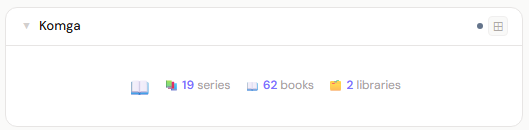
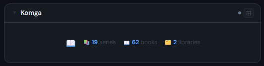
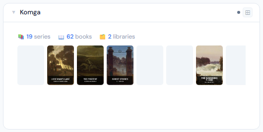
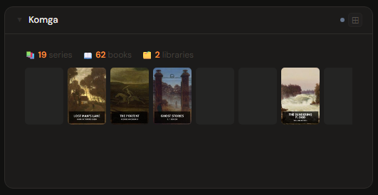
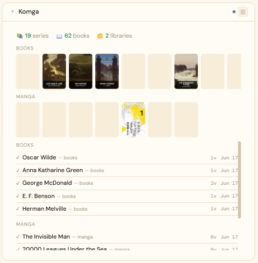
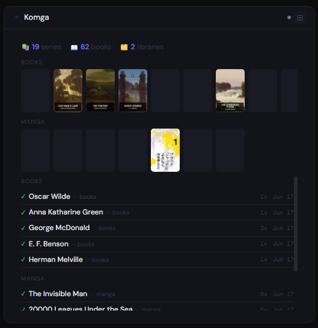

# Komga

**Category:** Photos & Libraries | **Status:** Tested | **Polling:** 30 min

---

## Integration

**Secret format:** `username:password` or plain API key

> Your Komga login credentials, or an API key from Komga → Settings → API Keys.

**URL required:** Required

**Example URL:** `http://192.168.1.10:8080`

### Setup

1. Format as `username:password` **or** get an API key from Komga → Settings → API Keys
2. Stoa → Admin → Secrets → New: paste the credential
3. Stoa → Admin → Integrations → New: select **Komga**, enter URL and secret
4. Stoa → Admin → Panels → New: select **Komga**

---

## Panel

Library reader showing series and book counts, per-library scrollable cover filmstrips, and a recently-added list grouped by library.

### What's shown

- **Stats** — series count · book count · library count
- **Cover filmstrip** (2x+) — scrollable strip of recently added series; hover left/right edge to scroll
- **Per-library filmstrips** (4x+) — one strip per library, each labelled, drawn from the 30 most recently added series
- **Recently added list** (4x+) — recently added series grouped by library with sticky group headers, top 5 per library

### Height behavior

| Height | What you see |
|---|---|
| 1x | Series · book · library counts centered with panel icon |
| 2–3x | Stats + single combined cover filmstrip |
| 4x+ | Stats + per-library cover filmstrips + recently added grouped by library |

### Screenshots

| | Light | Dark |
|---|---|---|
| **1x** |  |  |
| **2x** |  |  |
| **4x** |  |  |

---

## Ratings filter

Set **Maximum age rating** (years) in the panel config to hide series above it (uses Komga's per-series age rating metadata). Series without a rating set are hidden when a filter is active.

---

## Notes

- **Auth:** `username:password` sends HTTP Basic auth; a plain API key is sent as the `X-API-Key` header. Both formats are auto-detected by checking for a colon in the secret
- **Cover proxy:** Thumbnails are fetched server-side by Stoa and cached in the browser for 24 hours — the browser never contacts Komga directly; only the Stoa server needs network access to it
- **Library grouping:** The 4x filmstrips and list are derived from the 30 most recently added series. Libraries with no recent additions will not appear as a strip
- **Polling and SSE:** Stoa polls Komga every 30 minutes. Results are cached and pushed to all connected browsers via SSE — no manual refresh needed
- **API calls per poll:** `GET /api/v1/libraries` (library list), `GET /api/v1/series?page=0&size=1` (series count), `GET /api/v1/books?page=0&size=1` (book count), `GET /api/v1/series/new?page=0&size=30` (recently added)
