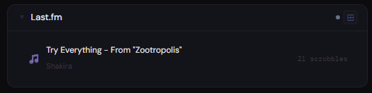
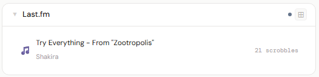
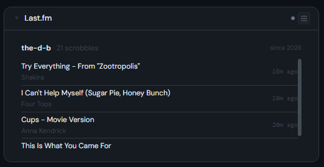
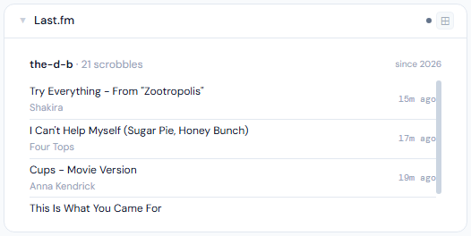
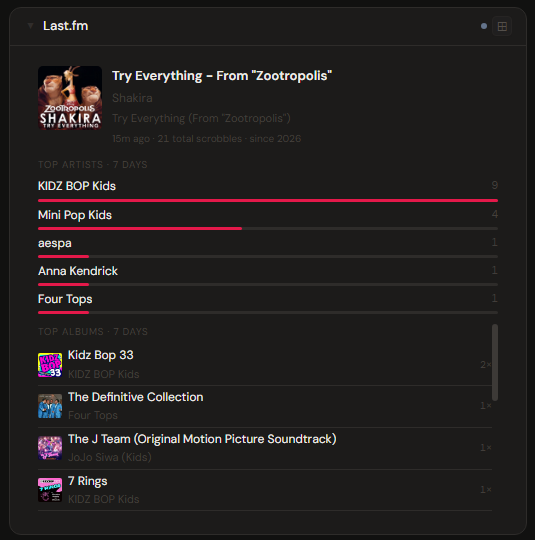
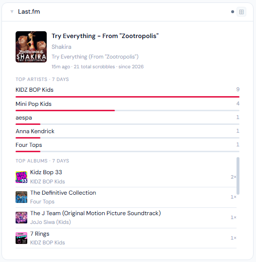

# Last.fm

**Category:** Music | **Status:** Tested | **Polling:** 30 s

---

## Integration

**Secret format:** `username:apiKey`

> Your Last.fm username and a free API key, colon-separated: `yourusername:yourapikey`

**URL required:** None (Last.fm public API)

### Setup

1. Log in to Last.fm and go to **last.fm/api** → click **"Get an API account"**
2. Fill in the form — name and description can be anything (e.g. "Stoa"), leave the Callback URL blank
3. Submit — your **API key** is shown immediately on the next page. Copy it (you do not need the Shared Secret)
4. Stoa → **Admin → Secrets → New**: paste `yourusername:yourapikey` (colon-separated, no other prefix)
5. Stoa → **Admin → Integrations → New** → select **Last.fm**, no URL needed, select the secret → **Save**
6. Stoa → **Admin → Panels → New** → select **Last.fm**, select the integration

> **Connect Spotify for scrobbling:** In Last.fm → **Settings → Music Services → Spotify → Connect**. From that point, everything you play on Spotify is recorded automatically. The panel updates within seconds of a track starting.

---

## Panel

Music scrobbling panel — live now-playing indicator, recent scrobble history, lifetime scrobble count, top artists bar chart (7-day), and top albums and tracks (7-day) with artwork.

### Height behavior

| Height | What you see |
|---|---|
| 1x | Now-playing dot · current track · artist · total scrobble count |
| 2–3x | Now-playing header + recent scrobble history (4 tracks at 2x, 7 at 3x) |
| 4x+ | Album art + current track + stats + top artists chart + top albums + top tracks (scrollable) |
| 5x+ | All of above + recent scrobbles section |

### Now playing

- A pulsing red dot appears when a track is actively scrobbling
- Updates within ~30 seconds of a new track starting (the panel's poll interval)
- If nothing is playing, shows the most recently scrobbled track instead

### Top charts

- Top artists, top albums, and top tracks all use a **7-day rolling window**
- Top artists displayed as a proportional bar chart with play counts
- Top albums and tracks include artwork where available

### Screenshots

| | Dark | Light |
|---|---|---|
| **1x** |  |  |
| **2x** |  |  |
| **4x** |  |  |

---

## Notes

- Last.fm's API is public and free — no OAuth, no premium requirement, no rate limiting concerns for a single-user dashboard
- Your Last.fm profile must be set to **public** (the default) for the API to return data
- The top charts populate after a week of scrobble history; the panel still shows now-playing and recent tracks from day one
- Last.fm removed artist images from their API in 2020 — artist art is not available; album and track art still loads normally
