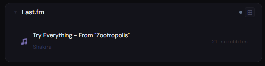
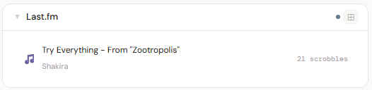
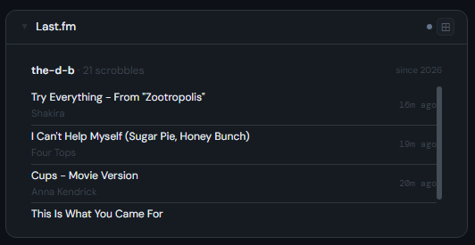
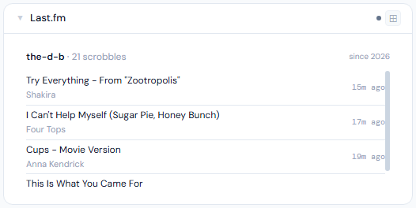
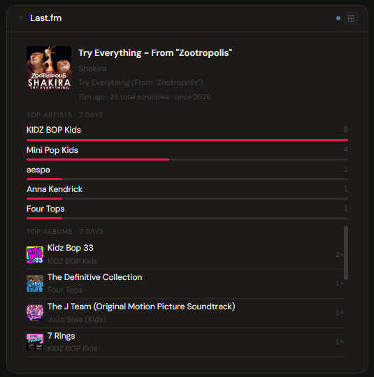
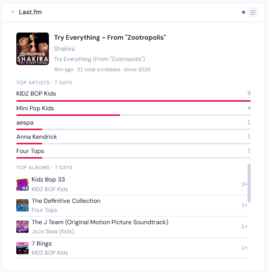

# Last.fm

## What is Last.fm?

Last.fm is a music-tracking service that "scrobbles" (logs) the songs you play from Spotify, your local player, and many other sources, building a history and charts of your listening. Stoa reads it via the free public API — a no-Premium alternative to the Spotify integration.

**Official site:** [last.fm](https://www.last.fm)

---

## Getting the key

Log in to Last.fm, go to [last.fm/api](https://www.last.fm/api) → **Get an API account**, fill in any name/description (leave Callback URL blank), and copy the **API key** shown on the next page (you don't need the Shared Secret). Combine with your username.

- **Secret format:** `username:apiKey`
- **URL:** none — Last.fm's public API

> **Connect Spotify for scrobbling:** In Last.fm → Settings → Music Services → Spotify → Connect. From then on, everything you play on Spotify is recorded automatically, and the panel updates within seconds of a track starting.

---

## Add it to Stoa

1. **Admin → Secrets → New** — paste `yourusername:yourapikey`.
2. **Admin → Integrations → New** — select **Last.fm**, no URL, choose the secret.
3. **Admin → Panels → New** — select **Last.fm**.

---

## Panel

Music scrobbling panel — live now-playing indicator, recent scrobble history, lifetime scrobble count, top artists bar chart (7-day), and top albums and tracks (7-day) with artwork.

### Height behavior

| Height | What you see |
|---|---|
| 1x | Now-playing dot · current track · artist · total scrobble count |
| 2–3x | Now-playing header + recent scrobble history (4 tracks at 2x, 7 at 3x) |
| 4x+ | Album art + current track + stats + top artists chart + top albums + top tracks (scrollable) |
| 5x+ | All of above + recent scrobbles section |

### Now playing

- A pulsing red dot appears when a track is actively scrobbling
- Updates within ~30 seconds of a new track starting (the panel's poll interval)
- If nothing is playing, shows the most recently scrobbled track instead

### Top charts

- Top artists, top albums, and top tracks all use a **7-day rolling window**
- Top artists displayed as a proportional bar chart with play counts
- Top albums and tracks include artwork where available

### Screenshots

| | Dark | Light |
|---|---|---|
| **1x** |  |  |
| **2x** |  |  |
| **4x** |  |  |

---

## Notes

- Last.fm's API is public and free — no OAuth, no premium requirement, no rate limiting concerns for a single-user dashboard
- Your Last.fm profile must be set to **public** (the default) for the API to return data
- The top charts populate after a week of scrobble history; the panel still shows now-playing and recent tracks from day one
- Last.fm removed artist images from their API in 2020 — artist art is not available; album and track art still loads normally
