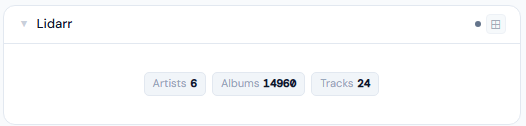
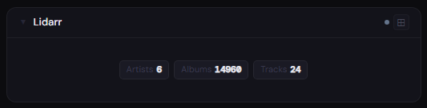
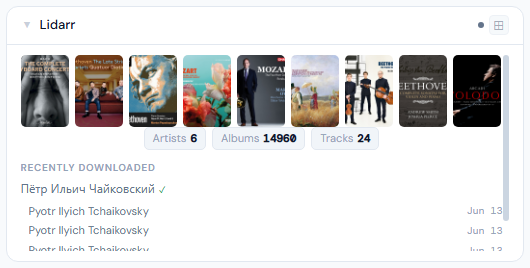
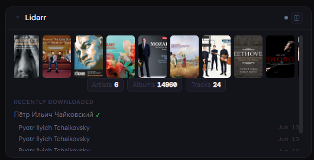
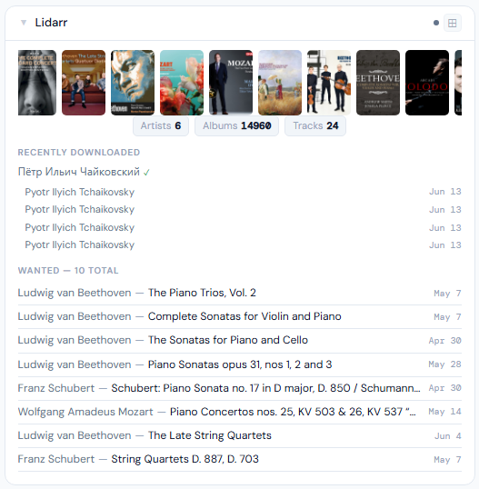
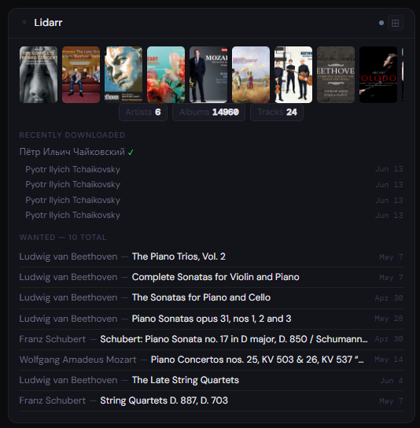

# Lidarr

**Category:** Media Management | **Status:** ✅ Tested | **Polling:** 30 min

---

## Integration

**Secret format:** Plain API key

> Lidarr → Settings → General → Security → API Key

**URL required:** Required — point at your Lidarr port

**Example URL:** `http://192.168.1.10:8686`

### Setup

1. Lidarr → Settings → General → copy the API Key
2. Admin → Secrets → New: paste the key
3. Admin → Integrations → New: type `Lidarr`, URL = `http://lidarr:8686`, select your secret
4. Admin → Panels → New: type `Lidarr`, select the integration

---

## Panel

Music library overview with recently downloaded albums, wanted/missing albums, and library stats (artists / albums / tracks on disk). A poster artwork filmstrip appears at 4x.

### Height behavior

| Height | What you see |
|---|---|
| 1x | Stat chips: artist count · album count · track count |
| 2x | Stat chips + recently downloaded albums (grouped by artist) |
| 4x+ | Album artwork filmstrip + stat chips + recently downloaded + wanted albums |

### Artwork filmstrip (4x+)

The 4x filmstrip shows album cover artwork for missing albums and recently downloaded albums — a "want + got" view of your music library activity. Artwork is fetched from Lidarr through Stoa's **image proxy** (`/api/images/proxy`), so your Lidarr instance does not need to be publicly accessible.

### How data flows

On each 30-minute poll cycle the backend calls:

| Endpoint | Data retrieved |
|---|---|
| `GET /api/v1/history` | Recently grabbed/imported albums with cover URLs |
| `GET /api/v1/wanted/missing` | Albums wanted but not on disk, with cover URLs |
| `GET /api/v1/artist` | Artist count |
| `GET /api/v1/album` | Album count, track file counts |

All data is cached by integration ID. The browser never calls Lidarr directly, and album artwork is served through Stoa's image proxy — Lidarr's internal URLs are never exposed to the browser.

The panel subscribes to **Server-Sent Events (SSE)**. When the worker refreshes the cache, it broadcasts a `cache-update` event on the integration's SSE channel. The panel updates automatically without a page reload.

### Screenshots

| | Light | Dark |
|---|---|---|
| **1x** |  |  |
| **2x** |  |  |
| **4x** |  |  |

---

## Notes

**Calendar:** Lidarr release dates appear on the Calendar panel. Add Lidarr as a calendar source in Profile → Calendar Sources.

**Wanted sample:** The wanted list shows a random 8-album sample that re-shuffles on each data refresh.
