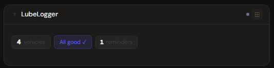
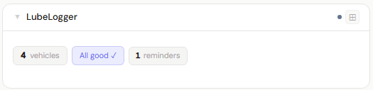
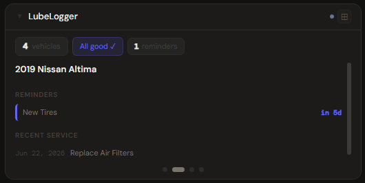
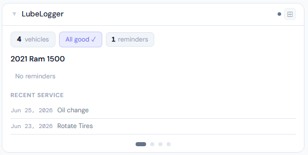
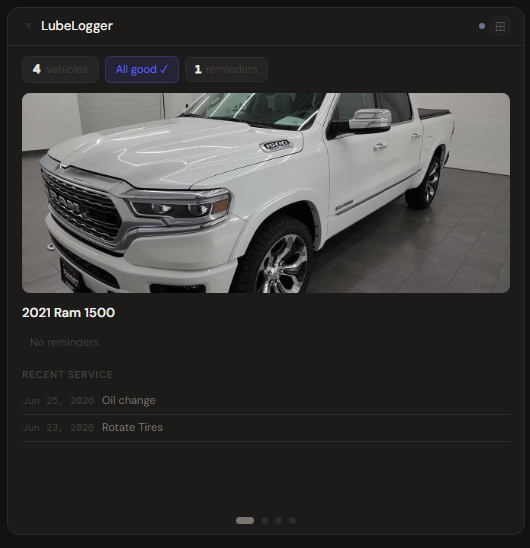
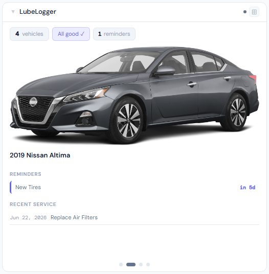

# LubeLogger

**Category:** Smart Home | **Status:** Tested | **Polling:** 15 min

---

## Integration

**Secret format:** `username:password` or blank (if auth disabled)

> If you have authentication enabled in LubeLogger, use your login credentials. If auth is disabled (the default for self-hosted installs), leave the secret blank.

**URL required:** Required

**Example URL:** `http://192.168.1.10:8080`

### Setup

1. Stoa → **Admin → Secrets → New**: paste `username:password`, or create a blank secret if auth is disabled
2. Stoa → **Admin → Integrations → New** → select **LubeLogger**, URL = your LubeLogger address, select the secret → **Save**
3. Stoa → **Admin → Panels → New** → select **LubeLogger**, select the integration → **Create**

---

## Panel

Vehicle maintenance dashboard with a per-vehicle carousel. Each slide shows the vehicle photo (at 4x+), urgency-color-coded reminders, and recent service history. The carousel auto-advances every 30 seconds. Navigation dots at the bottom let you jump to any vehicle manually.

### Height behavior

| Height | What you see |
|---|---|
| 1x | Fleet count chip + overdue/urgent/all-good summary |
| 2–3x | Auto-advancing carousel — vehicle name, odometer, reminders, service history (no photo) |
| 4x+ | Same carousel with vehicle photo above the data |

### Screenshots

| | Dark | Light |
|---|---|---|
| **1x** |  |  |
| **2x** |  |  |
| **4x** |  |  |

---

## Notes

- **No auth:** LubeLogger allows anonymous access by default — leave the secret blank and it works out of the box
- **Vehicle photos:** Upload a photo to each vehicle in LubeLogger (Vehicle → Edit → Image) and it will appear in the 4x+ panel view
- **Reminders:** Urgency levels are color-coded — purple (not urgent) → amber (urgent) → orange (very urgent) → red (past due)
- **Calendar:** Add LubeLogger as a calendar source in Stoa to see date-bound maintenance reminders on the calendar panel
- **Carousel:** With multiple vehicles the panel cycles automatically every 30 seconds; clicking a dot resets the timer and jumps to that vehicle
