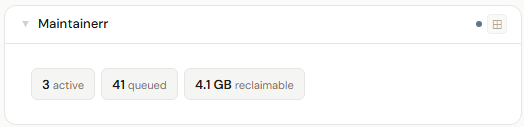
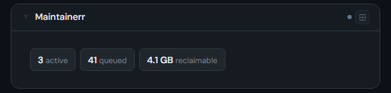
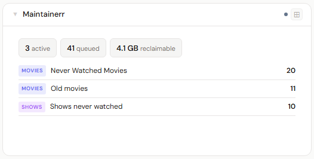
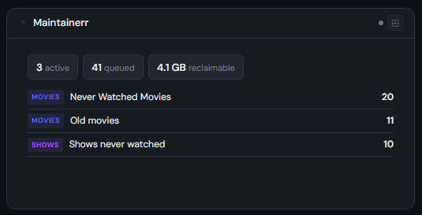
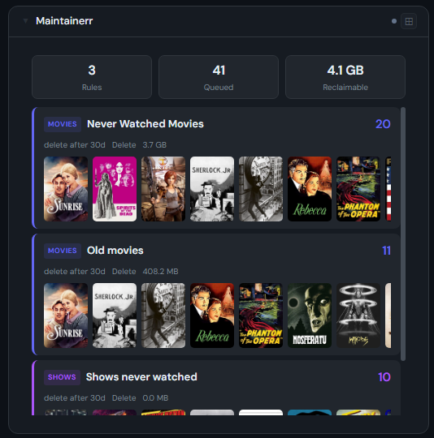

# Maintainerr

**Category:** Media Management | **Status:** Tested | **Polling:** 5 min

---

## Integration

**Secret format:** Blank (no auth) or Bearer token

> Most Maintainerr instances run without authentication. If you have configured an API key, paste it as a plain token. Leave the field blank if your instance has no auth.

**URL required:** Required

**Example URL:** `http://192.168.1.10:6246`

### Setup

1. Stoa → Admin → Secrets → New: leave blank, or paste your Maintainerr API token
2. Stoa → Admin → Integrations → New: select **Maintainerr**, enter URL and secret
3. Stoa → Admin → Panels → New: select **Maintainerr**

---

## What is Maintainerr?

Maintainerr is a self-hosted media management tool that automatically cleans up your Plex library based on rules you define — never-watched movies, shows not played in years, etc. You configure rules that build collections; items that meet the criteria and have aged past your delete-after window are removed automatically from Plex (and optionally unmonitored or deleted from Radarr/Sonarr).

---

## Panel

Collection cards showing what's queued for deletion — with poster filmstrips, type badges, item counts, delete-after windows, and lifetime cleanup stats.

### What's shown

- **Stat chips (4x)** — total rules, items queued across all collections, reclaimable disk space, and lifetime items cleaned up
- **Header bar (2x)** — active rule count, total queued items, reclaimable bytes
- **Stat tiles (1x)** — bordered tiles for active count, queued, and reclaimable — consistent with other panels
- **Collection cards (4x)** — one card per collection with:
  - Type badge (Movies / Shows / Seasons / Episodes) color-coded by media type
  - Title, item count, delete-after window, arr action (Delete / Unmonitor + Delete / Unmonitor), collection size
  - Poster filmstrip from TMDB artwork for the items queued in that collection
  - Paused collections shown at reduced opacity with a "paused" label
- **Collection rows (2x)** — compact list with type badge, title, pause state, and item count

### Height behavior

| Height | What you see |
|---|---|
| 1x | Bordered stat tiles — active rules · queued · reclaimable |
| 2–3x | Stat tiles header + scrollable collection row list |
| 4x+ | Stat chips + full collection cards with poster filmstrips |

### Screenshots

| | Light | Dark |
|---|---|---|
| **1x** |  |  |
| **2x** |  |  |
| **4x** |  |  |

---

## Notes

- **Polling and SSE:** Stoa polls Maintainerr every 5 minutes. Results are cached and pushed to all connected browsers via SSE — no manual refresh needed
- **API calls per poll:** 1 call to `/api/collections` for collection metadata, then 1 call per collection to `/api/collections/media/{id}/content/1` for poster images — typically 3–6 calls total depending on how many collections you have
- **Poster images:** Fetched from the content endpoint rather than the collections list — the collections list returns `image_path: null` for TV shows; the content endpoint returns populated TMDB poster URLs for both movies and shows
- **Show size bytes:** Maintainerr tracks `totalSizeBytes` accurately for movie collections (sourced from Radarr) but stores a nominal internal record size for TV show collections — the reclaimable figure is reliable for movies and near-zero/inaccurate for shows. This is a Maintainerr behavior, not a Stoa limitation
- **Reclaimable vs Freed:** The 4x panel shows reclaimable space when collections have queued items. Once items are deleted and `reclaimableBytes` drops to zero, it switches to showing lifetime bytes freed from the storage-metrics endpoint
- **Lifetime stats:** Cleaned-up item count and bytes freed come from Maintainerr's `/api/storage-metrics` endpoint and reflect all-time activity, not a sliding window
- **Authentication:** Maintainerr supports no auth, Basic auth (`username:password`), or Bearer token. Stoa detects the colon pattern automatically — if the secret contains a colon it sends Basic auth, otherwise Bearer
- **API endpoints used:** `/api/health` (connection test), `/api/collections`, `/api/collections/media/{id}/content/1?size=25`, `/api/storage-metrics`
