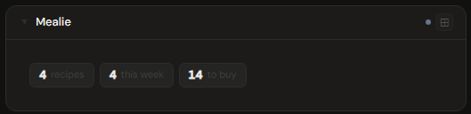
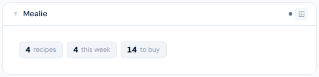
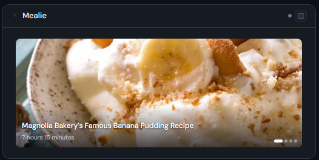
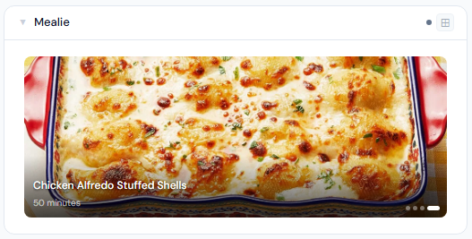
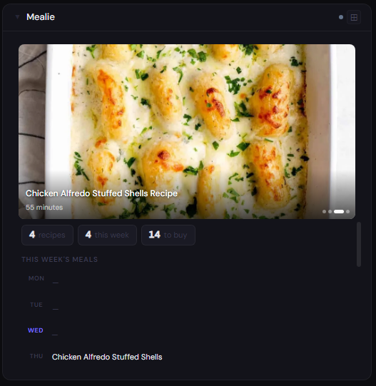
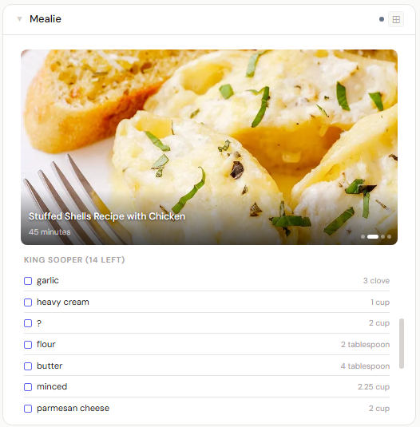

# Mealie

**Category:** Food & Home | **Status:** Tested | **Polling:** 15 min

---

## Integration

**Secret format:** API token (Bearer)

> Mealie → **User Settings → API Tokens** → **+ Create** → choose "Long-lived" → copy it

**URL required:** Yes — base URL of your Mealie instance

**Example URL:** `http://192.168.1.10:9000`

### Setup

1. In Mealie, go to **User Settings → API Tokens** → **+ Create** → select **Long-lived** → copy the token
2. Stoa → **Admin → Secrets → New**: paste the token (no prefix — Stoa adds `Bearer` automatically)
3. Stoa → **Admin → Integrations → New**: type **Mealie**, enter your Mealie URL, select the secret
4. Stoa → **Admin → Panels → New**: type **Mealie**, select the integration

> A long-lived API token is required — short-lived tokens expire and will cause the panel to stop loading. If you see an authentication error, regenerate the token in Mealie and update the secret in Stoa.

---

## Panel

Recipe and meal planning panel — full-panel photo carousel of random recipes, weekly 7-day meal plan, and shopping list. Photos auto-advance every 4 seconds and pause on hover.

### Height behavior

| Height | What you see |
|---|---|
| 1x | Stat chips: recipe count · meals this week · shopping items |
| 2–3x | Full-panel recipe photo carousel with recipe name overlay |
| 4x+ | Photo carousel (top) + stat chips + 7-day meal plan + shopping list (scrollable) |

### Photo carousel

- Shows up to 6 randomly selected recipes (shuffled from 50 most recent) — refreshes every 15 minutes so the panel looks different throughout the day
- Recipes without photos are excluded from the carousel
- Click any photo to open the recipe in Mealie
- Dot navigation at bottom-right; hover to pause auto-advance

### Meal plan

- Displays all 7 days of the current week (Mon–Sun)
- Today's row is highlighted in accent color
- Entries link directly to the recipe in Mealie

### Screenshots

| | Dark | Light |
|---|---|---|
| **1x** |  |  |
| **2x** |  |  |
| **4x** |  |  |

---

## Notes

- Recipe images are proxied through Stoa (auth-gated) — they will not load if the backend cannot reach your Mealie instance
- Recipe links use Mealie's household URL format (`/g/{household}/r/{slug}`); the household slug is fetched automatically from your account
- Shopping list shows the first household shopping list with unchecked items; requires items to be added in Mealie
- Mealie v1.x+ required; the panel uses the `/api/households/` endpoint family
