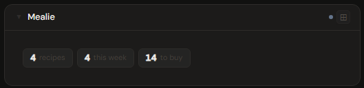
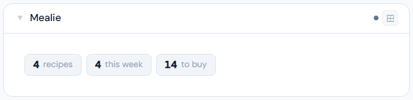
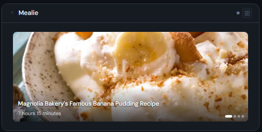
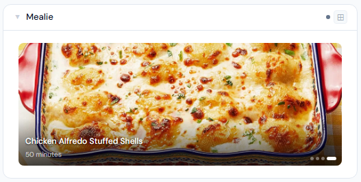
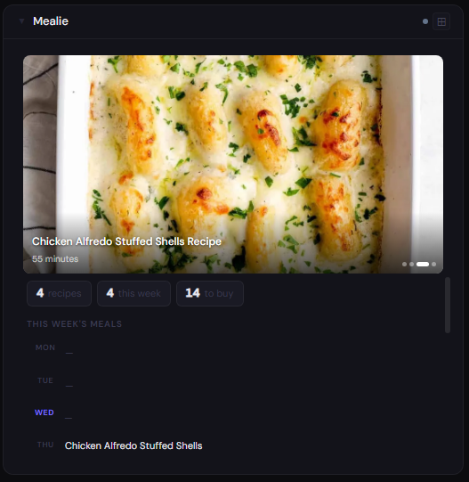
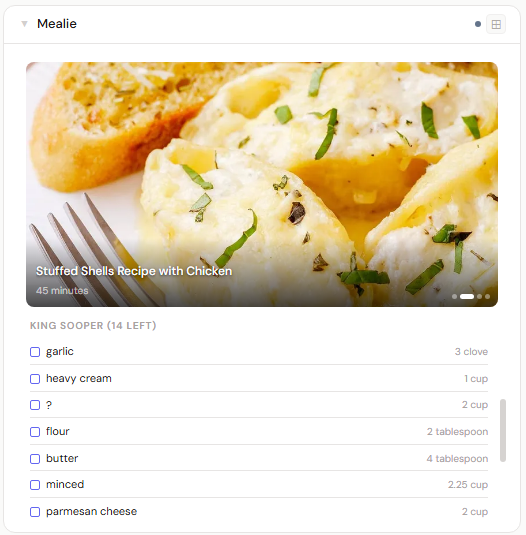

# Mealie

## What is Mealie?

Mealie is a self-hosted recipe manager and meal planner. It stores your recipes with photos and ingredients, imports them from URLs, builds weekly meal plans, and generates shopping lists — a private recipe box for your household.

**Official site:** [mealie.io](https://mealie.io)

---

## Getting the key

Mealie → **User Settings → API Tokens → + Create** → choose **Long-lived** → copy the token. (Short-lived tokens expire and will stop the panel loading.)

- **Secret format:** API token (Stoa adds `Bearer` automatically)
- **URL:** required — base URL of your Mealie instance, e.g. `http://192.168.1.10:9000`

---

## Add it to Stoa

1. **Admin → Secrets → New** — paste the token (no prefix).
2. **Admin → Integrations → New** — select **Mealie**, enter the URL, choose the secret.
3. **Admin → Panels → New** — select **Mealie**.

---

## Panel

Recipe and meal planning panel — full-panel photo carousel of random recipes, weekly 7-day meal plan, and shopping list. Photos auto-advance every 4 seconds and pause on hover.

### Height behavior

| Height | What you see |
|---|---|
| 1x | Stat chips: recipe count · meals this week · shopping items |
| 2–3x | Full-panel recipe photo carousel with recipe name overlay |
| 4x+ | Photo carousel (top) + stat chips + 7-day meal plan + shopping list (scrollable) |

### Photo carousel

- Shows up to 6 randomly selected recipes (shuffled from 50 most recent) — refreshes every 15 minutes so the panel looks different throughout the day
- Recipes without photos are excluded from the carousel
- Click any photo to open the recipe in Mealie
- Dot navigation at bottom-right; hover to pause auto-advance

### Meal plan

- Displays all 7 days of the current week (Mon–Sun)
- Today's row is highlighted in accent color
- Entries link directly to the recipe in Mealie

### Screenshots

| | Dark | Light |
|---|---|---|
| **1x** |  |  |
| **2x** |  |  |
| **4x** |  |  |

---

## Notes

- Recipe images are proxied through Stoa (auth-gated) — they will not load if the backend cannot reach your Mealie instance
- Recipe links use Mealie's household URL format (`/g/{household}/r/{slug}`); the household slug is fetched automatically from your account
- Shopping list shows the first household shopping list with unchecked items; requires items to be added in Mealie
- Mealie v1.x+ required; the panel uses the `/api/households/` endpoint family
