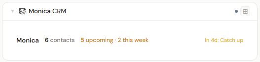
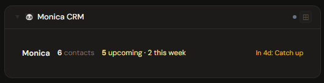
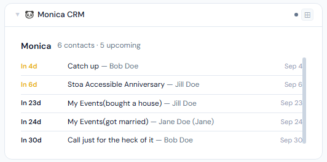
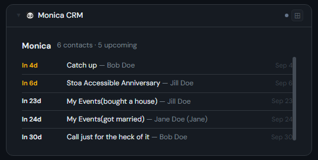
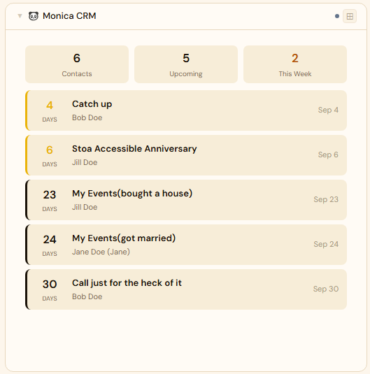
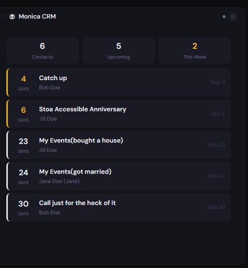

# Monica

## What is Monica?

Monica is a self-hosted personal CRM (a "personal relationship manager"). It helps you remember details about the people in your life — conversations, important dates, gift ideas, and reminders — so you can stay in better touch, all kept private on your own server.

**Official site:** [monicahq.com](https://www.monicahq.com)

---

## Getting the key

Monica → **Settings → API → Personal Access Tokens → Create** — copy the token.

- **Secret format:** Bearer token
- **URL:** required — point at your Monica port, e.g. `http://192.168.1.10:8080`

---

## Add it to Stoa

1. **Admin → Secrets → New** — paste the token.
2. **Admin → Integrations → New** — select **Monica**, enter the URL, choose the secret.
3. **Admin → Panels → New** — select **Monica**.

---

## Panel

Personal CRM panel — total contact count and upcoming reminders with contact name, date, and days until. Color-coded for reminders due today or within the week.

### Height behavior

| Height | What you see |
|---|---|
| 1x | Contact count + imminent reminders |
| 2-3x | Reminder list |
| 4x+ | Full reminder list with dates and contact detail |

### Screenshots

| | Light | Dark |
|---|---|---|
| **1x** |  |  |
| **2x** |  |  |
| **4x** |  |  |

---

## Notes

Monica's calendar reminders can also be added as a source on Stoa's [Calendar panel](../calendar/README.md#monica) — each reminder appears on its actual due date, alongside any Sonarr, Google Calendar, or other sources on the same panel.

**Known Monica bug (confirmed in 4.1.2):** checking "create annual reminder" on a life event silently fails to create the reminder if the life event uses one of Monica's **built-in** life event types (e.g. "Got married," "New job," "Moved," anything you didn't create yourself under Settings → Life Event Types). The life event itself saves normally, but no reminder is ever created and Monica shows no error anywhere.

Root cause: built-in life event types have no `name` value set (their display text comes from a translation lookup instead), and Monica's reminder-creation code uses that `name` as the reminder's title — a required field — so creation fails validation silently. **Workaround:** create a custom life event type (Settings → Life Event Types) and use that instead of a built-in one; custom types do have a `name` set, so the reminder creates correctly. This is a Monica bug, not a Stoa limitation — reported upstream to [monicahq/monica](https://github.com/monicahq/monica).
