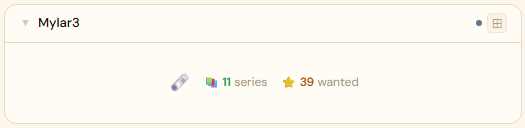
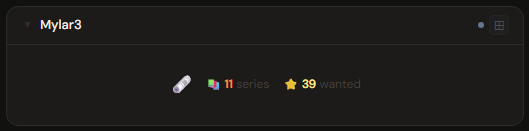
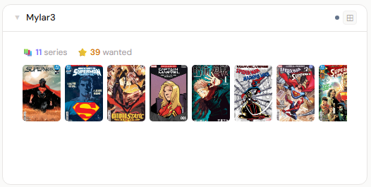
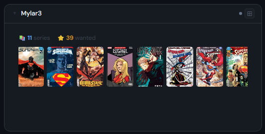
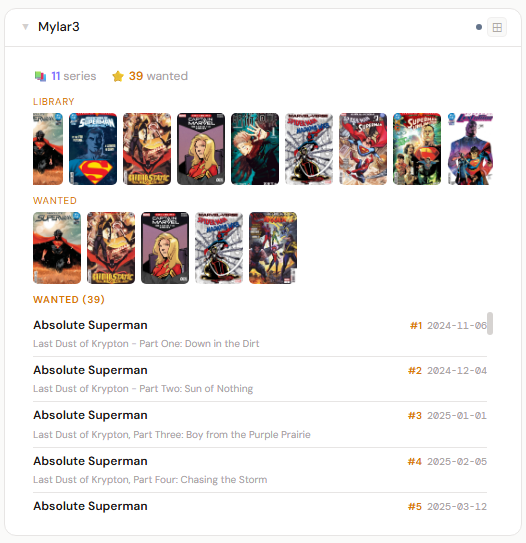
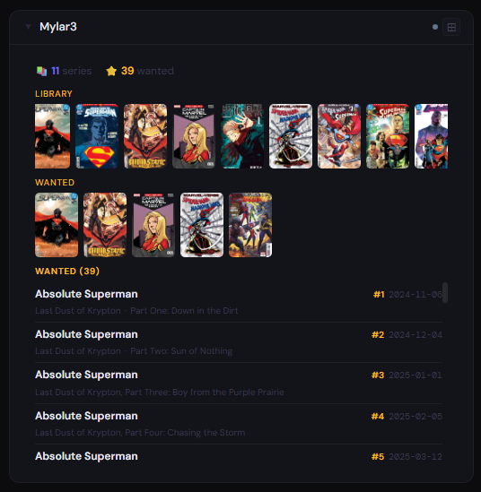

# Mylar3

**Category:** Comics & Manga | **Status:** Tested | **Polling:** 30 min

---

## Integration

**Secret format:** Plain API key

> Mylar3 → Settings → Web Interface → Enable API → copy API Key

**URL required:** Required

**Example URL:** `http://mylar3:8090`

### Setup

1. Mylar3 → Settings → Web Interface → enable API, copy the API Key
2. Stoa → Admin → Secrets → New: paste the key
3. Stoa → Admin → Integrations → New: select **Mylar3**, enter URL and secret
4. Stoa → Admin → Panels → New: select **Mylar3**

---

## Panel

Western comics manager showing your series library, wanted missing issues, upcoming release schedule, and scrollable cover filmstrips.

### What's shown

- **Stats** — series count · wanted issue count · upcoming issue count; "all up to date" when nothing is pending
- **Library filmstrip** (2x+) — scrollable cover strip of all series; covers are sourced from the public ComicVine CDN URL embedded in Mylar3's series data
- **Wanted filmstrip** (4x+) — cover strip filtered to only series that have at least one wanted (missing) issue
- **Issue lists** (4x+) — Wanted issues and Upcoming releases columns; each row shows comic name, issue number, and date

### Height behavior

| Height | What you see |
|---|---|
| 1x | Series · wanted · upcoming counts centered with panel icon |
| 2–3x | Stats + scrollable library cover filmstrip |
| 4x+ | Library filmstrip + wanted filmstrip (if applicable) + wanted/upcoming issue columns |

### Screenshots

| | Light | Dark |
|---|---|---|
| **1x** |  |  |
| **2x** |  |  |
| **4x** |  |  |

---

## Calendar

Add Mylar3 as a calendar source (Profile/Admin → Calendar panel → Calendar sources → **Stoa integration**) to see upcoming comic issue release dates on the calendar. Events appear on the release date as `Series Name #issue` and click through to the series page in Mylar3. A single `getUpcoming` API call covers all monitored series; results are cached for 15 minutes. See [Calendar](../calendar/README.md#mylar3) for details.

---

## Notes

- **Auth:** API key is appended as the `apikey` query parameter on all requests (`/api/v3?apikey=...&cmd=...`)
- **Cover images:** Series covers come from the public ComicVine CDN via the `imageURL` field in Mylar3's `getIndex` response. They load directly in the browser with no Stoa proxy — `` tags bypass CORS preflight, so external CDN URLs work without any server-side relay
- **Wanted filmstrip:** The wanted series strip is derived in the browser by cross-referencing `comicId` values from the wanted issue list against the full series list. No extra API call is required
- **Polling and SSE:** Stoa polls Mylar3 every 30 minutes and pushes updates to all connected browsers via SSE — no manual refresh needed
- **API calls per poll:** `GET /api/v3?cmd=getIndex` (series library with cover URLs), `GET /api/v3?cmd=getWanted` (missing issues), `GET /api/v3?cmd=getUpcoming` (upcoming releases)
