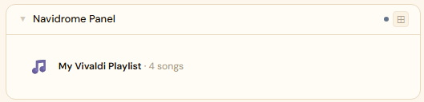
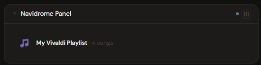
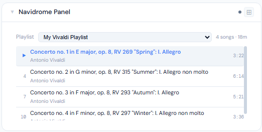
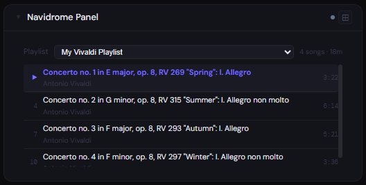
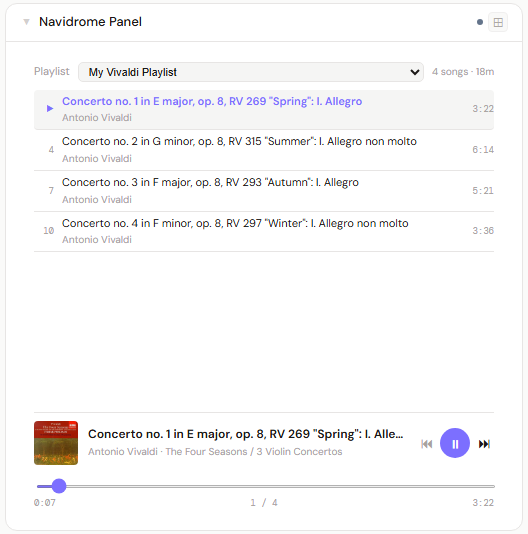
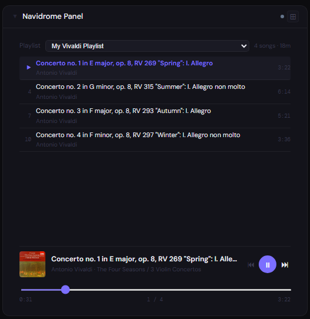

# Navidrome

**Category:** Photos & Libraries | **Status:** Tested | **Polling:** 30 s

---

## Integration

**Secret format:** `username:password`

> Your Navidrome local account credentials — **not** your OIDC/SSO provider credentials. See the OIDC note below.

**URL required:** Required

**Example URL:** `http://192.168.1.10:4533`

### Setup

1. Format your secret as `yourusername:yourpassword` using your Navidrome local account
2. Stoa → Admin → Secrets → New: paste the credential
3. Stoa → Admin → Integrations → New: select **Navidrome**, enter URL and secret
4. Stoa → Admin → Panels → New: select **Navidrome**

---

## Panel

Music player panel with playlist selection, scrollable track list, and a built-in player with album art, seek bar, and prev/next controls. Audio streams directly from your Navidrome server through Stoa.

### What's shown

- **1x** — active playlist name and track count
- **2–3x** — playlist selector dropdown with song count and total duration, scrollable track list (click any track to set it as the active track)
- **4x+** — playlist selector + track list + player bar (album art · title · artist · play/pause · prev/next · seek bar · time display)

### Height behavior

| Height | What you see |
|---|---|
| 1x | Active playlist name · track count |
| 2–3x | Playlist selector + full scrollable track list |
| 4x+ | Playlist selector + track list + player bar with album art and seek |

### Screenshots

| | Light | Dark |
|---|---|---|
| **1x** |  |  |
| **2x** |  |  |
| **4x** |  |  |

---

## Notes

### Per-user panels

Because Navidrome's Subsonic API is fully user-scoped, each Stoa user can create their own Navidrome integration with their own `username:password`. Their panel will show only their own playlists. This is the recommended way to give multiple household members personalized music panels pointing at the same Navidrome server.

### OIDC / SSO users

Navidrome's OIDC support covers **web UI login only**. The Subsonic API — which Stoa, mobile apps, and all third-party clients use — runs on Navidrome's own local credential system and is entirely separate from OIDC.

When a user first logs in via OIDC, Navidrome auto-creates a local account for them. That local account may have **no password set**, since the user never went through Navidrome's normal registration flow. Before the Stoa panel will work, a local password must be set:

- **Admin path:** Navidrome → Settings → Users → edit user → set password
- **User path:** profile settings page inside Navidrome (if available in your version)

Use that local Navidrome password — not your OIDC provider password — as the password half of the `username:password` secret in Stoa.

> **Using OIDC and local API access for the same account simultaneously is experimental and essentially untested.** Some Navidrome versions or OIDC configurations may behave differently. The panel itself is validated and confirmed working against local (non-OIDC) Navidrome accounts. Community feedback on OIDC + API combinations is welcome.

### Streaming and cover art

Both audio streams and album art are proxied through Stoa — the browser never contacts Navidrome directly. Audio is fetched with the Stoa auth token injected, then handed to the browser as a blob URL. Range headers are forwarded so seeking works correctly. Only the Stoa server needs network access to Navidrome.

### Playlist selection

The active playlist is saved per-panel in the panel config, so it persists across reloads and page refreshes. Switching playlists via the dropdown saves the selection immediately.

### API calls per poll

`GET /rest/ping.view` (connection test), `GET /rest/getPlaylists.view` (playlist list), `GET /rest/getPlaylist.view?id=X` (tracks for the selected playlist). Cover art and audio are fetched on demand via `/rest/getCoverArt.view` and `/rest/stream.view`.
