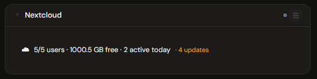
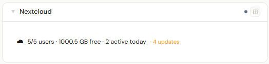
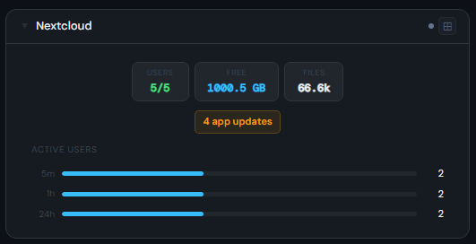
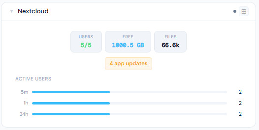
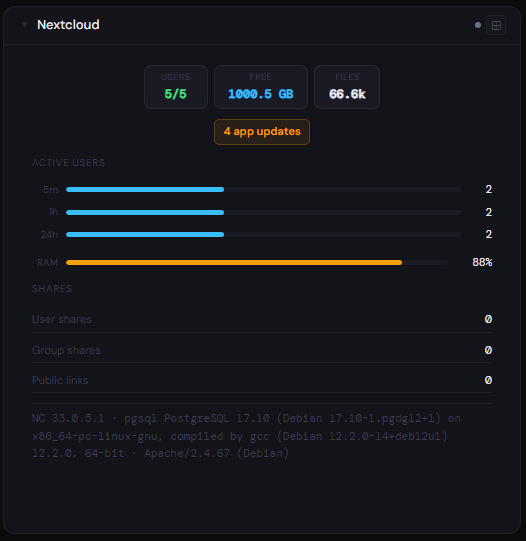
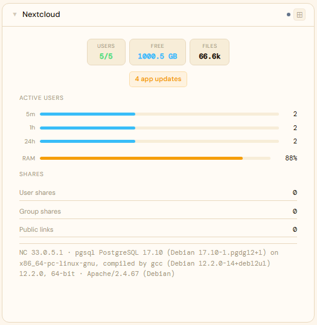

# Nextcloud

**Category:** Storage | **Status:** Tested | **Polling:** 5 min

---

## Integration

**Secret format:** `username:password`

> Your Nextcloud username and an **app password**, colon-separated: `yourusername:apppassword`

**URL required:** Yes — your Nextcloud base URL, e.g. `https://cloud.example.com`

### Setup

1. In Nextcloud → **Settings → Security → Devices & sessions** → scroll to the bottom → enter a name (e.g. "Stoa") → click **Create new app password**. Copy the generated password — it is only shown once.
2. Stoa → **Admin → Secrets → New**: paste `yourusername:apppassword` (colon-separated). If your username contains `@` (e.g. a UPN from SAML/SSO), that is fine — Stoa splits on the first colon only.
3. Stoa → **Admin → Integrations → New** → select **Nextcloud**, enter your Nextcloud base URL, select the secret → **Save & Test**.
4. Stoa → **Admin → Panels → New** → select **Nextcloud**, select the integration.

> **App passwords bypass SAML / SSO.** If your Nextcloud login goes through an identity provider (Keycloak, Authentik, LDAP, etc.), app passwords are the correct credential type — they authenticate directly against Nextcloud and do not require going through your IdP.

> **Admin account required for server stats.** RAM usage and server info come from the Nextcloud **Monitoring** app endpoint. This requires admin-level credentials. A non-admin account will still show user and file counts but server stats will be absent.

> **Monitoring app required for server stats.** Install via Nextcloud → **Apps → Tools → Monitoring**. Without it the serverinfo endpoint returns a 404 and server stats are skipped silently.

---

## Panel

Nextcloud server overview — active user counts with proportional bars, storage free space, file count, app update alerts, share breakdown, RAM usage bar, and a server info summary line.

### Height behavior

| Height | What you see |
|---|---|
| 1x | Single text line: enabled/total users · free space · active users today (+ update count if any) |
| 2x | 3 stat chips (Users / Free / Files) · app update pill (if any) · active user bars (5 min / 1 h / 24 h) |
| 3x | All of 2x + share breakdown (user shares, group shares, public links) |
| 4x+ | All of 3x + RAM usage bar + server info line (NC version · DB · webserver) |

### Screenshots

| | Dark | Light |
|---|---|---|
| **1x** |  |  |
| **2x** |  |  |
| **4x** |  |  |

---

## Notes

- The 3 stat chips are always centered and capped at 3 so they render cleanly in both narrow and wide panel slots
- The **app update** pill only appears when one or more updates are pending — amber badge so it stands out
- Active user bars are relative to your total enabled user count; the bar fills to 100% when all users are active in that window
- Free space reflects the primary storage; additional external storages are not summed
- Share counts cover direct user-created shares; federated/remote shares may not appear depending on your Nextcloud version