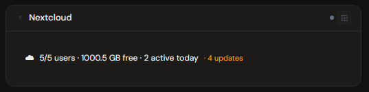
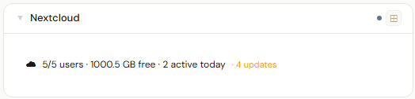
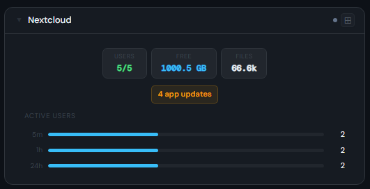
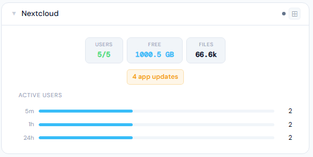
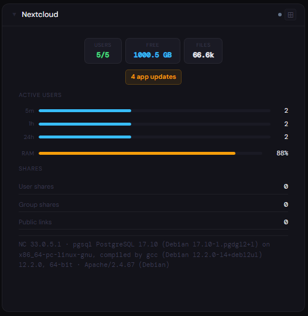
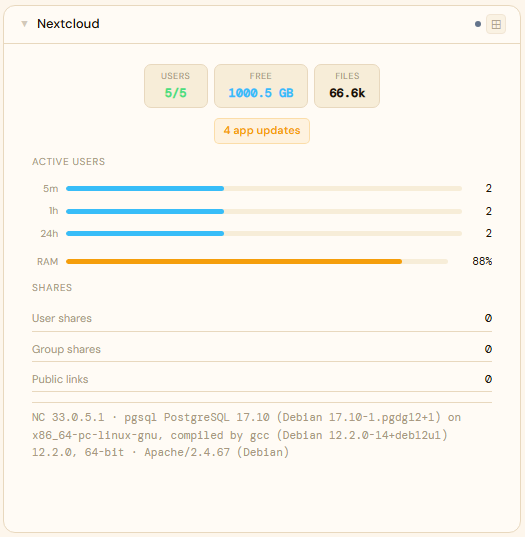

# Nextcloud

## What is Nextcloud?

Nextcloud is a self-hosted file-sync and collaboration platform — a private alternative to Dropbox and Google Workspace. It stores and syncs your files across devices and adds calendars, contacts, document editing, and much more through its app ecosystem, all running on your own server.

**Official site:** [nextcloud.com](https://nextcloud.com)

---

## Getting the key

In Nextcloud → **Settings → Security → Devices & sessions** → scroll to the bottom → enter a name (e.g. "Stoa") → **Create new app password**. Copy it — it's shown only once. Combine with your username: `yourusername:apppassword`.

- **Secret format:** `username:password` — use an **app password**. If your username contains `@` (a UPN from SAML/SSO), that's fine; Stoa splits on the first colon only.
- **URL:** required — your Nextcloud base URL, e.g. `https://cloud.example.com`

> **App passwords bypass SAML / SSO.** If your Nextcloud login goes through an identity provider (Keycloak, Authentik, LDAP, etc.), app passwords are the correct credential type — they authenticate directly against Nextcloud.

> **Admin account required for server stats.** RAM usage and server info come from Nextcloud's **Monitoring** app endpoint (install via Apps → Tools → Monitoring) and require admin credentials. A non-admin account still shows user and file counts, but server stats are absent.

---

## Add it to Stoa

1. **Admin → Secrets → New** — paste `yourusername:apppassword` (colon-separated).
2. **Admin → Integrations → New** — select **Nextcloud**, enter your base URL, choose the secret → **Save & Test**.
3. **Admin → Panels → New** — select **Nextcloud**.

---

## Panel

Nextcloud server overview — active user counts with proportional bars, storage free space, file count, app update alerts, share breakdown, RAM usage bar, and a server info summary line.

### Height behavior

| Height | What you see |
|---|---|
| 1x | Single text line: enabled/total users · free space · active users today (+ update count if any) |
| 2x | 3 stat chips (Users / Free / Files) · app update pill (if any) · active user bars (5 min / 1 h / 24 h) |
| 3x | All of 2x + share breakdown (user shares, group shares, public links) |
| 4x+ | All of 3x + RAM usage bar + server info line (NC version · DB · webserver) |

### Screenshots

| | Dark | Light |
|---|---|---|
| **1x** |  |  |
| **2x** |  |  |
| **4x** |  |  |

---

## Notes

- The 3 stat chips are always centered and capped at 3 so they render cleanly in both narrow and wide panel slots
- The **app update** pill only appears when one or more updates are pending — amber badge so it stands out
- Active user bars are relative to your total enabled user count; the bar fills to 100% when all users are active in that window
- Free space reflects the primary storage; additional external storages are not summed
- Share counts cover direct user-created shares; federated/remote shares may not appear depending on your Nextcloud version
