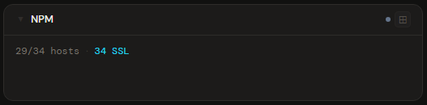
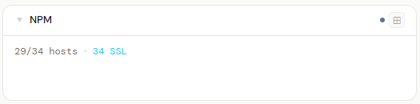
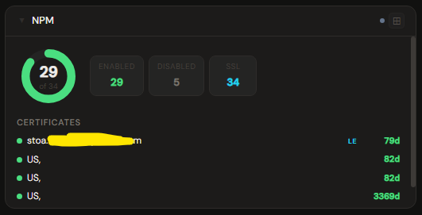
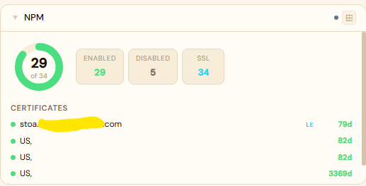
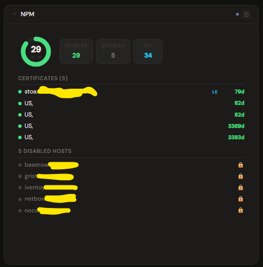
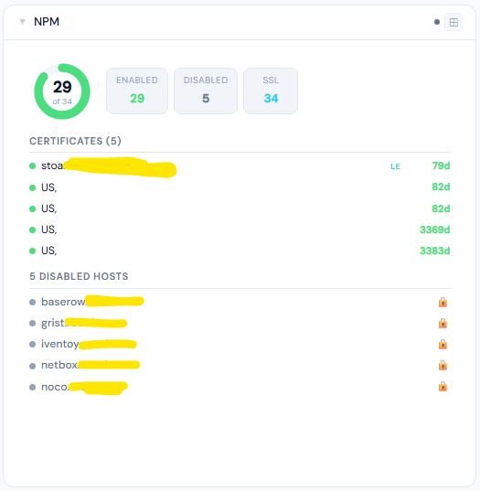

# Nginx Proxy Manager

**Category:** DNS & Proxy | **Status:** Tested | **Polling:** 60 s

---

## Integration

**Secret format:** `email:password`

> Your NPM web UI login, colon-separated: `admin@example.com:yourpassword`

**URL required:** Yes — your NPM base URL including port, e.g. `http://192.168.1.10:81`

### Setup

1. Stoa → **Admin → Secrets → New**: paste `youremail@example.com:yourpassword`
2. Stoa → **Admin → Integrations → New** → select **Nginx Proxy Manager**, enter your NPM URL (e.g. `http://npm:81`), select the secret → **Save & Test**
3. Stoa → **Admin → Panels → New** → select **Nginx Proxy Manager**, select the integration

> Stoa authenticates via the NPM `/api/tokens` endpoint and caches the token for 23 hours, refreshing automatically. You do not need to create a separate API key — your web UI email and password are all that is needed.

---

## Panel

Proxy host summary with enabled/disabled donut, SSL cert expiry countdown (color-coded by urgency), disabled host roster, redirect list, and stream/access-list counts.

### Height behavior

| Height | What you see |
|---|---|
| 1x | Inline text: enabled/total hosts · SSL count · expired or expiring cert warnings |
| 2–3x | Enabled/total donut + stat chips (Enabled, Disabled, SSL, Redirects, Expiring/Expired) + full certificate list |
| 4x+ | Donut + chips + certificate list (up to 12, then "+N more") + disabled hosts only + redirect list + stream/access-list counts |

### Certificate expiry colors

| Color | Meaning |
|---|---|
| Green | Healthy (>30 days remaining) |
| Amber | Expiring soon (<30 days) |
| Orange | Expiring very soon (<7 days) |
| Red | Expired |

Let's Encrypt certificates show an **LE** badge. Certificates are always sorted most-urgent first so problems surface at the top.

### Proxy host list

At 4x+, only **disabled** hosts are listed — enabled hosts are already counted in the chips. With large numbers of proxy hosts this keeps the panel readable without a long list of entries that are all healthy.

### Screenshots

| | Dark | Light |
|---|---|---|
| **1x** |  |  |
| **2x** |  |  |
| **4x** |  |  |

---

## Notes

- Tokens are fetched once per day — a credential change in NPM requires a Stoa restart or a 23-hour wait for the cache to expire
- If you run NPM behind a reverse proxy with HTTPS, use your public HTTPS URL as the integration URL and enable **Skip TLS verification** if you use a self-signed certificate
- Streams and access lists are shown as counts only — there is no individual list view for those at any height