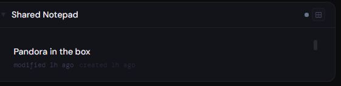
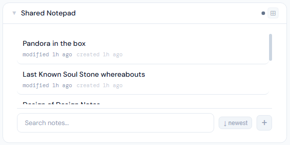
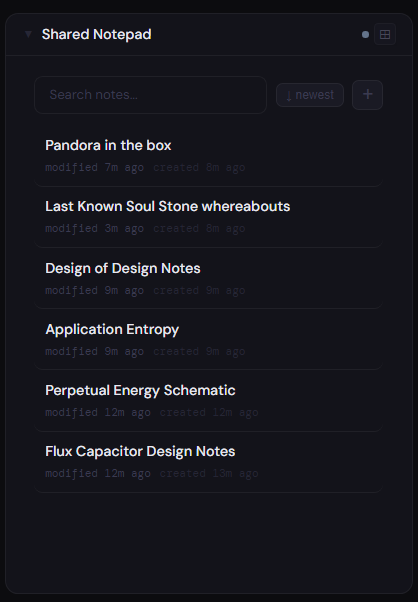
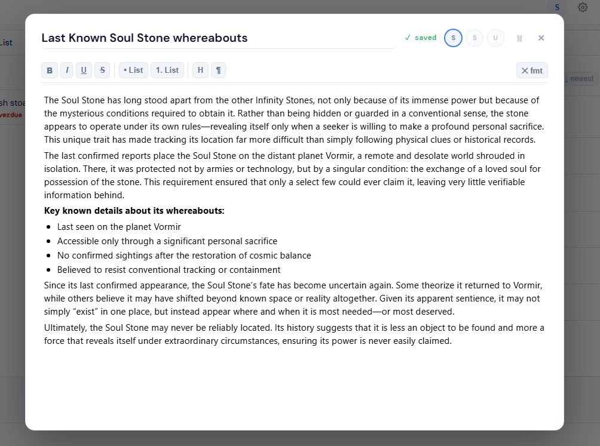

# Notes

**Category:** Productivity | **Status:** Tested | **Requires integration:** No - data stored locally in Stoa

---

## Panel

Shared markdown-capable note panel. Multi-user locking - only one user can edit at a time. Other users see the note as read-only while locked.

### Height behavior

All panel heights show the same layout: a scrollable note list with search, sort, and new note button pinned to the bottom.

| Height | What you see |
|---|---|
| All heights | Scrollable note list; search, sort, and new note button at bottom |

### Screenshots

| 1x | 2x | 4x |
|---|---|---|
|  |  |  |

*Screenshots pending - add as screenshots/1x.png, screenshots/2x.png, screenshots/4x.png.*

### Functional overlay

Clicking any note opens the full-screen editor overlay. The overlay includes a rich text toolbar (bold, italic, lists, headings), a title field, auto-save indicator, per-user activity avatars showing who last read or edited, and a lock banner when another user is currently editing.

| Editor overlay |
|---|
|  |

*Screenshot pending - add as screenshots/overlay.png.*
---

## Notes

Both system notes (shared with groups) and personal notes are supported.