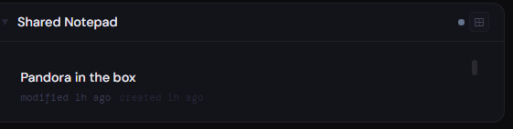
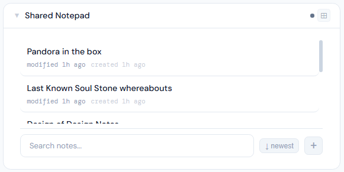
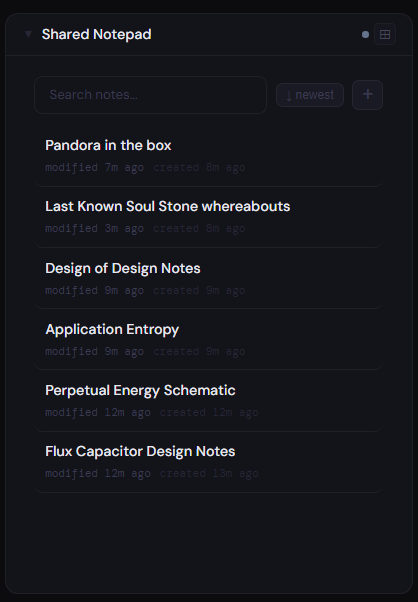
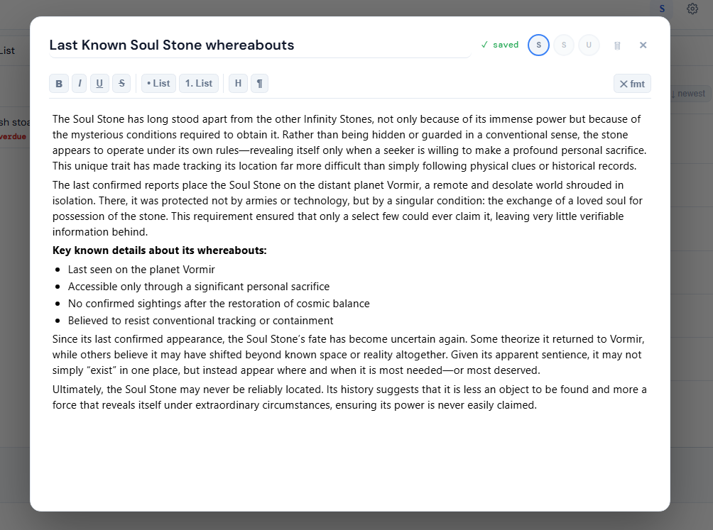

# Notes

## What is the Notes panel?

Notes is a built-in Stoa panel — a shared, markdown-capable notepad stored in Stoa's own database, with no external service. It supports multi-user editing with locking (one editor at a time; others see read-only while locked) and works out of the box with no configuration. Both system (group-shared) and personal notes are supported.

---

## Panel

Shared markdown-capable note panel. Multi-user locking - only one user can edit at a time. Other users see the note as read-only while locked.

### Height behavior

All panel heights show the same layout: a scrollable note list with search, sort, and new note button pinned to the bottom.

| Height | What you see |
|---|---|
| All heights | Scrollable note list; search, sort, and new note button at bottom |

### Screenshots

| 1x | 2x | 4x |
|---|---|---|
|  |  |  |

### Functional overlay

Clicking any note opens the full-screen editor overlay. The overlay includes a rich text toolbar (bold, italic, lists, headings), a title field, auto-save indicator, per-user activity avatars showing who last read or edited, and a lock banner when another user is currently editing.  This panel is one of very few panels that do not require a backend data integration for full functionality.  You may create a notes panel out of the box with no additional configuration.  Data is stored in SQL.

| Editor overlay |
|---|
|  |

---

## Notes

Both system notes (shared with groups) and personal notes are supported.
