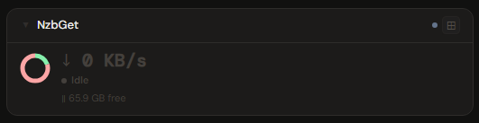
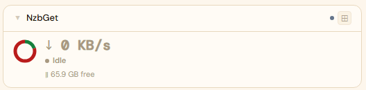
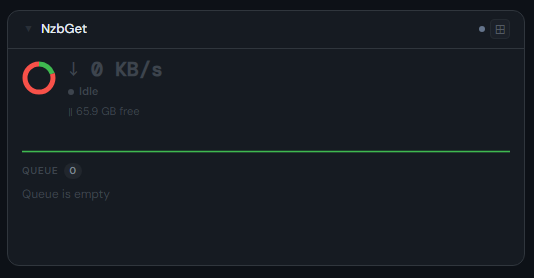
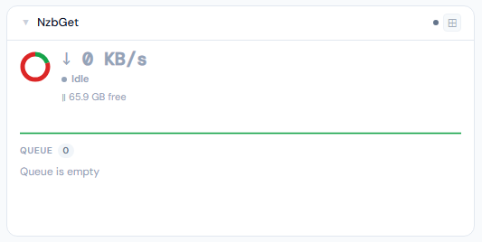
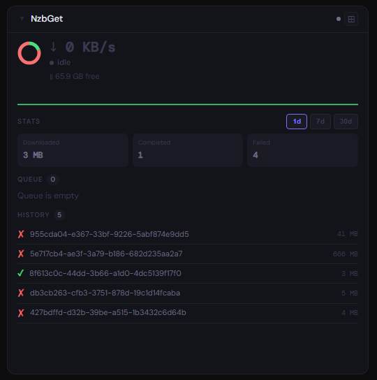
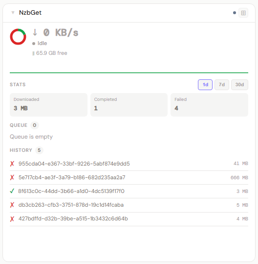

# NZBGet

**Category:** Downloads | **Status:** ✅ Tested | **Polling:** Adaptive — 5 s during active downloads, configured interval when idle

---

## Integration

**Secret format:** `username:password`

> Your NZBGet control user credentials. NZBGet → Settings → Security → Control username / Control password. The default is `nzbget:tegbzn6789` — change it before exposing the port. Format as `username:password` with a colon separator.

**URL required:** Required

**Example URL:** `http://192.168.1.10:6789`

### Setup

1. NZBGet → Settings → Security — note or set your **Control username** and **Control password**
2. Admin → Secrets → New: paste `username:password`
3. Admin → Integrations → New: type NZBGet, URL = `http://nzbget:6789`, select secret
4. Admin → Panels → New: type NZBGet, assign integration

### How it works

Stoa calls NZBGet's **JSON-RPC API** at `/jsonrpc` using HTTP Basic Auth (split from `username:password` at the first colon). Three methods are called per poll cycle:

- `status` — download rate (bytes/s), remaining MB, session downloaded MB, free disk space on the destination directory (`FreeDiskSpaceMB`), paused state
- `listgroups` — active download queue: each group's name, status, category, percentage, size, and remaining size; used for both the queue list and donut segment counts
- `history` — completed/failed items including `HistoryTime` (Unix timestamp) and `FileSizeMB`; used to compute 1d/7d/30d period stats

**Per-group state mapping for the donut:** `DOWNLOADING` → downloading (green) · `QUEUED` → queued (accent) · `PAUSED` → paused (amber) · `PP_QUEUED` / `LOADING_PARS` / `VERIFYING` / `REPAIRING` / `RENAMING` / `UNPACKING` / `MOVING` / `PP_FINISHED` → post-processing (purple) · `FAILED` / `DELETED` → failed (red)

**Period stats:** history items with `Status` starting with `SUCCESS` count as completed; `FAILURE*` or `DELETED` count as failed. Each item's `HistoryTime` determines which 1d/7d/30d buckets it falls into.

**Adaptive worker:** NZBGet shares the same adaptive SSE worker as SABnzbd. While `queueCount > 0` and not paused, it polls every **5 seconds** to drive the sparkline. After the queue drains it holds the 5 s rate for a **30 s coast-down** before returning to the configured interval. A 60-entry MB/s ring buffer is maintained in the goroutine and injected as `speedHistory` on every cache update.

Updates arrive via SSE push — the frontend never polls; it reacts to pushes from the worker.

---

## Panel

Queue state donut (5 segments including post-processing), live speed with sparkline, 1d/7d/30d period stats, free disk, per-group progress bars, and recent history.

### Height behavior

| Height | What you see |
|---|---|
| 1x | State donut + download speed + status dot + queue count/remaining/free disk |
| 2x | 1x summary + speed sparkline + **Queue** list — up to 6 groups with progress bars |
| 3x+ | 2x content + **Stats** (1d/7d/30d pill selector: downloaded GB, completed count, failed count) + queue + history at 4x+ |
| 4x+ | All of the above + **History** — up to 10 recent completed/failed items |

**Donut segments (when queue active):** green = downloading · accent = queued · amber = paused · purple = post-processing · red = failed

**Donut when queue is empty:** reflects the currently selected period — green = completed downloads, red = failures — so the donut stays informative between download sessions and honors the 1d/7d/30d pill selection.

**Free disk** is `FreeDiskSpaceMB` from NZBGet's status response — free space on the disk where the configured destination directory lives. If your destination is on a network mount or separate volume, this reflects that volume's free space rather than the container's root disk.

**Post-processing (purple segment):** NZBGet performs par2 repair, unpack, and move steps after the download completes. These in-progress post-processing tasks appear as a purple segment in the donut and a purple progress bar in the queue list.

### Screenshots

| | Dark | Light |
|---|---|---|
| **1x** |  |  |
| **2x** |  |  |
| **4x** |  |  |
