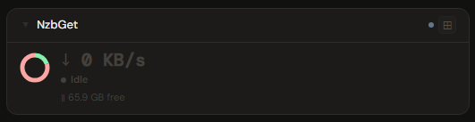
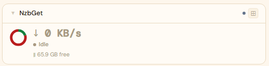
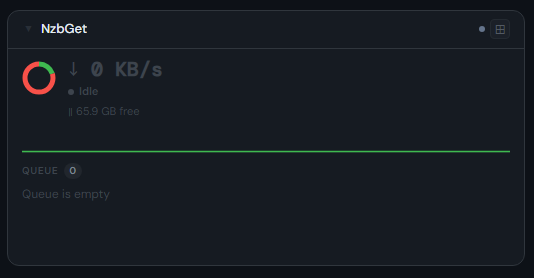
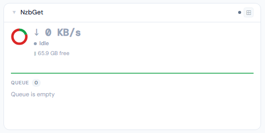
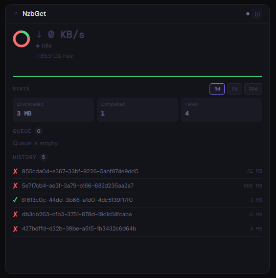
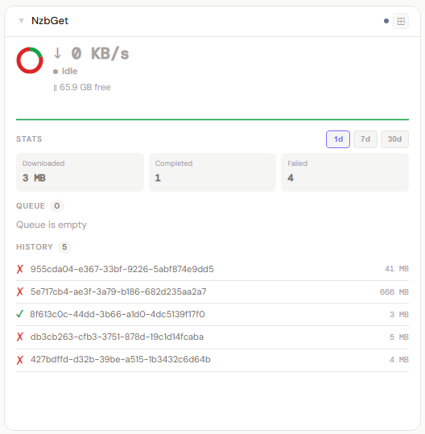

# NZBGet

## What is NZBGet?

NZBGet is a lightweight, high-performance Usenet (NZB) downloader written in C++. It downloads, verifies, repairs, and unpacks NZBs with very low resource usage and integrates with the \*arr apps — an efficient alternative to SABnzbd.

**Official site:** [nzbget.com](https://nzbget.com)

---

## Getting the key

NZBGet → **Settings → Security** → note or set your **Control username** and **Control password** (default `nzbget:tegbzn6789` — change it before exposing the port). Combine as `username:password`.

- **Secret format:** `username:password`
- **URL:** required — point at your NZBGet port, e.g. `http://192.168.1.10:6789`

---

## Add it to Stoa

1. **Admin → Secrets → New** — paste `username:password`.
2. **Admin → Integrations → New** — select **NZBGet**, enter the URL, choose the secret.
3. **Admin → Panels → New** — select **NZBGet**.

---

## How it works

Stoa calls NZBGet's **JSON-RPC API** at `/jsonrpc` using HTTP Basic Auth (split from `username:password` at the first colon). Three methods per poll cycle:

- `status` — download rate, remaining MB, session downloaded MB, free disk space on the destination directory (`FreeDiskSpaceMB`), paused state
- `listgroups` — active download queue: each group's name, status, category, percentage, size, remaining size; used for the queue list and donut segment counts
- `history` — completed/failed items including `HistoryTime` and `FileSizeMB`; used for 1d/7d/30d period stats

**Per-group state mapping for the donut:** `DOWNLOADING` → downloading (green) · `QUEUED` → queued (accent) · `PAUSED` → paused (amber) · post-processing states (`PP_QUEUED`, `LOADING_PARS`, `VERIFYING`, `REPAIRING`, `RENAMING`, `UNPACKING`, `MOVING`, `PP_FINISHED`) → post-processing (purple) · `FAILED`/`DELETED` → failed (red)

**Adaptive worker:** NZBGet shares the same adaptive SSE worker as SABnzbd. While the queue is active it polls every **5 seconds** to drive the sparkline, holds that rate for a **30 s coast-down** after the queue drains, then returns to the configured interval. Updates arrive via SSE push — the frontend never polls.

---

## Panel

Queue state donut (5 segments including post-processing), live speed with sparkline, 1d/7d/30d period stats, free disk, per-group progress bars, and recent history.

### Height behavior

| Height | What you see |
|---|---|
| 1x | State donut + download speed + status dot + queue count/remaining/free disk |
| 2x | 1x summary + speed sparkline + **Queue** list — up to 6 groups with progress bars |
| 3x+ | 2x content + **Stats** (1d/7d/30d pill selector: downloaded GB, completed count, failed count) + queue + history at 4x+ |
| 4x+ | All of the above + **History** — up to 10 recent completed/failed items |

**Donut segments (when queue active):** green = downloading · accent = queued · amber = paused · purple = post-processing · red = failed

**Donut when queue is empty:** reflects the currently selected period — green = completed downloads, red = failures — so the donut stays informative between download sessions and honors the 1d/7d/30d pill selection.

**Free disk** is `FreeDiskSpaceMB` from NZBGet's status response — free space on the disk where the configured destination directory lives.

**Post-processing (purple segment):** NZBGet performs par2 repair, unpack, and move steps after the download completes. These in-progress tasks appear as a purple segment in the donut and a purple progress bar in the queue list.

### Screenshots

| | Dark | Light |
|---|---|---|
| **1x** |  |  |
| **2x** |  |  |
| **4x** |  |  |
