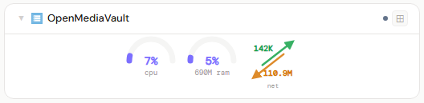
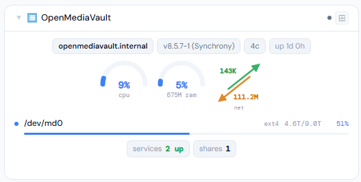
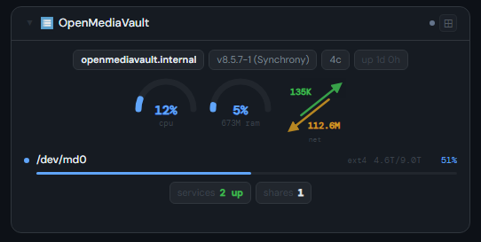
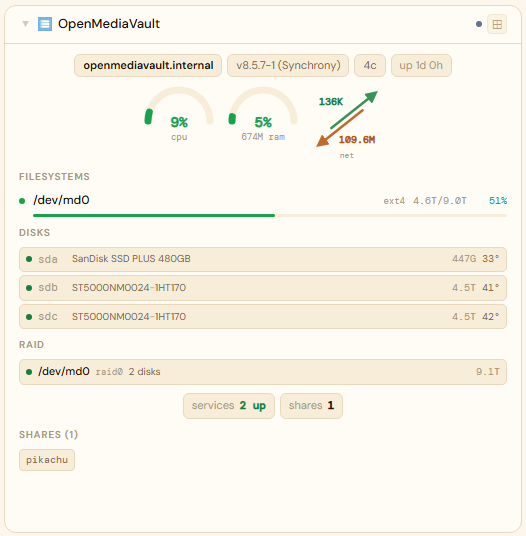
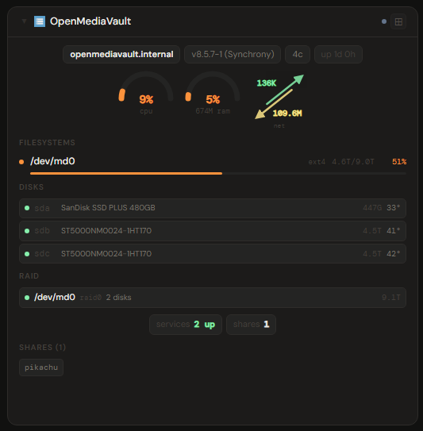

# OpenMediaVault

## What is OpenMediaVault?

OpenMediaVault (OMV) is a free, Debian-based NAS operating system. It provides a web interface for managing disks, filesystems, and network shares (SMB/NFS/FTP and more), with a plugin system for extra services — a lightweight, fully open-source way to build a home NAS.

**Official site:** [openmediavault.org](https://www.openmediavault.org)

---

## Getting the key

Use your OMV WebUI login in `username:password` form (e.g. `admin:yourpassword`).

- **Secret format:** `username:password`
- **URL:** required — point at your OMV host, e.g. `http://192.168.1.10`

---

## Add it to Stoa

1. **Admin → Secrets → New** — paste `admin:yourpassword`.
2. **Admin → Integrations → New** — select **OpenMediaVault**, enter the URL, choose the secret.
3. **Admin → Panels → New** — select **OpenMediaVault**.

---

## Panel

CPU, memory, and network throughput on one row of arcs; filesystem usage; a disk table with temperature and a SMART health dot per disk; software RAID (mdadm) array status; shared folders; and a synthesized Alerts section (reboot required, pending package updates, degraded RAID, failed SMART checks) — OMV has no unified "current alerts" API of its own, so this is assembled from several individual signals rather than one feed.

### Height behavior

| Height | What you see |
|---|---|
| 1x | Compact CPU/RAM/net arcs only |
| 2-3x | Arcs + filesystem rows |
| 4x+ | Arcs + filesystems + disks (with SMART) + RAID + network + services + shares + alerts |

### Screenshots

| | Light | Dark |
|---|---|---|
| **1x** |  |  |
| **2x** |  |  |
| **4x** |  |  |

---

## Notes

OMV's RPC API (the same JSON-RPC API its own web UI uses internally, at `/rpc.php`) turned out to be unusually inconsistent about wire types, and testing against a real instance surfaced several real bugs:

- **Login response field mismatch**: success is signaled by a string `"status": "authenticated"` field, not a boolean `"authenticated"` field — the original code checked for a field that doesn't exist, so authentication always silently reported as failed regardless of whether the credentials were actually correct. Go doesn't error on a missing JSON field, only a type mismatch on one that's present, so this failed with no hint anything was wrong.
- **Several byte-count fields are quoted JSON strings, not numbers** (`memTotal`, `memUsed`, `memUtilization`, `cpuCores`, network `rx_bytes`/`tx_bytes`) — a numeric Go target fails the *entire* struct's unmarshal, not just that one field, which silently zeroed out unrelated data (hostname, version, CPU%) in the same response.
- **`cpuUtilization` and `memUtilization` use different scales**: memory is a 0–1 fraction (needs ×100), CPU is already 0–100 and clamped by OMV itself — assuming both worked the same way produced CPU readings over 900%.
- **Filesystem `used` is a pre-formatted, unit-suffixed string** (`"13.99 GiB"`), not a byte count — parsed as `size - available` instead (both clean byte-count strings), which is both correct and avoids needing a GiB/MiB/TiB text parser.
- **No unified "list current alerts" API** — checked all core RPC services. Stoa synthesizes an Alerts section from `System.getInformation`'s `rebootRequired`/`availablePkgUpdates` fields plus RAID/SMART state instead.
- **No clean disk I/O throughput data** — OMV's only performance-history mechanism (`rrd.inc`) returns pre-rendered PNG graph images, not JSON. This is a permanent gap relative to TrueNAS's panel, not something worth working around.
- **RAID/software-array status** requires the `openmediavault-md` plugin (not core OMV) — if it's not installed, the RAID section just doesn't appear rather than erroring, since "no RAID service" is a normal, expected state for a single-disk instance.
- The **services list only exposes a running/stopped count**, not which services — Stoa doesn't currently surface which specific services are up.
